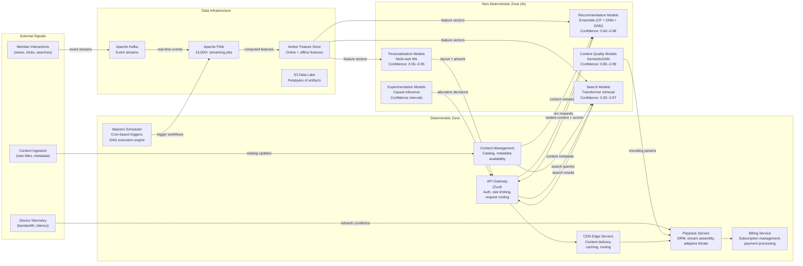

# AI Boundary Delineation

> **Extends:** arc42 S3 -- Context & Scope

## Purpose

The Netflix ML Platform integrates hundreds of non-deterministic ML models into a broader deterministic infrastructure of CDN edge servers, API gateways, playback services, and billing systems. This section delineates the boundary between deterministic and non-deterministic behavior across the platform, so that engineers, product teams, and leadership understand where probabilistic outputs are produced, what confidence guarantees apply, and how the system degrades when ML components are unavailable. At Netflix's scale (200M+ subscribers, 3,000+ ML projects), this boundary is not a simple line but a complex, multi-layered interface.

## AI Components Inventory

| Component | Type | Input Domain | Output Domain | Confidence Range | Fallback Strategy |
|-----------|------|-------------|---------------|-----------------|-------------------|
| Recommendation Models (ensemble) | Collaborative filtering + DNN + GNN | Member viewing history, content metadata, contextual signals (time, device, region) | Ranked content rows (homepage, "Because You Watched," "Top Picks") with relevance scores | 0.60--0.98 (varies by member activity level; cold-start members have lower confidence) | Popularity-based ranking by region; editorially curated content rows |
| Personalization Models (multi-task) | Multi-task neural networks | Member profile, device context, session history, content artwork variants | UI layout decisions, artwork selection per title, notification targeting | 0.55--0.95 | Default artwork (poster), standard layout template, no targeted notifications |
| Content Quality Models | Deep neural networks (SemanticGNN) | Raw video/audio frames, encoding parameters, network conditions | Quality prediction scores, optimal encoding parameters, bitrate recommendations | 0.80--0.99 (high confidence on well-represented content types) | Conservative encoding defaults; standard bitrate ladder per resolution tier |
| Search Models | Transformer-based retrieval + ranking | Query text, member context, content catalog | Ranked search results with relevance and intent scores | 0.50--0.97 (lower for ambiguous or misspelled queries) | Keyword-based full-text search on content metadata; no semantic understanding |
| Experimentation Models | Causal inference, contextual bandits | Experiment design, member allocation, metric observations | Treatment effect estimates, experiment decisions, optimal arm selection | p-value and confidence intervals per metric | Fixed allocation (equal split); no adaptive optimization |

## System Boundary Diagram

## Failure Modes

| Component | Failure Condition | System Behavior | User Impact |
|-----------|------------------|-----------------|-------------|
| Recommendation Models | Model serving cluster unavailable (health check fails for >10s) | API Gateway routes to popularity-based fallback; pre-computed batch recommendations served from Cassandra cache | Homepage shows regionally popular content instead of personalized rows; members see a less personalized but still functional experience. Estimated engagement drop: 10--15% (inferred from public Netflix research on personalization impact). |
| Recommendation Models | Confidence score < 0.60 for a member (cold-start or sparse history) | Low-confidence recommendations suppressed; member receives a blend of popularity-based and genre-based rows with a "Trending Now" emphasis | New members or infrequent users see less personalized content; compensated by Netflix's strong editorial curation layer. |
| Personalization Models | Model unavailable or inference latency > 200ms | Default poster artwork served for all titles; standard grid layout applied; no notification targeting | Visual experience degrades to uniform presentation; no artwork personalization. Functionally complete but less engaging. |
| Content Quality Models | Model unavailable | Playback falls back to conservative encoding ladder with standard bitrate-per-resolution mapping | Slightly less optimal video quality; higher bandwidth consumption in some cases. No visible degradation for most members on stable networks. |
| Search Models | Model unavailable or confidence < 0.50 | Fall back to Elasticsearch keyword matching on title, description, cast, and genre metadata | Semantic search (e.g., "movies like Inception") fails; only keyword matches returned. Noticeable degradation for complex queries. |
| Feature Store (Amber) | Online feature serving unavailable | All real-time models switch to pre-computed batch features (stale by up to 24h) or deterministic fallbacks | Recommendations and personalization based on yesterday's member profile. Acceptable for hours; degradation compounds over days. |
| Flink Streaming Cluster | Partial failure (subset of 15,000+ jobs) | Feature freshness degrades for affected data domains; dependent models receive stale features with freshness metadata | Impact depends on which features are stale; real-time responsiveness to member behavior is delayed. |

## External AI Dependencies

| Service | Provider | SLA | Data Exchanged | Fallback |
|---------|----------|-----|---------------|----------|
| AWS GPU Instances (P4d, P5) | Amazon Web Services | 99.99% per-instance | Training jobs, model weights, gradient computations | Queue training jobs; no impact on serving (models already deployed) |
| AWS S3 | Amazon Web Services | 99.99% | Model artifacts, training datasets, experiment logs | Cached model versions in Cassandra; batch predictions may be stale |
| AWS EKS (Kubernetes) | Amazon Web Services | 99.95% | Model serving pod orchestration | Spinnaker can deploy to alternative clusters; multi-region redundancy |

All ML model inference is performed within Netflix's own infrastructure. No member data is sent to external AI providers. Training data remains within Netflix's AWS accounts under their data governance framework.

## Confidence Propagation

At Netflix's scale, confidence is not a single number but propagates through a chain of ML components. A recommendation depends on personalization features, which depend on behavioral models, which depend on feature freshness:

| Chain Stage | Component | Contribution to Confidence | Degradation Effect |
|-------------|-----------|---------------------------|-------------------|
| Feature freshness | Flink + Amber | Features stale > 1 hour: confidence reduced by 0.05 per additional hour | Recommendations lag behind member's recent behavior |
| Behavioral signals | Implicit feedback models | Sparse member history (< 10 interactions): confidence floor at 0.60 | Cold-start problem; fall back to popularity |
| Content coverage | Content quality models | New titles without quality scores: encoding confidence reduced | Conservative encoding used; higher bandwidth |
| Ensemble agreement | Recommendation ensemble | Low agreement across ensemble members: confidence reduced | Wider variance in recommendation quality |
