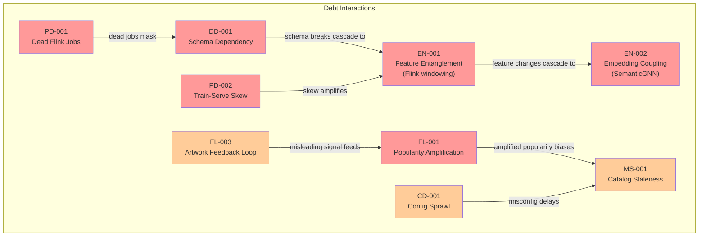

# AI Debt Register

> **Extends:** arc42 S11 -- Risks & Technical Debt
>
> **System:** Netflix ML Platform (Metaflow/Maestro)
>
> **Last Updated:** 2026-02-17

## Purpose

Structured tracking of ML-specific technical debt categories at Netflix, based on Sculley et al.'s taxonomy of ML system technical debt. Netflix's ML platform, with 3,000+ ML projects sharing infrastructure, features, and data pipelines, creates debt patterns that traditional technical debt tracking misses. The interconnected nature of ML models sharing features via Amber, orchestrated by Maestro, and consuming shared Flink pipelines amplifies debt through cascading dependencies.

*Note: The specific debt items below are illustrative, constructed from Netflix's publicly documented architectural patterns and known ML debt categories. They represent the types of debt that would realistically arise in a platform of this scale and architecture.*

## Debt Categories

### Boundary Erosion

*When the boundaries between ML components and the rest of the system become unclear, making changes risky.*

| ID | Description | Severity | Affected Components | Mitigation Plan | Status |
|----|-------------|----------|--------------------|-----------------| --------|
| BE-001 | Recommendation models directly consume features from Amber's online store using low-level key-value lookups, bypassing the formal feature schema API. This creates a tight coupling between model code and feature store internals. When the Amber team migrates the online store backend (e.g., from one key-value store to another), models must be individually updated and redeployed even if the logical feature interface has not changed. | High | MDL-REC, MDL-PERS, MDL-SEARCH, Amber | Introduce a feature serving abstraction layer with formal schema contracts; decouple model code from storage implementation; version the feature API independently of storage backend | Open |
| BE-002 | Metaflow workflows that were originally prototyped in notebooks contain hardcoded S3 paths, Kafka topic names, and Hive table references. As the platform evolves (topic name changes, table migrations), these hardcoded references break silently or require manual updates across hundreds of workflows. | Medium | Metaflow workflows (3,000+ projects) | Introduce centralized resource registry; replace hardcoded references with named resource lookups; lint workflows for hardcoded paths in CI | Open |

### Entanglement

*When changing one model's input features or behavior unexpectedly affects other models (CACE: Changing Anything Changes Everything).*

| ID | Description | Severity | Affected Components | Mitigation Plan | Status |
|----|-------------|----------|--------------------|-----------------| --------|
| EN-001 | Multiple recommendation models share behavioral features computed by the same Flink streaming jobs. When a Flink job's windowing logic is updated (e.g., changing from 5-minute to 1-minute aggregation windows for improved freshness), all downstream models receive features with different statistical properties. Models trained on the old feature distribution experience an implicit distribution shift without any explicit retraining trigger, because the feature name and schema remain unchanged. | High | All models consuming real-time features; Flink PL-002; Amber | Implement feature versioning in Amber: each feature definition change creates a new version; downstream models pin to specific feature versions; automated impact analysis triggers offline evaluation of all consuming models before feature version promotion | Open |
| EN-002 | The consolidated recommendation model (MDL-REC) uses content embeddings produced by the SemanticGNN component (part of MDL-QUAL). When MDL-QUAL is retrained and produces updated content embeddings, MDL-REC's behavior changes without MDL-REC itself being retrained. The change propagates through the shared embedding space, creating a transitive dependency that is not visible in the workflow orchestration graph. | High | MDL-REC, MDL-QUAL | Version content embeddings independently; MDL-REC pins to a specific embedding version; embedding version updates trigger MDL-REC offline evaluation before production adoption | Open |
| EN-003 | Search ranking (MDL-SEARCH) and recommendation (MDL-REC) share member preference features. Retraining MDL-SEARCH on new query data can subtly shift how preference features are weighted, and if the same feature computation is shared, the feedback loop between search behavior and recommendation features creates unexpected coupling. | Medium | MDL-SEARCH, MDL-REC, shared features | Isolate search-specific features from recommendation features where possible; maintain separate feature computation pipelines for shared signals that have different consumption patterns | Open |

### Hidden Feedback Loops

*When model outputs indirectly influence future training data, creating self-reinforcing biases.*

| ID | Description | Severity | Affected Components | Mitigation Plan | Status |
|----|-------------|----------|--------------------|-----------------| --------|
| FL-001 | **Recommendation popularity amplification:** Recommended content receives more views, generating more positive training signal, causing the model to recommend it even more. Over time, this creates a rich-get-richer dynamic where popular content accumulates disproportionate recommendation share, while new and niche content is systematically underexposed. Netflix has publicly acknowledged this challenge and uses exploration to mitigate it. | High | MDL-REC, training data pipelines | Contextual bandit exploration (5--10% of recommendations); inverse propensity weighting in training loss; explicit diversity objectives in multi-task training; periodic cold-start content injection experiments | Mitigated (ongoing, not fully resolved) |
| FL-002 | **Position bias feedback loop:** Items ranked higher by the model receive more clicks due to position (not relevance). These clicks become positive training signal, reinforcing the model's existing ranking. The model learns to replicate its own biases rather than learning true content relevance. | Medium | MDL-REC, MDL-SEARCH | Position-debiased training (Netflix has published on this); randomized position experiments on small traffic fraction; counterfactual learning from logged implicit feedback | Mitigated (ongoing) |
| FL-003 | **Artwork selection feedback loop:** The personalization model (MDL-PERS) selects which artwork to display for a title. The selected artwork influences click-through rate, which becomes training data for both MDL-PERS (artwork selection) and MDL-REC (content relevance). If MDL-PERS selects misleading artwork that generates clicks but poor viewing outcomes, both models learn incorrect signals. | Medium | MDL-PERS, MDL-REC | Track post-click engagement (view duration) not just clicks; penalize high-click-low-completion patterns in training; human review of artwork quality | Open |

### Data Dependency Debt

*Unstable, underutilized, or poorly understood data dependencies.*

| ID | Description | Severity | Affected Components | Mitigation Plan | Status |
|----|-------------|----------|--------------------|-----------------| --------|
| DD-001 | The ML platform depends on hundreds of Kafka topics as data sources. Topic schemas evolve over time (fields added, types changed, fields deprecated). Without comprehensive schema governance across all 15,000+ Flink jobs, a schema change in an upstream topic can break downstream feature computation, which silently degrades model inputs. Netflix's internal Schema Registry mitigates this partially, but schema validation coverage is not 100%. | High | All Flink jobs (PL-002), Amber, all models | Enforce schema validation on all Kafka consumers; require backward-compatible schema evolution; add feature distribution monitoring that detects anomalous value distributions caused by schema issues | Open |
| DD-002 | Content metadata from the Content Management System is consumed by multiple models but has no formal SLA for completeness or freshness. When metadata for new titles is incomplete (missing genre tags, incomplete cast information), content-dependent features are degraded, and new titles receive worse recommendations during their critical launch window. | Medium | MDL-REC, MDL-SEARCH | Establish content metadata SLA with Content Engineering team; implement metadata completeness checks before a title enters the recommendation candidate pool; use embedding-based feature imputation for missing metadata | Open |

### Pipeline Debt

*Complexity and fragility in data pipelines, feature engineering, and preprocessing logic.*

| ID | Description | Severity | Affected Components | Mitigation Plan | Status |
|----|-------------|----------|--------------------|-----------------| --------|
| PD-001 | Of the 15,000+ Flink streaming jobs, a significant fraction (estimated 10--20%) are legacy jobs that compute features no longer consumed by any active model version. These "dead" jobs consume compute resources, contribute to Kafka consumer group complexity, and create noise in monitoring dashboards. Identifying which jobs are truly unused is difficult because the dependency graph between Flink jobs, Amber features, and model versions is not fully tracked. | High | Flink cluster, Amber | Build automated lineage tracking from Flink job output to Amber feature to model version; implement dead-job detection pipeline that flags jobs with no downstream consumers for > 60 days; establish decommissioning process with 30-day deprecation warning | Open |
| PD-002 | Feature computation logic is duplicated between Flink streaming pipelines (real-time) and Spark batch pipelines (training data). The two implementations use different libraries and sometimes diverge in behavior, creating training-serving skew. For example, a text normalization function in the Spark training pipeline might handle Unicode differently from the Flink serving pipeline, causing features to differ between training and inference. | High | PL-002 (Flink), PL-003/PL-004 (Spark), all models | Implement shared feature computation libraries usable by both Flink and Spark; add feature parity tests that compare streaming and batch feature outputs on identical input data; use Amber as the single source of truth for feature definitions | Open |

### Configuration Debt

*Sprawling configuration (hyperparameters, feature flags, thresholds) that is hard to manage, test, and audit.*

| ID | Description | Severity | Affected Components | Mitigation Plan | Status |
|----|-------------|----------|--------------------|-----------------| --------|
| CD-001 | With 3,000+ Metaflow projects, each with its own configuration (hyperparameters, data paths, feature selections, deployment settings), there is no centralized view of all active model configurations. Different teams use different configuration patterns (YAML files, environment variables, Metaflow Config objects, hardcoded defaults). This makes it impossible to audit what configurations are actually in production or to detect conflicting configurations. | High | All Metaflow projects | Netflix introduced "Configurable Metaflow" (Config objects) in late 2024 to standardize configuration management. Migrate remaining projects from ad-hoc configuration to Metaflow Config objects; implement configuration audit pipeline | Mitigated (Configurable Metaflow deployed; migration ongoing) |
| CD-002 | A/B test configurations in ABlaze (traffic allocation percentages, guardrail metric thresholds, experiment duration) interact with model serving configurations (feature flags, model version routing). When an A/B test is active, the effective model behavior is a combination of the test configuration and the model's own configuration. This two-layer configuration makes it difficult to reproduce a specific member's experience or debug issues during active experiments. | Medium | ABlaze, model serving, Metaflow Hosting | Implement unified configuration snapshot that captures the complete effective configuration for a given member request (test allocation + model version + feature flags); log configuration snapshot with every prediction for debugging | Open |

### Model Staleness

*Models that have not been retrained despite data distribution changes.*

| ID | Description | Severity | Affected Components | Mitigation Plan | Status |
|----|-------------|----------|--------------------|-----------------| --------|
| MS-001 | Content catalog changes (new titles added, titles removed) create a continuous distribution shift. A model trained on last month's catalog does not know about this month's new releases and cannot properly recommend them. While real-time features capture member engagement with new content, the model's learned content representations (embeddings) do not update until retraining. During the gap between content launch and model retraining, new content relies on exploration and popularity signals rather than personalized recommendation. | High | MDL-REC, MDL-SEARCH | Frequent retraining cadence (shorter than content launch cycles); incremental embedding updates for new content without full model retraining; contextual bandit exploration provides immediate coverage for new titles | Mitigated (exploration provides partial coverage; full solution requires incremental learning) |

## Debt Summary Dashboard

| Category | Open | Mitigated | Total |
|----------|------|-----------|-------|
| Boundary Erosion | 2 | 0 | 2 |
| Entanglement | 3 | 0 | 3 |
| Hidden Feedback Loops | 1 | 2 | 3 |
| Data Dependency Debt | 2 | 0 | 2 |
| Pipeline Debt | 2 | 0 | 2 |
| Configuration Debt | 1 | 1 | 2 |
| Model Staleness | 0 | 1 | 1 |
| **Total** | **11** | **4** | **15** |

## Debt Dependency Map

## Review Cadence

- **Debt review frequency:** Continuous monitoring via ML Observability platform; formal review at platform-level retrospectives
- **Debt ownership:** ML Platform (MLP) team owns platform-level debt; individual model teams own model-specific debt
- **Escalation:** High-severity debt affecting > 10% of ML projects escalated to ML Platform leadership
- **Reporting:** Debt metrics tracked as platform health indicators alongside uptime, latency, and throughput
