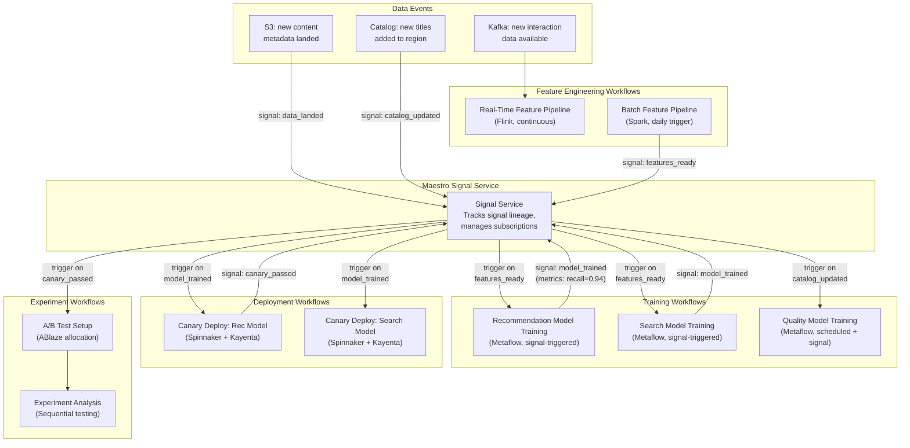
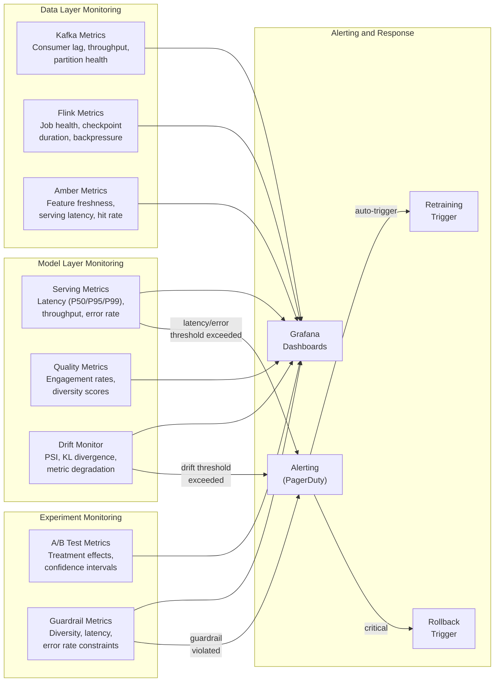
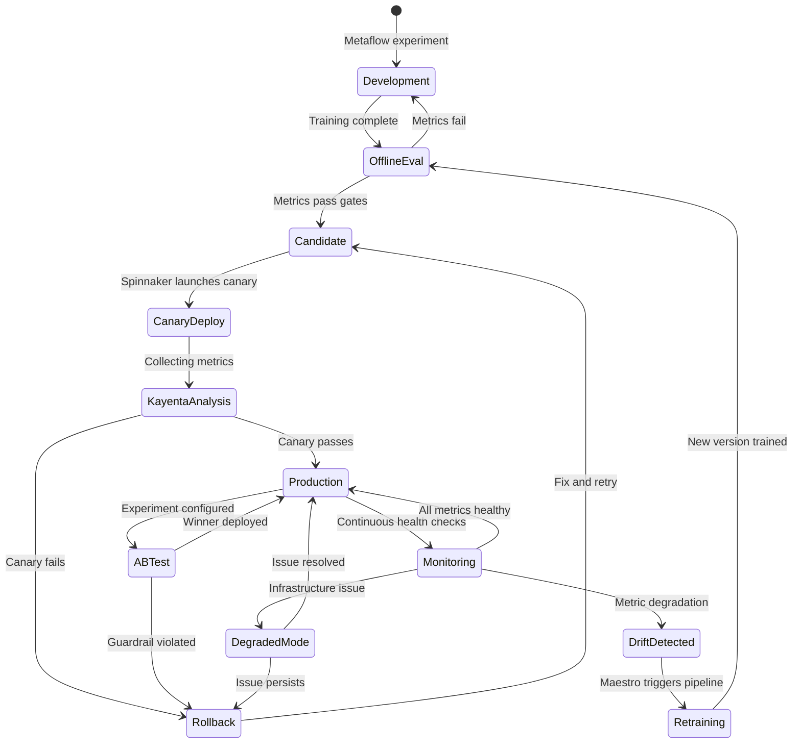

# Operational AI View

> **New section** -- extends arc42 beyond S11
>
> **System:** Netflix ML Platform (Metaflow/Maestro)
>
> **Last Updated:** 2026-02-17

## Purpose

Document the continuous operational concerns unique to Netflix's ML platform that evolve post-deployment: drift monitoring, retraining orchestration via Maestro, canary deployment via Spinnaker/Kayenta, A/B testing through ABlaze, and rollback procedures. This section covers the operational lifecycle that no existing arc42 section addresses -- how 3,000+ ML projects are kept healthy, updated, and correctly serving in production. At Netflix's scale, operational AI concerns are not afterthoughts; they are first-class architectural concerns.

## Maestro Workflow Orchestration

### Event-Driven ML Pipeline Orchestration

Maestro's signal service is the architectural backbone of Netflix's ML operational lifecycle. Rather than running ML pipelines on fixed schedules, Maestro enables event-driven orchestration where pipeline stages trigger based on data availability and upstream completion signals.

**Signal-Based Coordination Pattern:**

**Signal Types in Netflix's ML Orchestration:**

| Signal Type | Source | Subscribers | Metadata Carried |
|-------------|--------|------------|-----------------|
| `data_landed` | S3 event notifications | Batch feature pipelines, training data preparation | S3 path, partition date, record count, schema version |
| `features_ready` | Batch feature pipeline completion | Model training workflows | Feature version, feature count, quality metrics (null rate, distribution stats) |
| `model_trained` | Metaflow training workflow completion | Deployment workflows | Model version, offline metrics (recall, NDCG, latency), artifact S3 path |
| `canary_passed` | Kayenta canary analysis completion | Full deployment or A/B test setup | Canary metrics comparison, traffic percentage, duration |
| `experiment_concluded` | ABlaze experiment analysis | Model promotion workflow | Treatment effect estimates, p-values, guardrail metric status |
| `drift_detected` | Drift monitoring pipeline | Retraining trigger workflow | Drift type (data/concept), affected features, severity score |
| `catalog_updated` | Content Management System | Content-dependent model retraining | New title count, region, metadata completeness |

### Maestro `@trigger_on_finish` Chains

Within Metaflow workflows, the `@trigger_on_finish` decorator (implemented via Maestro signals) creates cross-workflow dependencies:

| Upstream Workflow | Downstream Workflow | Trigger Condition | Metadata Passed |
|------------------|--------------------|--------------------|----------------|
| `feature_engineering_daily` | `rec_model_training` | Upstream completes successfully | Feature version, row count |
| `rec_model_training` | `rec_model_validation` | Training step produces model artifact | Model S3 path, training metrics |
| `rec_model_validation` | `rec_canary_deploy` | Validation metrics pass all gates | Validation report, approved model version |
| `search_index_update` | `search_model_reindex` | Search index rebuild completes | Index version, document count |
| `content_embedding_update` | `rec_model_evaluation` | New content embeddings available | Embedding version, delta count |

## Monitoring Architecture

### Drift Detection

| Model | Drift Type | Detection Method | Threshold | Check Frequency | Response |
|-------|-----------|-----------------|-----------|----------------|----------|
| MDL-REC | Data drift | Feature distribution monitoring (PSI on top features) | PSI > 0.2 sustained for 3 checks | Hourly | Alert ML team; if sustained > 24h, trigger retraining |
| MDL-REC | Concept drift | Engagement metric degradation (CTR, play rate) vs. 30-day rolling baseline | > 5% degradation sustained 3 days | Daily | Trigger retraining with recent data emphasis |
| MDL-REC | Prediction drift | Recommendation distribution analysis (content coverage, genre diversity) | Significant distribution shift (KL divergence > 0.1) | Daily | Investigate root cause; may indicate model or data issue |
| MDL-SEARCH | Data drift | Query distribution monitoring (new query patterns) | > 15% queries unmatched by existing patterns | Daily | Expand training data; retrain with recent queries |
| MDL-SEARCH | Concept drift | Search success rate (query -> click -> view) degradation | > 3% degradation sustained 5 days | Daily | Retrain with recent click-through data |
| MDL-QUAL | Data drift | Content feature distribution (new content types, encoding changes) | Significant shift in content complexity distribution | Weekly | Retrain with updated content corpus |

### ML Observability

Netflix's ML Observability infrastructure (publicly described in their blog) provides production performance monitoring and analysis:

| Capability | Description | Coverage |
|------------|-------------|----------|
| Long-term performance tracking | Track model metrics over time with automated degradation detection | All production models |
| Feature drift monitoring | Monitor input feature distributions for unexpected shifts | All features in Amber Feature Store |
| Prediction drift monitoring | Monitor model output distributions for unexpected changes | All serving endpoints |
| Data quality checks | Automated validation of training data and feature pipeline outputs | All data pipelines |
| Model explainability | Feature importance and prediction decomposition for debugging | On-demand for investigation |

### Monitoring Dashboard Topology

## A/B Testing Infrastructure (ABlaze)

### Experiment Lifecycle

ABlaze manages the complete lifecycle of model experiments at Netflix:

| Phase | ABlaze Role | Description |
|-------|-------------|-------------|
| Design | Experiment configuration | Define treatment groups, traffic allocation, primary metrics, guardrail metrics, target duration |
| Allocation | Member assignment | Assign members to control/treatment groups; support batch and real-time allocation; handle interaction effects with concurrent experiments |
| Execution | Traffic routing | Route members to appropriate model variant (control or treatment) via API Gateway integration |
| Monitoring | Real-time metrics | Stream experiment metrics via Spark Streaming + Kafka to ElasticSearch; display near-real-time updates in ABlaze dashboard |
| Analysis | Statistical evaluation | Sequential testing for continuous monitoring; always-valid confidence intervals (Netflix's published methodology); multiple metric evaluation |
| Decision | Winner declaration | Statistical significance on primary metric + all guardrails pass = winner; automated deployment trigger |

### Concurrent Experiment Management

At any given time, Netflix members are simultaneously enrolled in multiple A/B tests. ABlaze manages interactions between experiments:

| Concern | ABlaze Solution |
|---------|----------------|
| Experiment collision | Test schedule view showing overlapping tests; dimension-based filtering to identify potential interactions |
| Traffic budgeting | Traffic allocation pool management; prevent over-allocation that would leave insufficient control traffic |
| Metric contamination | Isolation of treatment effects using difference-in-differences; randomization at member level |
| Guardrail enforcement | Universal guardrail metrics checked across all active experiments; any experiment violating guardrails is paused |

### Canary Deployment via Kayenta

When a new model version passes offline evaluation, Spinnaker orchestrates canary deployment and Kayenta performs automated analysis:

| Step | Component | Description | Duration |
|------|-----------|-------------|----------|
| 1. Canary launch | Spinnaker | Deploy candidate model to a small cluster; deploy a fresh baseline (same config as production) alongside | Minutes |
| 2. Traffic routing | API Gateway | Route configurable fraction (e.g., 1--5%) of production traffic to canary and baseline clusters | Immediate |
| 3. Metric collection | Monitoring stack | Collect serving metrics (latency, error rate) and business metrics (engagement) from canary and baseline | Hours to days |
| 4. Statistical analysis | Kayenta | Compare canary metrics vs. baseline using configurable statistical tests (Mann-Whitney, t-test); compute pass/fail for each metric | At analysis intervals |
| 5. Decision | Kayenta + Spinnaker | If canary passes all metrics: promote to full production. If canary fails: abort and rollback all traffic to production cluster. If marginal: prompt manual intervention. | Automatic or manual |

## Rollback Procedures

| Scenario | Detection | Rollback Mechanism | Recovery Time | Automation Level |
|----------|-----------|-------------------|---------------|-----------------|
| Model serving error rate > 1% | Automated monitoring (serving metrics) | Spinnaker reverts deployment to previous model version; DNS/load balancer routes all traffic to stable cluster | < 5 minutes | Fully automated |
| Canary analysis failure (Kayenta) | Kayenta statistical comparison | Spinnaker terminates canary cluster; 100% traffic returns to production cluster | < 2 minutes | Fully automated |
| Engagement metric degradation (> 5% drop) | Daily engagement analysis pipeline | Previous model version reactivated; current version quarantined for investigation | < 1 hour (requires analysis confirmation) | Semi-automated (analysis automated; rollback manual) |
| Feature store outage (Amber) | Feature serving health checks | All models switch to pre-computed batch features (Cassandra/S3 cache); degraded but functional | < 1 minute (automated fallback) | Fully automated |
| Flink pipeline failure (> 10% of jobs) | Flink job health monitoring | Jobs restart from last checkpoint; during recovery, features serve stale values with freshness metadata | < 30 seconds per job (checkpoint recovery) | Fully automated (per-job) |
| A/B test guardrail violation | ABlaze guardrail monitoring | Experiment paused; all members return to control experience; experiment team notified | < 5 minutes | Fully automated |

### Rollback State Diagram

## Operational Metrics Summary

| Metric Category | Examples | Collection Method | Retention |
|----------------|---------|------------------|-----------|
| Serving performance | Latency (P50/P95/P99), throughput (req/s), error rate | Real-time metrics from serving infrastructure | 90 days at full resolution; 1 year aggregated |
| Model quality | Engagement rates, diversity scores, search success rates | Daily batch evaluation against ground truth | 1 year at full resolution |
| Data infrastructure | Kafka consumer lag, Flink checkpoint duration, feature freshness | Real-time infrastructure metrics | 30 days at full resolution; 1 year aggregated |
| Experiment metrics | Treatment effects, confidence intervals, guardrail status | Streaming (near-real-time) + daily batch analysis | Experiment duration + 1 year post-experiment |
| Operational events | Retraining triggers, deployments, rollbacks, incidents | Event logging | 2 years |
