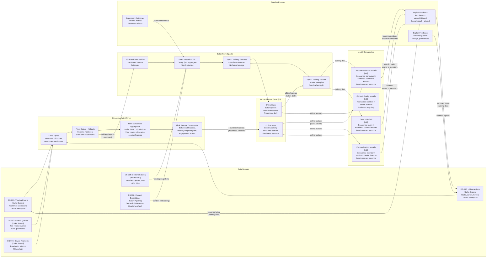
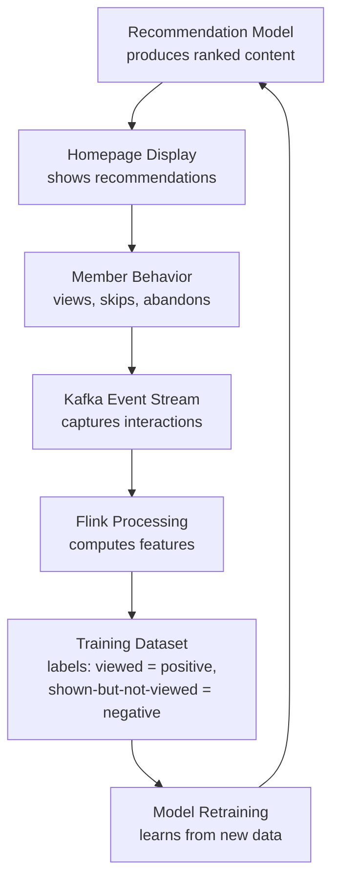

# Data Lineage Overlay -- Netflix ML Platform

> **Diagram type:** C4 Data Lineage Overlay (RAD-AI extension)
>
> **Purpose:** Trace data provenance from member interaction events through transformation to model consumption, annotated with freshness requirements, processing modes (streaming vs. batch), and feedback loops. This overlay makes visible the critical streaming/batch distinction that standard C4 diagrams cannot express.

## Data Source Inventory

| Source ID | Name | Type | Freshness | Volume | Processing Mode |
|-----------|------|------|-----------|--------|----------------|
| DS-001 | Member Viewing Events | Kafka Stream | Real-time (sub-second) | Hundreds of thousands of events/sec peak | Streaming (Flink) |
| DS-002 | Member UI Interactions | Kafka Stream | Real-time (sub-second) | Hundreds of thousands of events/sec peak | Streaming (Flink) |
| DS-003 | Search Queries | Kafka Stream | Real-time | Tens of thousands of queries/sec | Streaming (Flink) |
| DS-004 | Device Telemetry | Kafka Stream | Real-time (5s intervals) | Millions of reports/min | Streaming (Flink) |
| DS-005 | Content Catalog | Internal API | On catalog change | ~15,000 titles with metadata | Batch (Spark) + event-driven |
| DS-006 | Content Embeddings | Batch pipeline output | Quarterly recomputation | All titles (dense vectors, dim 256) | Batch (Metaflow) |
| DS-007 | Member Profiles | Aggregated from DS-001/DS-002 | Daily aggregation | 200M+ profiles | Batch (Spark) |

## Data Lineage Diagram

## Lineage Details

### DS-001 (Viewing Events) -> MDL-REC (Recommendation) Path

**Streaming path (real-time serving):**

| Stage | Input | Transformation | Output | Quality Gate |
|-------|-------|---------------|--------|-------------|
| Kafka ingestion | Raw view event (play, pause, stop, complete) from Netflix client | Schema validation (Avro); deduplication by event_id + timestamp | Validated viewing events in Kafka topic | Schema conformance 100%; dedup rate logged |
| Flink windowed aggregation | Validated viewing events | Tumbling windows (1-min, 5-min, 1-hour): compute view count, avg duration, genre distribution per member | Time-windowed behavioral aggregates | Window completeness > 99%; late events handled within 5-min allowed lateness |
| Flink feature computation | Windowed aggregates + cached member profile | Compute engagement score, recency-weighted genre preferences, session momentum, viewing velocity | Real-time behavioral feature vector | Feature null rate < 0.1%; value range validation |
| Amber online materialization | Feature vector | Write to online store; key: member_id; TTL: 5 minutes (auto-refresh by next window) | Online features serving real-time inference | Write latency < 10ms; freshness < 5 seconds from source event |

**Batch path (model training):**

| Stage | Input | Transformation | Output | Quality Gate |
|-------|-------|---------------|--------|-------------|
| S3 archival | Validated Kafka events (written by Flink) | Partitioned by date, stored in Parquet | Raw event archive in S3 | Partition completeness check; record count reconciliation |
| Spark ETL | S3 raw events + content catalog + member profiles | Deduplication, join with content metadata, compute historical behavioral features (30/60/90-day windows) | Historical behavioral features per member per time window | No future data leakage (point-in-time correctness enforced) |
| Training dataset construction | Historical features + labels (viewed/not-viewed) | Negative sampling, label construction (implicit feedback), train/val/test split by time | Training dataset in S3 (Parquet) | Label distribution logged; class balance within expected range |

### Streaming vs. Batch: Freshness Comparison

| Feature Type | Streaming Freshness | Batch Freshness | Impact of Staleness |
|-------------|--------------------|-----------------|--------------------|
| Recent viewing behavior (last 1 hour) | < 5 seconds | 24 hours (stale) | High: member who just finished a series expects immediate recommendation update |
| Genre preferences (last 7 days) | < 1 minute | 24 hours | Medium: gradual preference shifts are captured daily |
| Long-term taste profile (last 90 days) | Not applicable (too expensive to recompute in streaming) | 24 hours | Low: long-term preferences change slowly |
| Content popularity (trending) | < 1 minute | 24 hours (stale) | High: trending content changes rapidly; stale popularity = outdated "Trending Now" |
| Device context (bandwidth, resolution) | < 5 seconds | Not applicable (always real-time) | High: encoding optimization requires current network conditions |

This freshness analysis demonstrates why the streaming/batch distinction matters architecturally: real-time features make recommendations responsive to a member's current session, while batch features capture long-term patterns that inform the model's underlying understanding of member preferences.

## Feedback Loop Analysis

### Primary Feedback Loop: Recommendations -> Viewing -> Training Data

**Feedback loop risks:**

| Risk | Description | Severity |
|------|-------------|----------|
| Popularity amplification | Recommended content gets viewed more, generating positive training signal, causing more recommendation | High |
| Position bias | Higher-ranked items get more clicks regardless of true relevance; model learns to replicate its own ranking | Medium |
| Filter bubble convergence | Member sees narrow content; narrows future preferences; model narrows further | High |
| Cold-start content disadvantage | New titles have no viewing data; model cannot recommend them; they never accumulate viewing data | Medium |

**Mitigations documented:**

| Mitigation | Mechanism | Effectiveness |
|------------|-----------|---------------|
| Contextual bandit exploration | 5--10% of recommendations are exploratory (not based on model ranking) | Breaks popularity feedback loop; provides unbiased training signal |
| Position-debiased training | Inverse propensity weighting accounts for position effect in training | Reduces position bias in learned rankings |
| Diversity post-processing | Genre entropy constraints applied to final recommendation sets | Prevents filter bubble convergence at serving time |
| Editorial injection | Editorially curated "Discovery" rows bypass ML ranking | Ensures new and niche content gets exposure regardless of model |

## Schema Registry

| Schema ID | Version | Domain | Used By | Last Breaking Change |
|-----------|---------|--------|---------|---------------------|
| SCH-VIEW | v4.1 | Viewing events | PL-001 (ingestion), PL-002 (Flink), PL-004 (training) | v4.0: added `view_context` field (device, session_id) |
| SCH-CLICK | v3.0 | UI interaction events | PL-001, PL-002, PL-004 | v3.0: unified click/scroll/hover into interaction event |
| SCH-SEARCH | v2.2 | Search events | PL-001, PL-002, MDL-SEARCH training | v2.0: added `query_intent` classification field |
| SCH-FEATURE | v5.0 | Feature vectors (Amber) | All models (online + offline) | v5.0: initial Amber schema (managed via Amber Schema Registry) |
