# Non-Determinism Boundary Diagram -- Netflix ML Platform

> **Diagram type:** C4 Non-Determinism Boundary (RAD-AI extension)
>
> **Purpose:** Explicitly delineate deterministic and non-deterministic regions of the Netflix ML platform architecture, with confidence contracts, fallback strategies, and degradation behavior for each AI component.

## Boundary Overview

Netflix's architecture has a clear structural separation between deterministic infrastructure (CDN, API gateway, playback, billing) and non-deterministic ML components (recommendation, personalization, search, content quality). The boundary is mediated by confidence gates that route requests to ML models when healthy and to deterministic fallbacks when ML components are unavailable or produce low-confidence outputs. At Netflix's scale, this boundary must be robust: a confidence gate failure affects millions of members.

## Boundary Diagram

```mermaid
graph TB
    subgraph Det ["Deterministic Region"]
        style Det fill:#e8f5e9,stroke:#2e7d32
        CDN["CDN Edge Servers<br/>[Container]<br/>Deterministic content<br/>delivery and caching"]
        APIGw["API Gateway (Zuul)<br/>[Container]<br/>Deterministic routing,<br/>auth, rate limiting"]
        Playback["Playback Service<br/>[Container]<br/>DRM, stream assembly,<br/>adaptive bitrate"]
        Billing["Billing Service<br/>[Container]<br/>Subscription, payments<br/>(fully deterministic)"]
        CMS["Content Management<br/>[Container]<br/>Catalog, metadata,<br/>availability rules"]
        Editorial["Editorial Curation<br/>[Container]<br/>Hand-picked collections,<br/>genre shelves"]
    end

    subgraph BoundaryLayer ["Confidence Gate Layer"]
        style BoundaryLayer fill:#e3f2fd,stroke:#1565c0
        CG1["Confidence Gate CG-1<br/>Recommendations<br/>Threshold: 0.60<br/>Action: fallback routing"]
        CG2["Confidence Gate CG-2<br/>Personalization<br/>Threshold: 0.55<br/>Action: default layout"]
        CG3["Confidence Gate CG-3<br/>Search<br/>Threshold: 0.50<br/>Action: keyword fallback"]
        CG4["Confidence Gate CG-4<br/>Content Quality<br/>Threshold: 0.80<br/>Action: conservative encoding"]
    end

    subgraph NonDet ["Non-Deterministic Region"]
        style NonDet fill:#fff3e0,stroke:#ef6c00
        RecModel["Recommendation Models<br/>[ML] Ensemble<br/>Confidence: 0.60 - 0.98<br/>Output: ranked content<br/>+ relevance scores"]
        PersModel["Personalization Models<br/>[ML] Multi-task NN<br/>Confidence: 0.55 - 0.95<br/>Output: layout + artwork<br/>+ targeting decisions"]
        SearchModel["Search Models<br/>[ML] Transformer<br/>Confidence: 0.50 - 0.97<br/>Output: ranked results<br/>+ intent classification"]
        QualModel["Content Quality Models<br/>[ML] SemanticGNN<br/>Confidence: 0.80 - 0.99<br/>Output: encoding params<br/>+ quality predictions"]
        AmberFS["Amber Feature Store<br/>[FS]<br/>Non-deterministic due to<br/>real-time feature freshness"]
        DriftMon["ML Observability<br/>[MON]<br/>Triggers fallback when<br/>drift exceeds thresholds"]
    end

    subgraph Fallback ["Deterministic Fallback Region"]
        style Fallback fill:#fce4ec,stroke:#c62828
        FB1["Popularity-Based Ranking<br/>[Fallback for RecModel]<br/>Regional popularity + editorial<br/>curation, no personalization"]
        FB2["Default Presentation<br/>[Fallback for PersModel]<br/>Standard poster artwork,<br/>default grid layout"]
        FB3["Keyword Search<br/>[Fallback for SearchModel]<br/>Elasticsearch full-text<br/>on title + metadata"]
        FB4["Conservative Encoding<br/>[Fallback for QualModel]<br/>Standard bitrate ladder<br/>per resolution tier"]
    end

    Member["Netflix Member<br/>[Person]"]

    Member -->|"opens app"| CDN
    CDN -->|"API requests"| APIGw

    APIGw -->|"rec request"| CG1
    APIGw -->|"layout request"| CG2
    APIGw -->|"search query"| CG3

    CG1 -->|"request features"| RecModel
    CG2 -->|"request features"| PersModel
    CG3 -->|"request features"| SearchModel

    AmberFS -->|"feature vectors"| RecModel
    AmberFS -->|"feature vectors"| PersModel
    AmberFS -->|"feature vectors"| SearchModel

    RecModel -->|"predictions +<br/>confidence"| CG1
    PersModel -->|"decisions +<br/>confidence"| CG2
    SearchModel -->|"results +<br/>confidence"| CG3
    QualModel -->|"encoding params +<br/>confidence"| CG4

    CG1 -->|"conf >= 0.60:<br/>ML recommendations"| APIGw
    CG1 -->|"conf < 0.60:<br/>use fallback"| FB1
    FB1 -->|"popularity-based<br/>recommendations"| APIGw

    CG2 -->|"conf >= 0.55:<br/>personalized layout"| APIGw
    CG2 -->|"conf < 0.55:<br/>default layout"| FB2
    FB2 -->|"standard layout"| APIGw

    CG3 -->|"conf >= 0.50:<br/>ML search results"| APIGw
    CG3 -->|"conf < 0.50:<br/>keyword search"| FB3
    FB3 -->|"keyword results"| APIGw

    CG4 -->|"conf >= 0.80:<br/>optimized encoding"| Playback
    CG4 -->|"conf < 0.80:<br/>standard encoding"| FB4
    FB4 -->|"conservative<br/>encoding"| Playback

    DriftMon -->|"drift alert:<br/>disable model"| CG1
    DriftMon -->|"drift alert:<br/>disable model"| CG2
    DriftMon -->|"drift alert:<br/>disable model"| CG3
    DriftMon -->|"drift alert:<br/>disable model"| CG4

    APIGw --> CDN
    CDN --> Member
    CG4 --> Playback
    Playback --> CDN

    Billing -.->|"subscription<br/>status"| APIGw
    CMS -->|"catalog data"| RecModel
    CMS -->|"catalog data"| SearchModel
    Editorial -->|"curated lists"| FB1
```

## Boundary Interfaces

| Interface ID | From (Region) | To (Region) | Data Exchanged | Contract |
|-------------|--------------|------------|---------------|---------|
| BI-001 | API Gateway (Det) | CG-1 (Boundary) | Recommendation request: member_id, device, session context | JSON; timeout 250ms |
| BI-002 | CG-1 (Boundary) | Rec Models (NonDet) | Feature request + member context | Feature request; response within 150ms |
| BI-003 | Rec Models (NonDet) | CG-1 (Boundary) | Ranked content rows (top-N per surface) + confidence scores per row | Prediction schema; confidence in [0, 1] |
| BI-004 | CG-1 (Boundary) | API Gateway (Det) | Selected recommendations (ML or fallback) + source flag | Response schema includes `decision_source: ml|fallback|editorial` |
| BI-005 | API Gateway (Det) | CG-2 (Boundary) | Personalization request: member_id, content_ids, device context | JSON; timeout 100ms |
| BI-006 | CG-2 (Boundary) | Pers Models (NonDet) | Member + content + device features | Feature request; response within 50ms |
| BI-007 | API Gateway (Det) | CG-3 (Boundary) | Search query: text, member_id, context | JSON; timeout 200ms |
| BI-008 | CG-3 (Boundary) | Search Models (NonDet) | Query features + member features + content index | Feature request; response within 100ms |
| BI-009 | Content pipeline (Det) | CG-4 (Boundary) | Video segment features, target resolution, bitrate budget | Encoding request; batch processing (no real-time constraint) |

## Confidence Thresholds

| Model | High Confidence | Medium Confidence | Low Confidence | Rejection / Fallback |
|-------|----------------|------------------|---------------|---------------------|
| Recommendation Models | >= 0.85: Full personalized homepage with high-quality ranked rows | 0.60 - 0.85: Personalized recommendations with popularity blending to fill gaps | 0.40 - 0.60: Minimal personalization; primarily popularity + editorial | < 0.40: Full fallback to popularity + editorial (cold-start members, new markets) |
| Personalization Models | >= 0.80: Full personalization (custom artwork, layout, notification targeting) | 0.55 - 0.80: Partial personalization (personalized artwork; default layout) | 0.35 - 0.55: Minimal personalization (default artwork; no targeting) | < 0.35: Full fallback to default presentation |
| Search Models | >= 0.85: Semantic search with personalized ranking and intent-based result grouping | 0.50 - 0.85: Semantic search with reduced personalization; broader result set | 0.30 - 0.50: Keyword search augmented with basic metadata matching | < 0.30: Pure keyword search (Elasticsearch full-text) |
| Content Quality Models | >= 0.90: Per-shot optimized encoding with ML-predicted quality scores | 0.80 - 0.90: Per-scene optimization (coarser granularity) | 0.60 - 0.80: Per-title optimization using content complexity heuristics | < 0.60: Standard bitrate ladder (no ML optimization) |

## Fallback Strategies

### FB1: Popularity-Based Ranking (Fallback for Recommendation Models)

**Trigger:** Recommendation model unavailable, confidence < 0.40, or drift monitor disables model.

**Behavior:** Homepage populated with: (1) regionally popular content ranked by recent viewership; (2) editorially curated collections (e.g., "Award Winners," "New Releases"); (3) genre-based rows using member's explicitly stated genre preferences (from profile setup). No personalization based on viewing history.

**Limitations:** No personalization beyond genre preferences. All members in a region see similar content. New members and established members receive the same experience. Estimated engagement reduction: 10--15% (inferred from Netflix's public statements about the value of personalization).

**User experience:** Functional but generic. Members can browse and discover content through editorial curation and popularity, but the "Netflix knows me" experience is absent.

### FB2: Default Presentation (Fallback for Personalization Models)

**Trigger:** Personalization model unavailable or confidence < 0.35.

**Behavior:** Default poster artwork displayed for all titles (no personalized artwork selection). Standard grid layout applied (no personalized row ordering or UI optimization). No push notification targeting (notifications sent to all eligible members uniformly).

**Limitations:** Visual engagement reduced; members do not see artwork tailored to their preferences (e.g., a romance fan seeing the romantic poster for a multi-genre film vs. an action fan seeing the action poster). Notification open rates decrease without targeting.

**User experience:** Content is still accessible and correctly ranked (by recommendation model or its fallback), but the visual presentation is uniform.

### FB3: Keyword Search (Fallback for Search Models)

**Trigger:** Search model unavailable or confidence < 0.30.

**Behavior:** Elasticsearch full-text search on title, description, cast, director, and genre metadata. No semantic understanding (e.g., "movies like Inception" returns results containing the word "Inception," not conceptually similar films). No personalized ranking of search results.

**Limitations:** Complex queries, misspelled queries, and conceptual queries fail. Search success rate decreases significantly for non-exact-match queries.

**User experience:** Simple keyword searches work well; complex or exploratory searches degrade noticeably.

### FB4: Conservative Encoding (Fallback for Content Quality Models)

**Trigger:** Content quality model unavailable or confidence < 0.60.

**Behavior:** Standard bitrate ladder applied per resolution tier (e.g., 1080p: 3, 5, 8 Mbps tiers). No per-shot or per-scene optimization. No content-adaptive encoding.

**Limitations:** Bandwidth consumption may increase (no optimization for low-complexity scenes). Visual quality may be suboptimal for high-complexity content (fast action, fine detail). Negligible impact for most content types.

**User experience:** Streaming quality remains acceptable for the vast majority of content. Minor visual quality reduction noticeable only on bandwidth-constrained connections with high-complexity content.

## Degradation Behavior

| Scenario | Detection | System Behavior | User Impact | Max Duration |
|----------|-----------|-----------------|-------------|-------------|
| Rec model unavailable | Health check failure (3 consecutive) | CG-1 routes to FB1 (popularity + editorial) | Generic homepage; ~10-15% engagement drop | Indefinite (FB1 is stable) |
| Rec model low confidence (member cohort) | > 30% of requests below 0.40 in 5-min window | Drift monitor alert; affected members get blended ML + popularity | Slightly less personalized experience for affected cohort | Until model retrained |
| Amber Feature Store unavailable | Online store health check failure | All real-time models switch to pre-computed batch features (24h stale) or full fallback | Stale personalization (yesterday's preferences); degradation compounds over hours | Target recovery: < 15 min |
| Flink partial failure (subset of 15,000+ jobs) | Job health monitoring; consumer lag increase | Affected features become stale; confidence reduced for predictions using those features | Reduced real-time responsiveness in affected feature domains | Job checkpoint recovery: < 30s per job |
| Multiple models degraded simultaneously | Correlated drift across models (e.g., shared feature issue) | System-wide degraded mode: all models use batch features or fallbacks | Broad degradation across recommendation, personalization, and search | Until root cause resolved |
| Kafka cluster issue | Broker health monitoring | No new events ingested; streaming features freeze at last computed values | Increasing staleness; recommendations lag behind current behavior | Until Kafka recovers |

## Propagation Rules

| Rule | Description | Example |
|------|-------------|---------|
| Feature freshness penalty | When Amber online feature freshness exceeds SLA, downstream model confidence is reduced by a staleness penalty | Features 10 min stale -> recommendation confidence reduced by 0.10 |
| Cascade fallback | If Amber online store is unavailable, all real-time models switch to batch features or fallback simultaneously | Amber outage -> all models degrade together |
| Independence of encoding | Content quality models operate on batch pipeline independently of real-time serving models; their fallback does not affect recommendations | QualModel in fallback -> recommendations unaffected |
| Editorial safety net | When recommendation model is in fallback, editorial curation provides a curated content layer that guarantees minimum content quality | FB1 includes editorially curated rows regardless of model state |
| Experiment isolation | A/B test variants are subject to the same confidence gates and fallbacks; test allocation does not bypass safety mechanisms | Canary model in test still must pass confidence gates |

## Testing Implications

| Test Type | Purpose | Approach | Frequency |
|-----------|---------|----------|-----------|
| Confidence gate testing | Verify correct routing at each confidence threshold | Inject synthetic predictions at threshold values and verify gate behavior | Every model deployment |
| Fallback activation | Verify seamless transition to fallback per model | Simulate model unavailability via circuit breaker; measure transition latency | Weekly automated |
| Fallback quality | Verify fallback output quality is acceptable for member experience | Compare engagement metrics in fallback mode vs. ML mode on holdout traffic | Monthly |
| Cascade testing | Verify system behavior when Amber Feature Store fails | Simulate Amber outage; verify all models fall back correctly | Monthly |
| Recovery testing | Verify clean transition from fallback back to ML | Restore model after simulated outage; verify confidence gates re-enable ML inference | Every model deployment |
| Load spike resilience | Verify confidence gates and fallbacks under extreme traffic | Load test at 5x peak traffic; verify graceful degradation | Quarterly |
