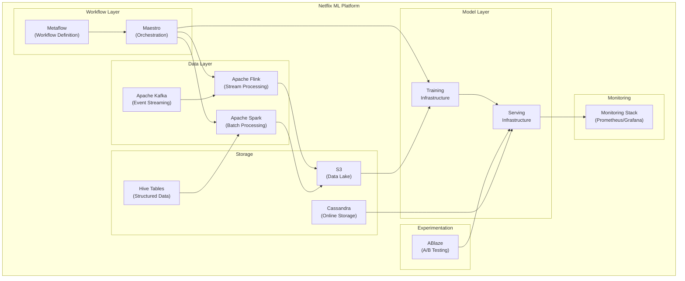

# arc42 Section 5: Building Block View

> **Standard arc42** -- no RAD-AI extensions applied

## Level 1: Overall System

The Netflix ML Platform is decomposed into the following top-level building blocks:

| Building Block | Responsibility | Technology |
|----------------|---------------|------------|
| Metaflow | ML workflow definition, execution, artifact management | Python framework |
| Maestro | Workflow orchestration, scheduling, event-driven triggers | Java service |
| Data Processing Layer | Data ingestion, transformation, feature computation | Apache Flink, Apache Spark |
| Model Training Infrastructure | Distributed model training on GPU/CPU clusters | PyTorch, TensorFlow, Horovod |
| Model Serving Layer | Real-time and batch model inference | Metaflow Hosting (REST), batch inference |
| Experimentation Platform | A/B testing, experiment allocation, analysis | ABlaze, Ignite |
| Storage Layer | Data lake, model artifacts, feature data | S3, Hive, Cassandra |
| Monitoring and Observability | Platform and model metrics, alerting | Prometheus, Grafana, internal tools |

### Building Block Diagram

## Level 2: Metaflow

| Sub-Component | Responsibility |
|---------------|---------------|
| Flow DSL | Python decorators for defining workflow steps and dependencies |
| Client Library | Local execution, experiment prototyping, notebook integration |
| Metadata Service | Tracks flow runs, step executions, and data artifacts |
| Datastore | Persists artifacts (models, datasets, metrics) in S3 |
| Configuration Service | Runtime configuration management for flows |

## Level 2: Maestro

| Sub-Component | Responsibility |
|---------------|---------------|
| Workflow Engine | Executes workflow DAGs, manages step dependencies |
| Scheduler | Time-based and event-based workflow triggering |
| Signal Service | Publish-subscribe signals for cross-workflow coordination |
| Resource Manager | Compute resource allocation across workflows |
| UI/API | Web interface and REST API for workflow management |

## Level 2: Data Processing

| Sub-Component | Responsibility |
|---------------|---------------|
| Flink Jobs (15,000+) | Real-time stream processing, feature computation, data transformation |
| Spark Jobs | Batch ETL, historical data processing, training data preparation |
| Kafka Connect | Source and sink connectors for data integration |
| Schema Registry | Schema management and validation for data streams |

## Level 2: Model Serving

| Sub-Component | Responsibility |
|---------------|---------------|
| Metaflow Hosting | RESTful model endpoints with auto-scaling and scale-to-zero |
| Batch Inference | Scheduled batch prediction pipelines via Maestro |
| Model Registry | Version management and artifact storage in S3 |
| Feature Retrieval | Feature lookup for inference-time feature augmentation |

## Limitations

This standard building block view captures the system's structural decomposition but fails to represent several ML-specific architectural concerns:

1. **ML models are invisible as building blocks.** The 3,000+ ML projects and their individual models do not appear as architectural elements. They are subsumed into the generic "Training Infrastructure" and "Serving Infrastructure" blocks. There is no way to see which specific models exist, what versions are deployed, or how they depend on each other. In an ML system, models are first-class building blocks with their own lifecycle, versioning, and dependency graph -- none of which is captured here.

2. **Feature store absent.** Netflix's Amber feature store, which provides a general-purpose API layer for both synchronous (online) and asynchronous (offline) feature queries, does not appear as a distinct building block. It mediates between the data layer and the model layer, serving pre-computed features to models at inference time. This critical intermediary is invisible.

3. **No model metadata.** For each ML model, architects and operators need to know: the model type (neural network, gradient boosted trees, etc.), the framework (PyTorch, TensorFlow), the serving mode (real-time, batch), current version, training data lineage, and performance baselines. Standard building blocks have no fields for this metadata.

4. **Workflow dependency structure lost.** Metaflow flows have explicit step-level dependencies (a step's output becomes the next step's input), and Maestro signals create cross-workflow dependencies. This rich dependency structure collapses into simple "uses" arrows in the building block view, losing the DAG topology that defines how data and models flow through the platform.

5. **No distinction between stateless and stateful components.** Flink jobs maintain state (windowed aggregations, keyed state for feature computation); Spark jobs are stateless batch transformations. This distinction matters for fault tolerance and scaling but is invisible in this view.

6. **Experimentation infrastructure disconnected.** ABlaze appears as a standalone block, but its deep integration with model serving (traffic allocation), data collection (experiment metrics), and model training (winning variant selection) is not expressible. The feedback loop from experiments to model updates is lost.
