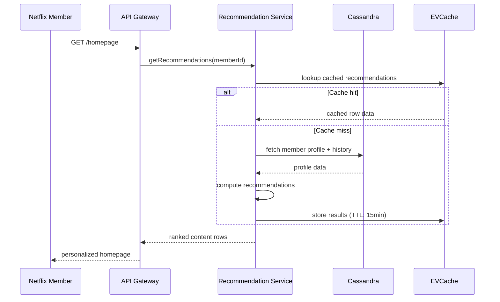
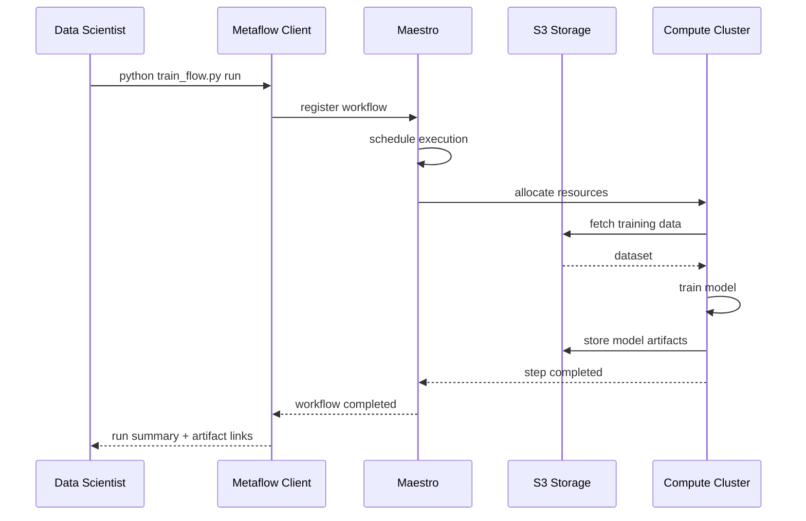
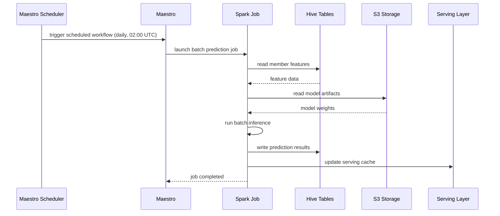
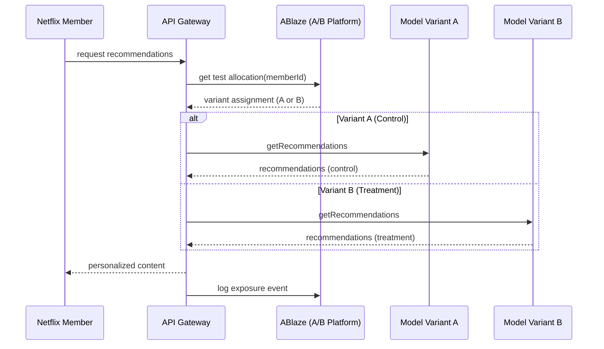

# arc42 Section 6: Runtime View

> **Standard arc42** -- no RAD-AI extensions applied

## Runtime Scenario 1: Content Recommendation Request

A Netflix member opens the app and the homepage is populated with personalized content rows.

## Runtime Scenario 2: Model Training Workflow

A data scientist triggers a Metaflow training workflow that Maestro orchestrates in production.

## Runtime Scenario 3: Batch Prediction Pipeline

A scheduled batch prediction pipeline generates recommendations for offline consumption.

## Runtime Scenario 4: A/B Test Traffic Allocation

A product team runs an A/B test comparing two recommendation model variants.

## Limitations

This standard runtime view shows request flows and interaction sequences but cannot represent several runtime behaviors critical to understanding the Netflix ML platform:

1. **Metaflow DAG dependencies invisible.** A Metaflow workflow is a directed acyclic graph where each step produces artifacts consumed by downstream steps. The `@trigger_on_finish` decorator (via Maestro) allows the completion of one workflow to automatically trigger another workflow. This event-triggered chaining is fundamental to how Netflix's ML pipelines operate -- for example, a feature engineering workflow completing triggers a model training workflow, which in turn triggers a model validation workflow. Standard sequence diagrams show linear request-response patterns but cannot express these DAG-shaped, event-driven execution flows.

2. **Maestro signal-based coordination absent.** Maestro's signal service enables a fundamentally different coordination pattern: one workflow step publishes an output signal (e.g., "new features available for region X"), and multiple other workflow steps that depend on that signal are unblocked simultaneously. The signal service tracks signal lineage, creating a dependency map between upstream and downstream workflows. This publisher-subscriber orchestration pattern cannot be represented in standard runtime views, which assume point-to-point communication.

3. **No streaming vs. batch distinction.** Runtime Scenario 1 (recommendation request) involves real-time feature lookups that depend on Flink streaming jobs having continuously updated the feature store. But the relationship between the streaming Flink job (which runs continuously, processing events as they arrive) and the point-in-time feature lookup (which happens when a member opens the app) cannot be expressed. The 15,000+ Flink jobs represent continuous, always-on processing, not request-response interactions.

4. **Training-serving interaction opaque.** The relationship between model training (Scenario 2) and model serving (Scenario 1) is not captured. When a new model version is trained, how does it get deployed? What canary analysis occurs? How does Kayenta evaluate the new model against the baseline? How does Spinnaker orchestrate the rollout? These operational runtime flows -- which are the most architecturally significant for an ML system -- have no standard representation.

5. **Feedback loops not representable.** Member interactions (views, clicks, skips) become training data for the next model version. This circular dependency between serving (producing member behavior data) and training (consuming that data) is fundamental to the system's behavior but cannot be shown in sequence diagrams, which are inherently acyclic.

6. **A/B testing only partially captured.** Scenario 4 shows the traffic allocation, but the complete A/B testing lifecycle -- experiment design, statistical analysis, winner declaration, model promotion -- involves workflows spanning weeks or months. The connection between experiment results and model updates is not expressible.
