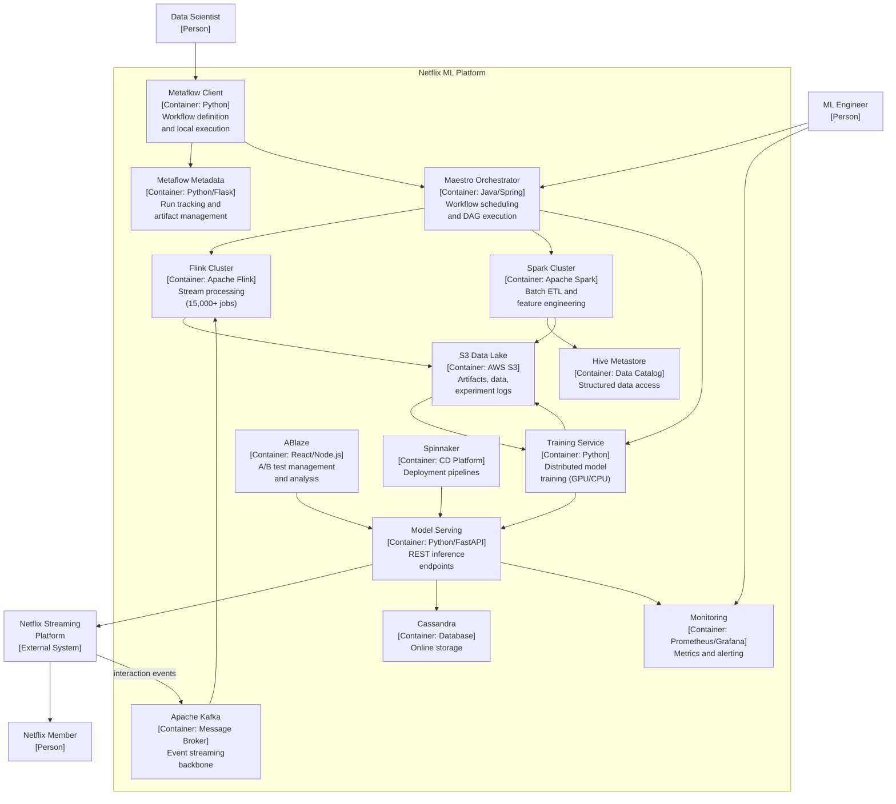

# C4 Container Diagram — Netflix ML Platform

> **Standard C4** Level 2 -- no RAD-AI extensions applied

## Container Inventory

| Container | Technology | Description |
|-----------|-----------|-------------|
| Metaflow Client | Python | Workflow definition SDK for data scientists |
| Metaflow Metadata Service | Python/Flask | Tracks workflow runs, step executions, artifacts |
| Maestro Orchestrator | Java/Spring | Workflow scheduling, DAG execution, signal management |
| Flink Processing Cluster | Apache Flink | Stream processing for real-time data transformation |
| Spark Processing Cluster | Apache Spark | Batch processing for ETL and feature engineering |
| Model Training Service | Python/PyTorch/TF | Distributed model training on GPU clusters |
| Model Serving (Metaflow Hosting) | Python/FastAPI | RESTful model inference endpoints |
| ABlaze Experimentation | React/Node.js | A/B test management, allocation, and analysis |
| Apache Kafka | Kafka | Event streaming and message brokering |
| S3 Data Lake | AWS S3 | Model artifacts, training data, experiment logs |
| Cassandra | Apache Cassandra | Online storage for member data and predictions |
| Hive Metastore | Apache Hive | Structured data catalog and query engine |
| Monitoring Stack | Prometheus/Grafana | Platform and application metrics, dashboards |
| Spinnaker | Spinnaker | Continuous delivery and deployment pipelines |

## Container Diagram

## Limitations

This standard C4 container diagram decomposes the ML Platform into its runtime containers, but critical ML-specific architectural information is lost:

1. **No AI-specific stereotypes.** All containers are generic "Application" or "Database" types. There is no way to distinguish an ML model serving container from a conventional web service, a feature store from a regular database, or a data pipeline from a generic batch job. The recommendation models, personalization models, search models, and content quality models -- the core AI components -- are not individually visible; they are hidden behind "Model Serving" and "Training Service."

2. **Feature store invisible.** Netflix's Amber feature store provides pre-computed features for online (low-latency, real-time) and offline (batch, historical) model consumption. It is architecturally distinct from both the data lake (S3) and the online store (Cassandra) but does not appear in this diagram. Feature stores are a defining component of modern ML architectures.

3. **No workflow dependency arrows.** Maestro orchestrates workflows with explicit step dependencies and cross-workflow signals, but the diagram shows only "Maestro -> Flink" and "Maestro -> Spark" generic arrows. The actual coordination patterns (time-triggered, signal-triggered, data-availability-triggered) are invisible.

4. **Model versions and performance metrics absent.** Each model serving endpoint serves a specific model version with known performance characteristics (latency, accuracy, throughput). Standard containers have no annotation for model version, training date, or key metrics.

5. **Data lineage not traceable.** The path from raw member interaction events through Kafka, Flink processing, feature computation, model training, and model serving -- with quality gates and schema validation at each stage -- is not visible. The arrows show connectivity but not data provenance.

6. **Monitoring lacks ML context.** The monitoring container appears as a generic observability tool. There is no way to express that it tracks ML-specific metrics (data drift, prediction drift, model accuracy, feature freshness) in addition to standard infrastructure metrics.

7. **No canary or shadow deployment visibility.** Spinnaker and Kayenta work together to perform canary deployments of new model versions, but this deployment strategy -- where a small percentage of traffic is routed to a candidate model while metrics are compared against the baseline -- is not expressible in standard C4.
