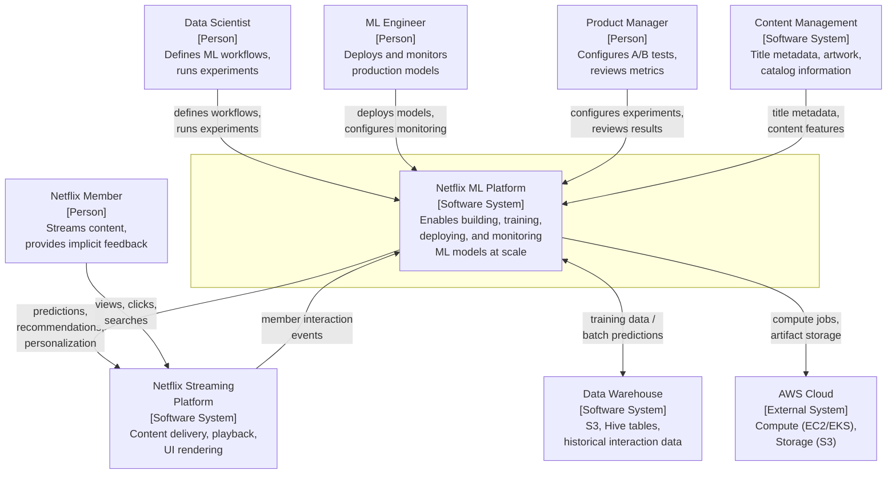

# C4 System Context Diagram — Netflix ML Platform

> **Standard C4** Level 1 -- no RAD-AI extensions applied

## System Context

## External Systems

| System | Relationship | Data Exchanged |
|--------|-------------|----------------|
| Netflix Streaming Platform | Bidirectional: ML Platform provides predictions; Streaming sends interaction events | Recommendations, personalization signals, search results (outbound); views, clicks, searches, dwell time (inbound) |
| Data Warehouse (S3/Hive) | Bidirectional: ML Platform reads training data, writes batch predictions | Historical interaction data, content features (inbound); batch prediction results, model metrics (outbound) |
| AWS Cloud Infrastructure | ML Platform consumes compute and storage | GPU/CPU instances for training, S3 for model artifacts and data, EKS for serving containers |
| Content Management System | Inbound: content metadata feeds ML features | Title metadata, genre taxonomy, artwork assets, content maturity ratings |

## Limitations

The standard C4 system context diagram represents the Netflix ML Platform as a single "Software System" box. This obscures the fundamental architectural distinction that makes ML platforms different from conventional software:

- The ML Platform contains both **deterministic components** (API gateway, data warehouse queries, scheduling logic) and **non-deterministic components** (recommendation models, personalization models, search ranking models) that produce different outputs for the same inputs depending on model version, training data, and real-time context.

- There is no way to indicate that the "predictions, recommendations, personalization" flowing to the Streaming Platform are **probabilistic outputs with confidence ranges**, not deterministic function results.

- The **feedback loop** (member interactions become training data for future model versions) is one of the most architecturally significant aspects of this system, but the standard C4 context diagram treats "member interaction events" as a simple input, not as a feedback mechanism that creates a closed loop between serving and training.

- The ML Platform's relationship with AWS is not merely "uses compute" -- it involves **elastic scaling** of GPU clusters for training, **model artifact versioning** in S3, and **container orchestration** for serving. These are qualitatively different from standard cloud resource consumption.
