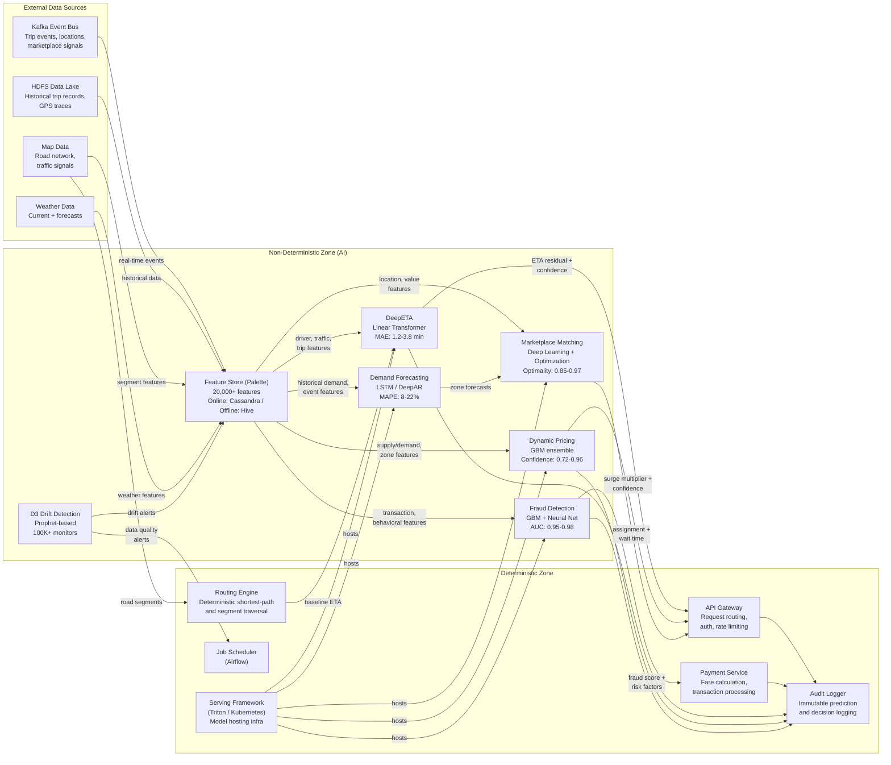

# AI Boundary Delineation

> **Extends:** arc42 S3 -- Context & Scope

## Purpose

Uber Michelangelo serves as the ML infrastructure for hundreds of use cases across Uber's product ecosystem. This section delineates the boundary between deterministic infrastructure components (API gateways, serving frameworks, data pipelines, logging) and non-deterministic ML components (trained models producing probabilistic outputs). The boundary is architecturally significant because downstream consumers, SRE teams, and product managers need to understand where predictions are deterministic and where they carry uncertainty, what confidence guarantees apply, and how the system degrades when ML components fail.

## AI Components Inventory

| Component | Type | Input Domain | Output Domain | Confidence Range | Fallback Strategy |
|-----------|------|-------------|---------------|-----------------|-------------------|
| DeepETA | Deep learning (Linear Transformer + routing engine residual) | Route segments, real-time traffic, driver features, trip type, time-of-day | Predicted travel time residual (minutes), added to routing engine baseline | MAE 1.2--3.8 min (varies by trip distance and region) | Routing engine raw estimate (no ML correction); deterministic but less accurate |
| Dynamic Pricing | Gradient boosted trees + demand forecasting | Supply/demand ratios, historical pricing, event signals, time-of-day, geographic zone | Surge multiplier (1.0x -- N.0x) with confidence interval | 0.72--0.96 (varies by zone density and event proximity) | Fixed surge tiers based on real-time supply/demand ratio thresholds; no ML, purely rule-based |
| Fraud Detection | Ensemble (GBM + neural network) | Transaction features, user behavioral signals, device fingerprint, trip anomaly features | Fraud probability score (0.0--1.0) with top risk factors | AUC 0.95--0.98 (varies by fraud type) | Rule-based fraud rules (velocity checks, amount thresholds); higher false-positive rate |
| Marketplace Matching | Deep learning + combinatorial optimization | Driver locations, rider requests, predicted trip values, ETA predictions | Driver-rider assignment with expected wait time | Assignment optimality: 0.85--0.97 (varies by supply density) | Nearest-driver dispatch; no value optimization |
| Demand Forecasting | Time-series models (LSTM / DeepAR) | Historical demand, weather, events, day-of-week, zone | Predicted ride requests per zone per time window (15-min granularity) | MAPE 8--22% (varies by zone and forecast horizon) | 4-week rolling average by zone, day-of-week, and time-of-day |

*Note: Confidence ranges are reasonable inferences based on publicly reported metrics. Exact production thresholds are internal to Uber.*

## System Boundary Diagram

## Failure Modes

| Component | Failure Condition | System Behavior | User Impact |
|-----------|------------------|-----------------|-------------|
| DeepETA | Model serving unavailable (Triton health check fails) | ETA prediction falls back to routing engine's raw segment-sum estimate. No ML correction applied. Predictions marked as "estimated" in downstream services. | ETAs slightly less accurate (routing engine MAE is roughly 30--50% higher than DeepETA). Users see trip time estimates but may notice reduced precision. |
| DeepETA | Feature Store (Cassandra) latency exceeds 10ms P95 | Inference uses cached or default features. Confidence score reduced proportionally to feature staleness. | Marginally less accurate ETAs. Transparent to users unless degradation is sustained. |
| Dynamic Pricing | Model unavailable or confidence < 0.72 | Pricing falls back to rule-based surge tiers: supply/demand ratio mapped to discrete surge levels (1.0x, 1.25x, 1.5x, 2.0x). Less granular than ML pricing. | Riders may see slightly different surge pricing (rounded to tier boundaries). Revenue impact is minor for short outages. |
| Dynamic Pricing | Demand Forecasting model unavailable | Pricing model loses forward-looking demand signal. Uses real-time supply/demand ratio only (no anticipatory pricing). | Pricing becomes reactive rather than predictive. May miss surge windows or over-surge during rapid demand changes. |
| Fraud Detection | Model unavailable | Falls back to rule-based fraud rules: velocity checks (>N transactions in T minutes), amount thresholds (>$X), known-bad device lists. Higher false-positive rate (~3x). | Legitimate transactions may be delayed for manual review. Fraud prevention coverage remains but with reduced precision. |
| Fraud Detection | Confidence score in ambiguous zone (0.4--0.6) | Transaction flagged for manual review by fraud operations team. Not auto-blocked. | Payment processing delayed by 1--5 minutes for flagged transactions. |
| Marketplace Matching | Model unavailable | Falls back to nearest-driver dispatch. No trip-value optimization or driver preference matching. | Riders may wait slightly longer. Drivers may receive less optimal assignments. System functional but less efficient. |
| Feature Store (Palette) | Online store (Cassandra) outage | All models lose access to online features simultaneously. Each model activates its individual fallback strategy. | Cascading degradation across all ML-powered features. Platform-wide reduction in prediction quality. |
| D3 Drift Detection | D3 monitoring unavailable | Data quality issues go undetected. Models continue serving on potentially drifted data without alerting. | Silent degradation risk. Time-to-detect for data quality issues reverts from ~2 days to manual discovery (potentially weeks). |

## External AI Dependencies

| Dependency | Type | Impact if Unavailable | Fallback |
|------------|------|----------------------|----------|
| Routing engine (deterministic) | Internal service | DeepETA cannot compute residual; raw routing unavailable | Pre-computed route cache (limited coverage, potentially stale) |
| Map data provider | External | Road network changes not reflected in features | Use cached map data (refreshed daily); flag affected routes |
| Weather data | External | Weather features stale or missing | Use last-known weather; reduce confidence for weather-sensitive models |
| Kafka event streams | Internal infrastructure | Real-time features cannot be updated | Models use last-known feature values; confidence penalty applied proportional to staleness |
| HDFS Data Lake | Internal infrastructure | No new training data; batch features cannot be refreshed | Models continue serving on current version; retraining blocked until restored |

## Feature Store Boundary Considerations

The Feature Store (Palette) straddles the deterministic/non-deterministic boundary. While the infrastructure (Cassandra read/write, Hive queries) is deterministic, the feature values themselves are derived from ML pipelines and statistical computations, making them non-deterministic in a broader sense. Specifically:

- **Batch-computed features** (e.g., "7-day average meal prep time" for UberEATS) are deterministic at query time but were computed from historical data that includes model-influenced behavior.
- **Near-real-time features** (e.g., "current driver supply in zone") are computed by Samza streaming jobs and reflect the current state, which itself is influenced by ML-driven marketplace decisions.
- **Feature freshness** varies from seconds (streaming features) to days (batch features). A stale feature is deterministic in the sense that it returns a fixed value, but the value may not reflect current reality.

RAD-AI treats the Feature Store as part of the non-deterministic zone because feature quality and freshness directly affect model output quality, and because features encode implicit assumptions about data distributions that may drift over time.
