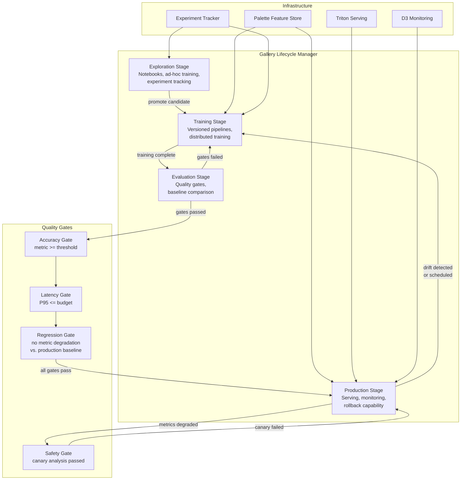
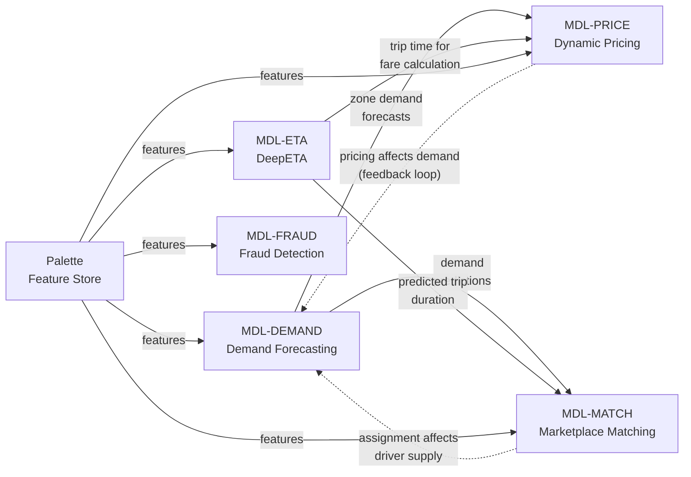

# Model Registry View

> **Extends:** arc42 S5 -- Building Block View

## Purpose

Michelangelo manages 5,000+ production models, each a first-class architectural building block with its own lifecycle, versioning, dependency graph, and performance baselines. Unlike conventional software components that evolve through code commits, these models evolve through retraining on new data, hyperparameter adjustments, architectural changes, and dataset version updates. This view captures the model inventory, Gallery's lifecycle management, Feature Store as a first-class building block, and the version-tracking infrastructure that standard arc42 S5 cannot represent.

## Model Inventory (Representative Production Models)

| Model ID | Name | Task | Framework | Serving Mode | Status |
|----------|------|------|-----------|-------------|--------|
| MDL-ETA | DeepETA | Travel time prediction (residual over routing engine) | PyTorch (Linear Transformer) via Triton | Online (real-time, P95 < 10ms) | Production |
| MDL-PRICE | Dynamic Pricing | Surge multiplier estimation | XGBoost / LightGBM | Online (real-time, P95 < 15ms) | Production |
| MDL-FRAUD | Fraud Detection | Payment fraud probability scoring | XGBoost + PyTorch (ensemble) | Online (real-time, P95 < 20ms) | Production |
| MDL-MATCH | Marketplace Matching | Driver-rider assignment optimization | PyTorch (deep learning) + custom solver | Online (real-time, P95 < 50ms) | Production |
| MDL-DEMAND | Demand Forecasting | Spatiotemporal ride demand prediction | PyTorch (LSTM / DeepAR) | Batch (15-min cycle) + online | Production |
| MDL-EATS-ETA | UberEATS Delivery Time | End-to-end delivery duration prediction | XGBoost (GBM) | Online (real-time) | Production |

*Note: Model IDs are illustrative. Uber uses internal identifiers. The models above are representative of publicly documented use cases.*

## Model Details

### DeepETA (MDL-ETA)

**Purpose:** Predicts the residual (correction factor) between the routing engine's deterministic segment-sum ETA and the actual observed travel time. This hybrid architecture combines the physical accuracy of map-based routing with the ability to capture non-linear patterns (traffic, weather, driver behavior) that the routing engine cannot model.

**Architecture:** Linear Transformer encoder that processes bucketized continuous features and embedded categorical features, with a decoder consisting of a fully connected neural network and segment bias adjustment layer. The linear transformer omits the full attention matrix, using a kernel approach to achieve low-latency inference.

**Versioning (inferred lifecycle based on public information):**

| Version | Description | Key Change | Performance |
|---------|-------------|------------|-------------|
| v1.x | XGBoost baseline | Gradient boosted trees predicting ETA directly | Baseline MAE |
| v2.x | DeepETA initial | Transformer architecture replacing XGBoost; residual prediction paradigm | MAE improvement over XGBoost |
| v3.x | Linear Transformer | Latency optimization via kernel-based attention approximation | Comparable accuracy, significantly reduced latency |
| v3.x+ | Segment bias layer | Added decoder component for trip-type-specific calibration | Further MAE improvement via trip-type segmentation |

**Hyperparameters (documented):**

| Parameter | Value / Approach | Rationale |
|-----------|-----------------|-----------|
| Feature processing | Bucketized continuous features, embedded categoricals | Bucketization improved accuracy vs. raw continuous input (documented in Uber blog) |
| Attention mechanism | Linear transformer (kernel approximation) | Full attention quadratic cost unacceptable for latency budget |
| Decoder | Fully connected network + segment bias adjustment | Segment bias layer captures systematic trip-type differences |
| Calibration features | Trip type flags (delivery drop-off, ride-sharing pickup, etc.) | Different trip populations have different ETA distributions |

**Training Data Lineage:**

| Dataset | Source | Description | Refresh Cadence |
|---------|--------|-------------|----------------|
| Trip completion records | HDFS Data Lake | Actual trip durations with timestamps, routes, and conditions | Continuous ingestion; training windows vary |
| Route segments | Map data provider | Road network with segment-level speed estimates | Daily refresh |
| Real-time traffic features | Kafka via Palette | Current traffic speeds, congestion indices | Real-time (streaming) |
| Historical driver features | Palette (offline) | Driver-specific trip history, acceptance patterns | Daily refresh |
| Weather features | External API via Palette | Current conditions and forecasts | 15-minute refresh |

**Dependencies:**

- Upstream: Routing engine (provides baseline ETA for residual computation), Palette Feature Store (driver, traffic, route, weather features), Map data
- Downstream: Rides app (displayed ETA), UberEATS (delivery time estimates), Marketplace Matching (predicted trip duration as input), Driver app (trip preview)

**Performance Baselines:**

| Metric | Value | Alert Threshold |
|--------|-------|----------------|
| MAE (overall) | ~1.5--2.5 min (varies by market) | Varies by market; alert on >15% degradation from baseline |
| P95 inference latency | < 10ms (with Cassandra feature lookup) | > 15ms |
| Throughput | Millions of predictions/sec | Per-market thresholds |

---

### Dynamic Pricing (MDL-PRICE)

**Purpose:** Estimates optimal surge multipliers that balance rider demand with driver supply across geographic zones. The model predicts the price point that maximizes market efficiency while maintaining rider affordability and driver earnings.

**Architecture:** Gradient boosted trees (XGBoost / LightGBM) trained on historical supply-demand outcomes with price elasticity features.

**Training Data Lineage:**

| Dataset | Source | Description | Refresh Cadence |
|---------|--------|-------------|----------------|
| Historical pricing outcomes | HDFS | Trip completions with applied surge, acceptance rates, wait times | Continuous |
| Supply-demand ratios | Palette (real-time) | Driver availability and open requests per zone | Real-time streaming |
| Event calendar | External + internal | Concerts, sports events, holidays, weather events | Daily |
| Zone demand forecasts | MDL-DEMAND output | Forward-looking demand predictions per zone | 15-minute batch cycle |

**Dependencies:**

- Upstream: MDL-DEMAND (demand forecasts as input features), Palette Feature Store, real-time marketplace signals
- Downstream: Rides fare estimation, driver incentive system, marketplace equilibrium

---

## Gallery Lifecycle Management

Gallery is Uber's model lifecycle management system, documented in the EDBT 2020 paper. It manages models through four distinct stages with automated orchestration.

### Lifecycle Stages

| Stage | Description | Entry Criteria | Exit Criteria | Automation |
|-------|-------------|---------------|---------------|------------|
| **Exploration** | Data scientists experiment with model architectures, features, and hyperparameters using notebooks and ad-hoc training | Project creation | Manual promotion when promising results identified | Training infrastructure provisioned; experiment tracking |
| **Training** | Formal training pipeline with versioned data, reproducible configuration, and automated evaluation | Experiment shows promise; training pipeline configured | Model passes automated evaluation gates | Distributed training orchestration; hyperparameter search |
| **Evaluation** | Automated quality gates and manual review against production baselines | Training pipeline produces candidate model | All quality gates pass; manual approval for high-risk models | Metric comparison, regression testing, fairness checks |
| **Production** | Model deployed to serving infrastructure with monitoring and rollback capability | Evaluation gates passed; deployment approved | Model superseded by newer version or manually retired | Canary deployment, A/B testing, automated rollback |

### Rule-Based Deployment Automation

Gallery supports rule-based automated deployment using declarative conditions. Examples:

```
WHEN metrics[mae] <= 5.0 AND metrics[latency_p95] <= 10
  THEN promote TO production
  WITH strategy = canary, traffic_pct = 5, duration = 24h

WHEN metrics[mae] > baseline * 1.15
  THEN rollback TO previous_version
  WITH notification = [team_channel, pagerduty]
```

*Note: The syntax above is illustrative. The actual Gallery rule syntax was described conceptually in the EDBT 2020 paper; exact DSL syntax is internal to Uber.*

### Gallery Architecture Diagram



## Feature Store (Palette) as First-Class Building Block

In standard arc42, the Feature Store appears as a generic database. RAD-AI elevates it to a first-class building block because it is architecturally distinct from a regular data store.

### Feature Store Architecture

| Property | Value |
|----------|-------|
| Total features | 20,000+ shared features |
| Online store | Cassandra (P95 < 5ms lookup) |
| Offline store | Hive / HDFS (batch access for training) |
| Streaming pipeline | Samza jobs consuming from Kafka, writing to Cassandra |
| Batch pipeline | Spark / Hive SQL jobs, scheduled via Airflow |
| Feature DSL | Scala-based DSL for feature transformation (identical in training and serving) |
| Consistency guarantee | Feature Processing DSL ensures identical transformations in training and serving pipelines |

### Feature Categories

| Category | Example Features | Count (approx.) | Refresh Rate | Consumers |
|----------|-----------------|-----------------|-------------|-----------|
| Trip features | trip_distance, route_segment_count, trip_type | ~2,000 | Real-time | MDL-ETA, MDL-PRICE, MDL-MATCH |
| Driver features | driver_acceptance_rate_7d, avg_trip_rating, years_active | ~3,000 | Hourly batch | MDL-MATCH, MDL-FRAUD |
| Rider features | rider_trip_count, preferred_payment_method, avg_rating | ~2,500 | Hourly batch | MDL-FRAUD, MDL-MATCH |
| Geographic features | zone_demand_current, zone_supply_current, zone_congestion_idx | ~4,000 | Real-time (streaming) | MDL-PRICE, MDL-DEMAND, MDL-MATCH |
| Temporal features | hour_of_day, day_of_week, is_holiday, minutes_to_event | ~500 | Real-time (computed) | All models |
| Historical aggregates | restaurant_avg_prep_time_7d, zone_avg_surge_7d | ~5,000 | Daily batch | MDL-EATS-ETA, MDL-PRICE |
| External features | weather_temp, weather_precip, traffic_speed_segment | ~3,000 | 15-min (weather), real-time (traffic) | MDL-ETA, MDL-DEMAND |

### Feature Serving Groups

*Based on Palette Meta Store architecture documented by Uber:*

| Serving Group | SLA (Latency) | SLA (Availability) | Storage Backend | Features Served |
|---------------|--------------|---------------------|----------------|----------------|
| ETA Critical | P95 < 3ms | 99.99% | Dedicated Cassandra cluster | Trip, traffic, driver features for MDL-ETA |
| Marketplace | P95 < 5ms | 99.95% | Shared Cassandra cluster | Supply/demand, zone, driver features |
| Safety | P95 < 5ms | 99.99% | Dedicated Cassandra cluster | Transaction, behavioral, device features for MDL-FRAUD |
| Batch Analytics | N/A (batch) | 99.9% | Hive / HDFS | All offline features for training and batch scoring |

## Model Interdependencies



This dependency graph is invisible in standard arc42 S5. The feedback loops (dashed lines) represent indirect dependencies where model outputs influence future training data for other models, creating potential for cascading drift.

## Integration with Model Registry Tools

| Tool / System | Purpose | Role in Michelangelo |
|---------------|---------|---------------------|
| Gallery | Model lifecycle management (4-stage promotion) | Core lifecycle orchestration; rule-based deployment automation |
| Michelangelo experiment tracker | Experiment tracking, hyperparameter logging, metric comparison | Records all training runs with full configuration and results |
| Model Excellence Score (MES) | Quality scoring across ML lifecycle dimensions | Measures offline eval coverage, shadow deployment, test coverage, monitoring |
| Palette Meta Store | Feature metadata, lineage, and serving group management | Tracks feature definitions, ownership, freshness SLAs, downstream consumers |
| D3 | Data quality monitoring for model inputs | Monitors 100,000+ data quality indicators; alerts on feature drift |

All models are registered in Gallery with their complete training lineage, hyperparameters, evaluation metrics, and deployment history. Model promotion from evaluation to production requires passing automated quality gates (accuracy, latency, regression testing) and, for high-criticality models, explicit approval from model owners and platform team leads.
