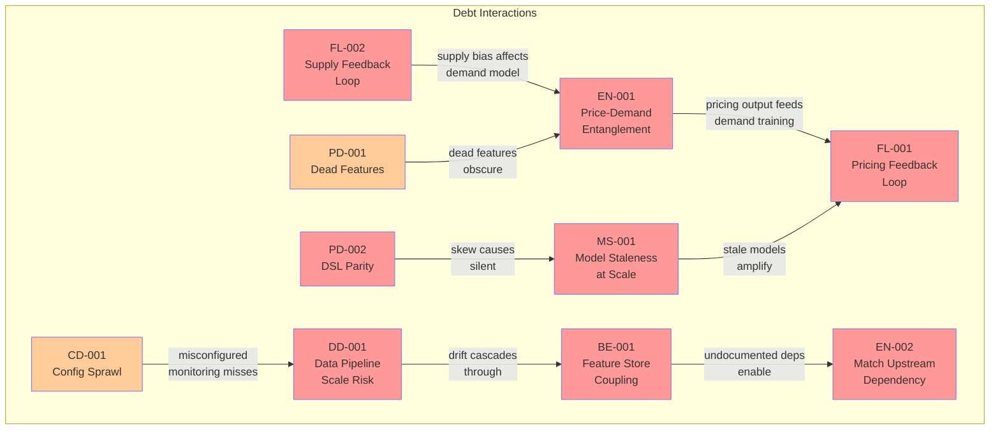

# AI Debt Register

> **Extends:** arc42 S11 -- Risks & Technical Debt
>
> **System:** Uber Michelangelo Platform
>
> **Last Updated:** 2026-02-17

## Purpose

Structured tracking of ML-specific technical debt categories in the Michelangelo platform, based on Sculley et al.'s taxonomy of hidden technical debt in ML systems. Michelangelo's 5,000+ production models, shared Feature Store (20,000+ features), and interconnected model ecosystem create debt patterns that traditional technical debt tracking misses: data dependencies, feedback loops, feature entanglement, and configuration complexity at unprecedented scale.

*Note: The debt items below are reasonable inferences based on Uber's publicly documented architecture and known challenges in large-scale ML platforms. Specific internal prioritization and mitigation status are not publicly documented.*

## Debt Categories

### Boundary Erosion

*When the boundaries between ML components and the rest of the system become unclear, making changes risky.*

| ID | Description | Severity | Affected Components | Mitigation Approach |
|----|-------------|----------|--------------------|--------------------|
| BE-001 | Feature Store serves as an implicit coupling layer between all models. Any model team can read any feature, creating undocumented dependencies. When a feature's computation logic changes (e.g., aggregation window from 15-min to 5-min), all consuming models are affected, but the Feature Store does not enforce explicit dependency declarations. Palette Meta Store was built to address this, but adoption across all 400+ projects varies. | High | All models, Palette Feature Store | Palette Meta Store tracks feature ownership and consumers; feature versioning to isolate changes; impact analysis tooling before feature modifications |
| BE-002 | DeepETA's residual prediction design creates a tight coupling between the routing engine (deterministic) and the ML model (non-deterministic). Changes to the routing engine's segment traversal algorithm change the baseline ETA, which changes the residual the ML model needs to predict. This coupling means routing engine updates require DeepETA retraining, but the dependency is not formally documented in the routing team's change management process. | Medium | MDL-ETA, Routing Engine | Joint testing protocol between routing and ETA teams; automated regression tests that detect routing engine changes and trigger DeepETA evaluation; documented dependency in Gallery model metadata |

### Entanglement

*When changing one model's input features or behavior unexpectedly affects other models (CACE: Changing Anything Changes Everything).*

| ID | Description | Severity | Affected Components | Mitigation Approach |
|----|-------------|----------|--------------------|--------------------|
| EN-001 | Dynamic Pricing (MDL-PRICE) and Demand Forecasting (MDL-DEMAND) share features through Palette (zone_demand_current, zone_supply_demand_ratio, time_of_day features). MDL-PRICE also consumes MDL-DEMAND's output as an input feature. When MDL-DEMAND is retrained and its output distribution shifts (e.g., higher variance in demand predictions), MDL-PRICE receives different input signals without any notification. This cascading effect can cause pricing anomalies until MDL-PRICE is also retrained. | High | MDL-PRICE, MDL-DEMAND, Palette | Feature versioning in Palette: MDL-PRICE pins to a specific MDL-DEMAND output version. Automated impact analysis: MDL-DEMAND retraining triggers offline evaluation of MDL-PRICE on new outputs before deployment. |
| EN-002 | Marketplace Matching (MDL-MATCH) depends on both DeepETA (MDL-ETA) predictions and Demand Forecasting (MDL-DEMAND) predictions as input features. A change in either upstream model alters MDL-MATCH's input distribution. With the scale of Michelangelo (5,000+ models), undocumented model-to-model dependencies likely exist beyond the core models, creating a web of entanglement that is difficult to map completely. | High | MDL-MATCH, MDL-ETA, MDL-DEMAND | Model dependency graph maintained in Gallery; automated downstream impact assessment before upstream model deployment; staged rollouts that observe downstream model metrics |
| EN-003 | Multiple teams independently create features with similar semantics but slightly different computation logic (e.g., "driver_recent_acceptance_rate" computed over 7 days by one team and 14 days by another). When models trained on one variant are inadvertently served features from the other variant, prediction quality silently degrades. Palette's 20,000+ features include an unknown number of such near-duplicates. | Medium | All models, Palette | Palette Meta Store deduplication tooling; feature similarity detection during feature registration; standardized feature naming conventions; periodic feature catalog audits |

### Hidden Feedback Loops

*When model outputs indirectly influence future training data, creating self-reinforcing biases.*

| ID | Description | Severity | Affected Components | Mitigation Approach |
|----|-------------|----------|--------------------|--------------------|
| FL-001 | Dynamic Pricing creates a direct feedback loop: surge pricing suppresses rider demand, which reduces observed demand in training data, which causes MDL-DEMAND to predict lower future demand, which reduces surge, which increases demand, creating an oscillation. The equilibrium may not reflect true latent demand but rather the demand-at-price-point. Over time, the pricing model may converge on a sub-optimal equilibrium where certain zones are systematically under-served because the model learned from its own demand-suppression effect. | High | MDL-PRICE, MDL-DEMAND | Price experimentation: randomized holdout regions/time-windows with fixed pricing to observe unmodified demand. Causal demand estimation: instrumental variable approaches to estimate price elasticity separately from demand forecasting. Counterfactual logging: record what the demand would have been at different price points for offline analysis. |
| FL-002 | Marketplace Matching decisions affect driver repositioning, which affects observed supply distribution, which feeds back into MDL-DEMAND and MDL-MATCH training data. If the matching model consistently routes drivers to high-value zones, the observed supply in those zones increases, and the model learns that those zones have high supply, potentially reinforcing the concentration. Lower-value zones may see a supply death spiral: fewer drivers -> longer wait times -> fewer trips -> confirming "low demand" in training data. | High | MDL-MATCH, MDL-DEMAND | Driver incentive experimentation: randomized incentive allocation to observe organic driver repositioning. Supply-side holdout: small fraction of driver assignments use random allocation to maintain uncontaminated supply signal. Zone-level supply equity monitoring with alerts on sustained imbalance. |
| FL-003 | Fraud Detection's actions (blocking fraudulent transactions) remove fraud patterns from future data. When MDL-FRAUD is retrained, it learns from data where successful interventions prevented fraud from materializing. The model may become less sensitive to patterns it previously caught, because those patterns now appear "safe" in the training data (the fraud was prevented). This is a form of survivor bias that gradually erodes detection sensitivity. | Medium | MDL-FRAUD | Maintain "pre-intervention" labels: label transactions with what would have happened without intervention. Synthetic fraud generation: augment training data with realistic fraud examples for patterns that the model has previously suppressed. Periodic "pen testing": controlled fraud simulation to validate detection capability on known patterns. |

### Data Dependency Debt

*Unstable, underutilized, or poorly understood data dependencies.*

| ID | Description | Severity | Affected Components | Mitigation Approach |
|----|-------------|----------|--------------------|--------------------|
| DD-001 | At Michelangelo's scale, hundreds of data pipelines feed into the Feature Store. Upstream data schema changes, pipeline failures, or subtle data quality regressions can cascade to affect multiple models simultaneously. D3 monitors 100,000+ data quality indicators, but the sheer scale means alert fatigue is a risk, and low-frequency but high-impact data quality issues may be lost in the noise. Before D3, time-to-detect for data quality issues averaged 45+ days. D3 reduced this to ~2 days, but 2-day detection for a critical feature serving 15M predictions/sec still means billions of potentially affected predictions. | High | All models, D3, Palette | D3 continuous monitoring (100,000+ monitors). Tiered alerting: critical features (serving real-time models) have tighter thresholds and faster escalation than batch features. Feature-level SLAs with data pipeline teams. Automated circuit breakers that degrade to fallback when feature quality drops. |
| DD-002 | External data dependencies (map data, weather APIs) are outside Uber's control. Map data updates can introduce breaking changes (road segment ID renumbering, topology changes). Weather API schema changes have historically broken ingestion pipelines. These dependencies are particularly dangerous because they affect feature computation for all models that consume geographic or weather features. | Medium | MDL-ETA, MDL-DEMAND, Palette | Schema validation on all external data ingestion. Secondary providers for critical external data. Cached fallback values for external data outages. Change detection and alerting on external data schema. |
| DD-003 | Some features in Palette are derived from other features in a multi-step computation chain (e.g., zone_demand_anomaly_score depends on zone_demand_current and zone_demand_rolling_avg_7d). Changes to upstream features cascade through the computation graph. The Feature Store does not currently enforce a DAG of feature dependencies, so circular dependencies are theoretically possible and would be difficult to detect. | Medium | Palette, consuming models | Feature lineage tracking in Palette Meta Store. DAG validation for feature computation pipelines. Automated impact analysis for feature definition changes. |

### Pipeline Debt

*Complexity and fragility in data pipelines, feature engineering, and preprocessing logic.*

| ID | Description | Severity | Affected Components | Mitigation Approach |
|----|-------------|----------|--------------------|--------------------|
| PD-001 | With 20,000+ features in Palette, an unknown fraction are "dead features" no longer consumed by any active model. These dead features still consume compute resources in feature pipelines (Samza streaming jobs, Spark batch jobs) and storage in Cassandra and Hive. At Uber's scale, even 10% dead features could represent significant wasted compute. | Medium | Palette, feature pipelines | Automated feature usage auditing: cross-reference active model configurations against Palette feature catalog. Deprecation workflow: dead features flagged, 30-day grace period, then decommissioned. Feature cost attribution: charge feature compute costs to consuming model teams (no consumer = flagged for removal). |
| PD-002 | The Feature Processing DSL (Scala-based) is critical for preventing training-serving skew. However, the DSL must be maintained in sync across two execution environments: Spark (offline, batch training) and Samza (online, streaming serving). Updates to the DSL that work correctly in one environment may behave differently in the other due to numerical precision, ordering, or timing differences. Testing DSL parity across both environments is an ongoing challenge. | High | All models, Palette, feature pipelines | DSL parity tests: automated comparison of feature values computed by Spark vs. Samza on identical input data. Feature reconciliation jobs: daily comparison of online and offline feature values for sampled entities. Alerting on divergence above configurable threshold. |
| PD-003 | At 20,000+ monthly training jobs, the training pipeline infrastructure (Spark clusters, GPU clusters, Airflow DAGs) accumulates configuration drift. Training jobs created months ago may reference deprecated data sources, outdated feature versions, or suboptimal compute configurations. Without active governance, old training pipelines become technical debt that is expensive to audit and risky to modify. | Medium | Training pipelines, Gallery | Gallery metadata enforcement: training jobs must declare all dependencies. Periodic pipeline health audits. Automated detection of training jobs using deprecated features or data sources. Training job expiration: jobs not run in 90 days require manual re-validation before re-execution. |

### Configuration Debt

*Sprawling configuration (hyperparameters, feature flags, thresholds) that is hard to manage, test, and audit.*

| ID | Description | Severity | Affected Components | Mitigation Approach |
|----|-------------|----------|--------------------|--------------------|
| CD-001 | With 5,000+ production models, the total configuration surface area (hyperparameters, feature selections, thresholds, deployment parameters) is enormous. Configuration is spread across model configs (YAML), Gallery metadata, Palette feature group definitions, serving infrastructure configuration, and monitoring threshold settings. There is no single configuration management system that spans the entire lifecycle from training configuration to production monitoring thresholds. | Medium | All models, Gallery, Palette, serving infrastructure | Model Excellence Score (MES) includes configuration coverage as a quality dimension. Centralized config management for critical model parameters. Automated config drift detection between training and serving environments. |
| CD-002 | D3's anomaly detection thresholds (Prophet-based) are automatically calibrated per feature/dataset, but the meta-parameters governing D3's sensitivity (how tight thresholds should be, how many consecutive violations trigger an alert) are manually configured per dataset tier. With 300+ Tier 1 datasets and 100,000+ monitors, the D3 configuration surface is itself a source of potential misconfiguration. An overly loose threshold on a critical feature could allow data quality issues to pass undetected. | Medium | D3, all models | Tiered default configurations based on dataset criticality. Automated threshold sensitivity analysis. Alert on monitors that have not triggered in an anomalously long period (potential misconfiguration indicator). |

### Model Staleness

*Models that have not been retrained despite data distribution changes.*

| ID | Description | Severity | Affected Components | Mitigation Approach |
|----|-------------|----------|--------------------|--------------------|
| MS-001 | With 5,000+ production models, model freshness governance at scale is a significant challenge. Not all models have well-defined retraining schedules. Some models may serve predictions for months without retraining, silently degrading as data distributions shift. D3 detects data drift at the feature level, but connecting feature drift to specific model degradation requires model-level monitoring that may not be configured for all 5,000+ models. | High | Long-running production models without active monitoring | Model Excellence Score (MES) includes freshness as a quality dimension. Automated alerts for models not retrained within configurable staleness thresholds. D3 feature drift alerts correlated with downstream model performance metrics. |
| MS-002 | DeepETA is particularly sensitive to staleness during major events: new road construction, highway closures, transit system changes. These events change the relationship between road segments and travel time in ways that the routing engine captures (through map updates) but DeepETA's learned residual does not (requires retraining). The gap between map update propagation (hours) and model retraining (days) creates a window of degraded ETA accuracy. | Medium | MDL-ETA | Map update -> ETA evaluation pipeline: automated accuracy assessment when map data changes in any market. Expedited retraining trigger linked to map update events. Increased confidence penalty for affected routes during retraining window. |

## Debt Summary Dashboard

| Category | Items | Severity Distribution |
|----------|-------|----------------------|
| Boundary Erosion | 2 | High: 1, Medium: 1 |
| Entanglement | 3 | High: 2, Medium: 1 |
| Hidden Feedback Loops | 3 | High: 2, Medium: 1 |
| Data Dependency Debt | 3 | High: 1, Medium: 2 |
| Pipeline Debt | 3 | High: 1, Medium: 2 |
| Configuration Debt | 2 | Medium: 2 |
| Model Staleness | 2 | High: 1, Medium: 1 |
| **Total** | **18** | **High: 8, Medium: 10** |

## Debt Dependency Map

## Review Cadence

- **Debt review frequency:** Addressed through Model Excellence Score (MES) framework, which continuously evaluates quality dimensions including staleness, monitoring coverage, and deployment safety
- **Escalation:** Models with MES below threshold cannot deploy new versions until debt items are addressed
- **Platform-level debt:** Reviewed by ML Platform team during quarterly planning; high-severity items tracked as platform OKRs
