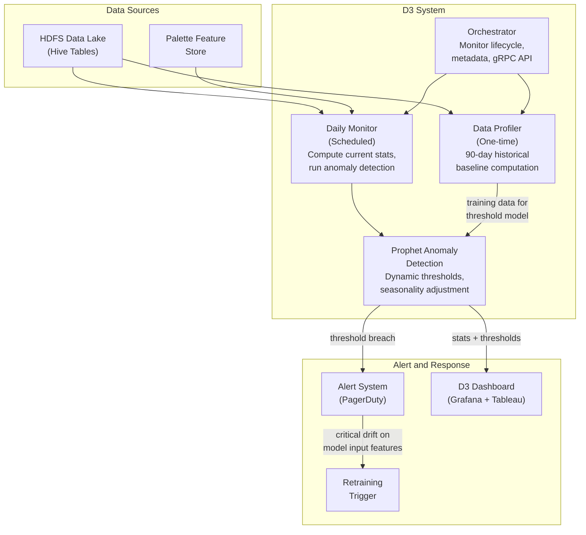
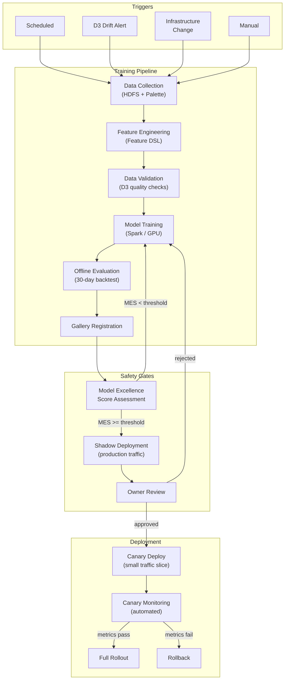
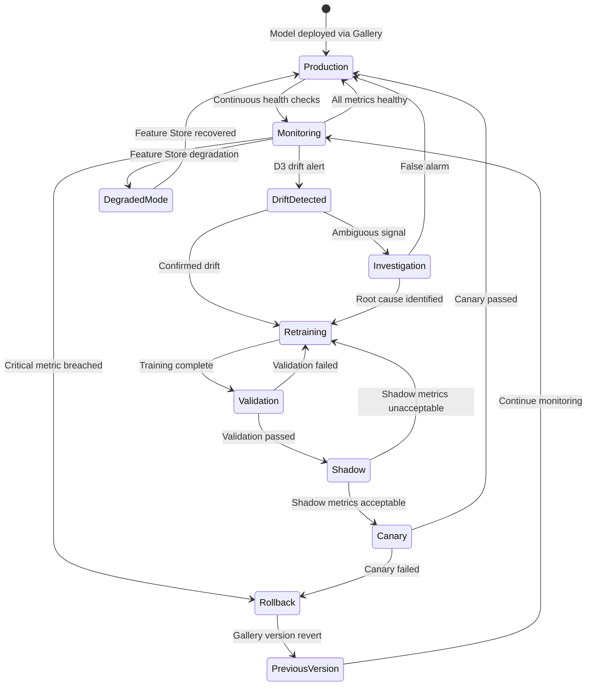

# Operational AI View

> **New section** -- extends arc42 beyond S11
>
> **System:** Uber Michelangelo Platform
>
> **Last Updated:** 2026-02-17

## Purpose

Document the continuous operational concerns unique to Michelangelo's 5,000+ production AI models that evolve post-deployment: D3 drift monitoring, Gallery deployment pipelines, Model Excellence Score framework, canary deployments, shadow testing, and rollback procedures. This section covers the operational lifecycle that no existing arc42 section addresses: how models are kept healthy, updated, and safe in production at Uber's scale.

## Monitoring Architecture

### D3 Drift Detection System

D3 (Dataset Drift Detector) is Uber's automated system for measuring and monitoring column-level data quality. It serves as the primary data quality assurance system for all Michelangelo pipelines.

**Architecture:**

| Component | Role | Technology |
|-----------|------|------------|
| Compute Layer | Executes data profiling jobs (historical baseline + daily monitoring) | Spark jobs on Uber's data platform |
| Anomaly Detection | Prophet-based nonlinear regression for dynamic threshold generation | Facebook Prophet |
| Orchestrator | Manages monitor lifecycle, metadata, gRPC endpoints, schema change synchronization | Custom service |
| Alert System | Integrates with monitoring stack for threshold breach notification | PagerDuty, Grafana dashboards |

**D3 Monitor Types:**

| Monitor Type | Description | Application |
|-------------|-------------|-------------|
| Null Percentage | Tracks drift in null/missing values per column | Detects pipeline failures that produce incomplete data |
| Percentile Checks | P1, P25, P50, P75, P99 for numeric columns | Detects distribution shifts in feature values |
| Mean / Median / StdDev | Statistical summary measures | Detects gradual drift in central tendency and spread |
| Categorical Distribution | Enum value drift detection | Detects changes in categorical feature distributions |
| Foreign Key Tests | Cross-dataset entity count consistency | Detects join failures or data source inconsistencies |
| Boolean Metrics | False/zero percentage checks | Detects flag columns drifting from expected rates |

**D3 Performance (documented):**

| Metric | Value |
|--------|-------|
| Tier 1 datasets monitored | 300+ |
| Total monitors deployed | 100,000+ |
| Time-to-detect improvement | 20x+ (from 45+ days to ~2 days average) |
| Detection accuracy (fact tables) | 95.23% |
| Incident coverage (column-level drift) | ~50% of analyzed incidents |
| Compute cost optimization | 100x (from $1.50 to $0.01 per dataset via query optimization) |
| Revenue impact of drift detection | Tens of millions of dollars in prevented loss |

**D3 Architecture Diagram:**

### Model Health Metrics

| Model | Metric | Baseline | Warning | Critical | Dashboard |
|-------|--------|----------|---------|----------|-----------|
| MDL-ETA | MAE (overall) | ~2 min (market-dependent) | >15% degradation from baseline | >25% degradation | Michelangelo Model Health |
| MDL-ETA | P95 inference latency | < 10ms | > 12ms | > 20ms | Michelangelo Serving |
| MDL-ETA | Throughput | Millions req/sec | < 80% of expected | < 50% of expected | Michelangelo Serving |
| MDL-PRICE | Pricing accuracy (predicted vs. actual market clearing) | Market-specific baseline | >10% degradation | >20% degradation | Marketplace Health |
| MDL-PRICE | Surge distribution (expected zone coverage) | Market-specific | Anomalous concentration | Widespread anomaly | Marketplace Health |
| MDL-FRAUD | AUC | 0.95--0.98 | < 0.93 | < 0.90 | Safety Dashboard |
| MDL-FRAUD | False positive rate | Market-specific | >2x baseline | >3x baseline | Safety Dashboard |
| MDL-DEMAND | MAPE (overall) | 8--15% (zone-dependent) | >20% | >30% | Forecasting Dashboard |
| MDL-DEMAND | Zone coverage | 100% of active zones | < 95% | < 85% | Forecasting Dashboard |
| MDL-MATCH | Wait time P75 | Market-specific | >20% degradation | >40% degradation | Marketplace Health |
| All models | Feature Store freshness | Per-feature SLA | > 2x SLA | > 5x SLA | Palette Health |

## Retraining Pipeline

### Trigger Conditions

| Trigger | Type | Condition | Applicable Models | Action |
|---------|------|-----------|-------------------|--------|
| Scheduled retrain | Scheduled | Periodic (frequency varies by model criticality: daily, weekly, monthly) | All models with defined retraining schedule | Full retrain with latest data window |
| D3 data drift trigger | Event-driven | D3 detects PSI > 0.2 sustained for 2+ consecutive daily checks on features consumed by the model | All models consuming drifted features | Investigation -> targeted retrain if drift is genuine (not pipeline bug) |
| Concept drift trigger | Event-driven | Model accuracy metric degrades beyond warning threshold for 3+ consecutive evaluations | Model-specific | Full retrain; canary deployment mandatory |
| Infrastructure change | Event-driven | Map data update (for MDL-ETA); marketplace rule change (for MDL-PRICE, MDL-MATCH) | Affected models | Expedited retrain with updated data; evaluation against pre-change baseline |
| Manual trigger | Manual | ML team initiates via Gallery or Airflow | Any model | Full or incremental retrain as specified; standard validation gates apply |

### Gallery Deployment Pipeline

| Step | Description | Automated? | Duration | Approval |
|------|-------------|-----------|----------|----------|
| 1. Data collection | Assemble training data from HDFS + offline features from Palette | Yes | Minutes to hours (data volume dependent) | No |
| 2. Feature engineering | Compute features via Feature DSL; validate against training baseline | Yes | Minutes to hours | No |
| 3. Data validation | D3-powered data quality checks on training data | Yes | Minutes | No (blocks on failure) |
| 4. Training | Distributed training on Spark/GPU clusters (Horovod, Ray) | Yes | Minutes to hours (model dependent) | No |
| 5. Offline evaluation | Backtesting against recent 30 days of production data | Yes | Minutes | No (blocks on failure) |
| 6. Model registration | Register candidate in Gallery with full lineage metadata | Yes | Seconds | No |
| 7. MES assessment | Compute Model Excellence Score across 4 safety dimensions | Yes | Minutes | No (blocks if MES below threshold) |
| 8. Shadow deployment | Run candidate in parallel on production traffic; compare outputs (75%+ of critical models) | Yes (deployment); monitored | Hours to days | No |
| 9. Deployment approval | Model owner reviews MES, offline evaluation, and shadow results | No | Hours (SLA) | Yes -- model owner |
| 10. Canary deployment | Deploy to small traffic slice; monitor for degradation | Yes (deployment); automated monitoring | Hours to days | No (auto-promotes if metrics pass) |
| 11. Full rollout | Promote to 100% traffic; archive previous version | Yes | Minutes | No (auto on canary success) |

### Deployment Pipeline Diagram

## Model Excellence Score (MES)

Uber's MES framework measures deployment safety across four dimensions, serving as a gate for production deployment.

### MES Dimensions

| Dimension | Description | Measurement | Target |
|-----------|-------------|-------------|--------|
| Offline Evaluation Coverage | Recent backtesting against production data | Fraction of evaluation metrics computed in last 30 days | 100% for critical online models |
| Shadow Deployment Coverage | Model tested on live production traffic before deployment | Whether shadow deployment was conducted (and duration) | Mandatory for critical models; 75%+ adoption by mid-2025 |
| Unit Test Coverage | Feature pipeline tests, inference tests, integration tests | Code coverage + test suite pass rate | Minimum threshold per model tier |
| Performance Monitoring Coverage | Drift detection, accuracy tracking, latency monitoring configured and active | Fraction of key metrics with active D3/Grafana monitors | 100% for Tier 1 models |

### Safety Level Classification (documented)

| Safety Level | Requirements | Model Coverage Target |
|-------------|-------------|----------------------|
| Basic | Offline evaluation exists | All production models |
| Intermediate | Offline eval + shadow deployment + monitoring configured | 75%+ of critical online models (mid-2025 target) |
| Advanced | All four MES dimensions fully covered; automated rollback configured | Aspirational for all critical models |

## Rollback Procedures

| Scenario | Detection | Rollback Step | Recovery Time | Auto/Manual |
|----------|-----------|--------------|---------------|-------------|
| Canary accuracy degradation | Automated monitoring compares canary vs. production metrics | Terminate canary; route all traffic to stable production model | < 2 min (traffic routing change) | Auto |
| Canary latency spike | P95 latency exceeds threshold during canary period | Same as above | < 2 min | Auto |
| Production model degradation (gradual) | D3 drift alert + accuracy monitoring threshold breach | Roll back to previous model version in Gallery; previous version always retained | < 15 min (model swap) | Manual (with automated alerting) |
| Production model failure (sudden) | Serving error rate spike; health check failure | Automated failover to previous model version; model-specific fallback activated if previous version also unhealthy | < 5 min | Auto |
| Feature Store degradation | Cassandra latency or availability breach | All models switch to fallback strategies (routing engine, rule-based, historical averages) | < 1 min (automated degraded mode) | Auto |
| Widespread model degradation (correlated) | Multiple models show simultaneous metric degradation (potential shared upstream cause) | Investigate shared dependency (Feature Store, data pipeline, external data source). Activate fallbacks for affected models. | Investigation: minutes; mitigation: varies | Manual (platform team) |

### Rollback State Diagram

## Incident Response

### Severity Definitions

| Severity | Condition | Scope | Response Time |
|----------|-----------|-------|---------------|
| **P1 -- Critical** | Revenue-impacting or safety-impacting model failure: MDL-PRICE producing anomalous surge levels, MDL-FRAUD false negative spike, MDL-ETA serving errors >1%, or Feature Store outage affecting all models | All hands (model team + platform team + SRE) | Acknowledge: 5 min; Mitigate: 15 min; Resolve: 4 hours |
| **P2 -- High** | Significant quality degradation: MDL-ETA MAE >25% above baseline in major market, MDL-DEMAND MAPE >30%, or sustained model-level D3 drift alert | Model team + platform team | Acknowledge: 15 min; Mitigate: 1 hour; Resolve: 24 hours |
| **P3 -- Medium** | Noticeable degradation: D3 warning-level drift, accuracy approaching warning thresholds, single-market quality issues | Model team | Acknowledge: 1 hour; Mitigate: 4 hours; Resolve: 1 week |
| **P4 -- Low** | Minor issues: MES below target for non-critical model, dead feature accumulation, configuration warnings | Sprint backlog | Acknowledge: 1 business day; Resolve: next sprint |

### On-Call Rotation (Inferred Structure)

| Role | Coverage | Responsibility |
|------|----------|----------------|
| ML Platform on-call | 24/7 | Michelangelo infrastructure, Feature Store, D3 system health |
| Model team on-call (per major model) | 24/7 for P1; business hours for P2+ | Model-specific accuracy, retraining, deployment issues |
| SRE on-call | 24/7 | Underlying infrastructure (Kubernetes, Cassandra, Kafka, GPU clusters) |
| Fraud operations | 24/7 | MDL-FRAUD false negatives, fraud pattern escalation |
