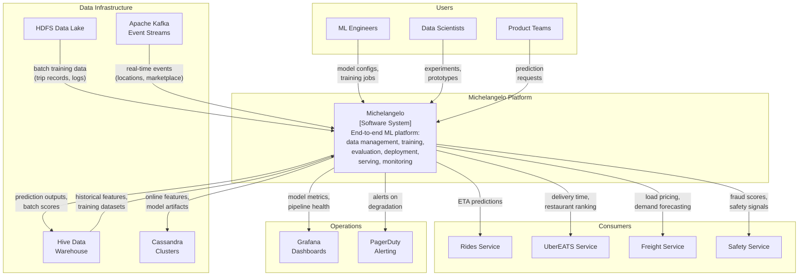

# Context and Scope

> **Standard arc42 S3 -- Context & Scope**

## Purpose

This section defines the system boundary of Uber Michelangelo, identifying external actors, surrounding systems, and the data flows that cross the platform boundary. Michelangelo is Uber's internal ML-as-a-service platform, providing end-to-end machine learning capabilities to engineering teams across the company.

## Business Context

### External Actors

| Actor | Role | Interaction with Michelangelo |
|-------|------|-------------------------------|
| ML Engineers | Primary users | Build, train, evaluate, and deploy models; configure feature pipelines; monitor model health |
| Data Scientists | Model developers | Explore data, prototype models, run experiments; promote successful models to production |
| Product Teams (e.g., UberEATS, Rides, Freight) | Consumers | Consume predictions via online serving endpoints or batch prediction outputs |
| End Users (Riders, Drivers, Eaters) | Indirect consumers | Experience model predictions through Uber products (ETAs, pricing, matching) |
| Data Engineering Teams | Infrastructure providers | Maintain data pipelines, Kafka clusters, HDFS data lake that feed Michelangelo |
| Operations / SRE | Platform operators | Monitor platform health, manage compute resources, respond to incidents |

### External Systems

| System | Direction | Data Exchanged |
|--------|-----------|----------------|
| HDFS Data Lake | Inbound | Raw event data, transaction logs, GPS traces, trip records |
| Apache Kafka | Inbound | Real-time event streams (trip events, driver location updates, marketplace signals) |
| Hive Data Warehouse | Inbound/Outbound | Historical tables for training data; prediction outputs for downstream analytics |
| Cassandra Clusters | Outbound (online features), Internal | Online feature serving for low-latency prediction; model artifact storage |
| Product Microservices | Outbound | Real-time predictions via Thrift/gRPC endpoints |
| Monitoring Stack (Grafana, PagerDuty) | Outbound | Model health metrics, pipeline alerts, latency dashboards |
| CI/CD Infrastructure | Bidirectional | Model deployment artifacts, configuration management |

## Technical Context

### System Boundary Diagram

### Data Flows

| Flow | Source | Destination | Protocol | Volume | Latency Requirement |
|------|--------|-------------|----------|--------|---------------------|
| Training data ingestion | HDFS / Hive | Michelangelo training pipelines | Spark jobs (batch) | Billions of records per training run | Hours (batch) |
| Real-time feature computation | Kafka | Feature Store (Cassandra) | Samza streaming jobs | Millions of events/sec | Seconds |
| Online prediction serving | Product microservices | Michelangelo serving containers | Thrift / gRPC | 10-15M predictions/sec (peak) | P95 < 10ms |
| Batch prediction | Hive tables | Hive output tables | Spark jobs | Variable | Hours |
| Model artifact deployment | Training pipeline | Serving containers | ZIP archive distribution | Per deployment | Minutes |
| Monitoring telemetry | Serving containers | Grafana / PagerDuty | Metrics push | Continuous | Near real-time |

## Limitations

This standard arc42 Context and Scope section captures the system boundary, actors, and data flows at a conventional level. However, several concerns critical to Michelangelo's operation as an ML platform are invisible:

1. **No AI boundary delineation.** The diagram does not distinguish between deterministic components (API gateway, serving infrastructure, logging) and non-deterministic components (trained models producing probabilistic outputs). A product team consuming predictions cannot tell from this documentation which responses are deterministic and which are probabilistic.

2. **No confidence ranges or uncertainty documentation.** The data flow table shows prediction serving at P95 < 10ms, but does not capture the confidence characteristics of those predictions. DeepETA predictions have different accuracy profiles for short vs. long trips, urban vs. rural routes, and these are architecturally significant.

3. **No fallback strategy documentation.** When models fail or produce low-confidence outputs, what happens? This section has no mechanism to document that DeepETA falls back to the routing engine's raw estimate, or that fraud detection escalates to manual review on low confidence. These fallback strategies are critical architectural decisions.

4. **No model-specific external dependencies.** The dependency on Cassandra is shown, but not that 20,000+ features in the Feature Store have different freshness requirements. A traffic feature that is 30 seconds stale has very different architectural implications than a city-level demographic feature refreshed weekly.

5. **No data quality or drift concerns.** The D3 system monitoring 100,000+ data quality indicators across 300+ datasets is invisible in this view. Data quality is an architectural concern for ML systems, not just an operational one.
