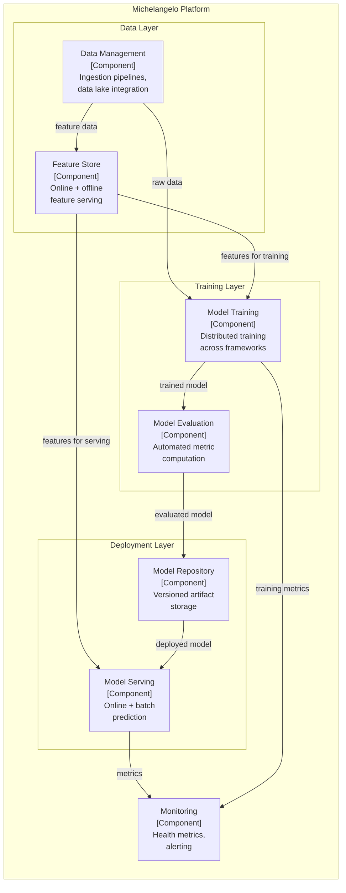

# Building Block View

> **Standard arc42 S5 -- Building Block View**

## Purpose

This section decomposes Michelangelo into its major building blocks: the subsystems and components that make up the platform. Following standard arc42 conventions, these are presented as software components with their responsibilities and interfaces.

## Level 1: Platform Decomposition

| Building Block | Responsibility | Technology |
|----------------|---------------|------------|
| Data Management | Ingestion, storage, and retrieval of training data and features | HDFS, Hive, Kafka, Spark, Samza |
| Feature Store | Centralized feature storage with online and offline serving | Cassandra (online), Hive (offline) |
| Model Training | Distributed model training across multiple frameworks | Spark, Horovod, Ray, TensorFlow, PyTorch, XGBoost |
| Model Evaluation | Automated evaluation of trained models against metrics | Custom evaluation framework |
| Model Repository | Versioned storage of trained model artifacts and metadata | Cassandra-backed repository |
| Model Serving | Low-latency online prediction and batch scoring | Triton, Kubernetes, Spark |
| Monitoring | Platform health metrics and alerting | Grafana, Prometheus, PagerDuty |

## Level 1 Diagram

## Level 2: Key Building Block Details

### Feature Store

| Property | Value |
|----------|-------|
| Component name | Palette |
| Online store | Cassandra (P95 < 5ms lookup) |
| Offline store | Hive (batch access for training) |
| Feature count | 20,000+ shared features |
| Streaming features | Samza jobs publishing to Kafka, writing to Cassandra |
| Batch features | Spark/Hive jobs computing features on schedule |

### Model Training

| Property | Value |
|----------|-------|
| Supported frameworks | XGBoost, LightGBM, TensorFlow, PyTorch, scikit-learn |
| Distributed training | Horovod (data parallel), DeepSpeed (model parallel), Ray |
| Compute | YARN/Mesos clusters (CPU), GPU clusters (5,000+ GPUs) |
| Hyperparameter search | Grid search, random search, Bayesian optimization (AutoTune) |
| Training jobs/month | 20,000+ |

### Model Repository

| Property | Value |
|----------|-------|
| Storage backend | Cassandra |
| Stored metadata | Creator, timestamp, configuration, hyperparameters, feature importance, accuracy metrics, model parameters |
| Versioning | Each training run produces a versioned artifact |
| Model format | ZIP archives with model weights and configuration |

### Model Serving

| Property | Value |
|----------|-------|
| Online serving | Triton Inference Server on Kubernetes |
| Batch serving | Spark jobs on YARN |
| Throughput | 10-15 million predictions/sec (peak) |
| P95 latency (without features) | < 5ms |
| P95 latency (with Cassandra features) | < 10ms |
| Deployment | ZIP artifacts distributed across data centers |
| A/B testing | Model UUID or tag-based traffic splitting |

### Monitoring

| Property | Value |
|----------|-------|
| Accuracy tracking | Automatic prediction-outcome joining |
| Regression metrics | R-squared, RMSLE, RMSE, MAE |
| Classification metrics | AUC, precision, recall, F1 |
| Infrastructure metrics | Latency (P50, P95, P99), throughput, error rate |
| Alerting | Threshold-based via PagerDuty |

## Limitations

This standard arc42 Building Block View presents Michelangelo's components as conventional software building blocks with defined responsibilities and interfaces. However, several ML-specific concerns are structurally invisible:

1. **Feature Store is indistinguishable from any database.** The Feature Store (Palette) appears as a generic "Component" with "Online + offline feature serving." There is no mechanism to convey that it manages 20,000+ semantically rich features with different freshness requirements, that features have lineage from specific data sources, or that feature changes cascade to all consuming models. In a standard building block view, Palette looks identical to Cassandra.

2. **Model lifecycle is invisible.** Gallery's 4-stage model lifecycle (exploration, training, evaluation, production) with rule-based deployment automation (e.g., `WHEN metrics[mae] <= 5, promote to production`) is architecturally significant but has no representation. The Model Repository appears as a passive storage component, not as an active lifecycle management system with promotion gates.

3. **Models are not first-class building blocks.** The 5,000+ production models are invisible. Individual models like DeepETA, the fraud detection ensemble, or the demand forecasting model are not represented as distinct building blocks with their own versioning, dependencies, and quality attributes. They are subsumed into the generic "Model Serving" component.

4. **No training lineage.** The connection between a specific model version, its training dataset, feature set version, hyperparameters, and evaluation metrics is not captured. This lineage is critical for reproducibility and debugging but has no structural home in standard arc42.

5. **No model interdependencies.** Some models consume other models' outputs as features (e.g., demand forecasts feeding into pricing models). These model-to-model dependencies are architecturally significant but invisible in this view.

6. **Gallery's orchestration is missing.** Gallery's automated lifecycle orchestration, including performance-based promotion rules, rollback triggers, and multi-stage deployment gates, is a critical architectural concern that standard building block views cannot represent.
