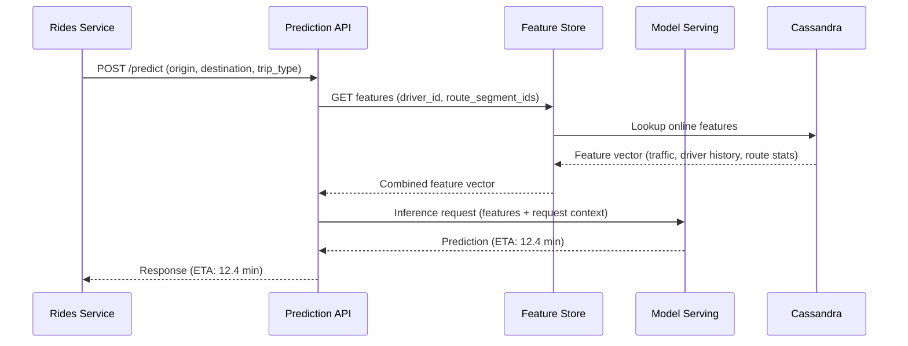
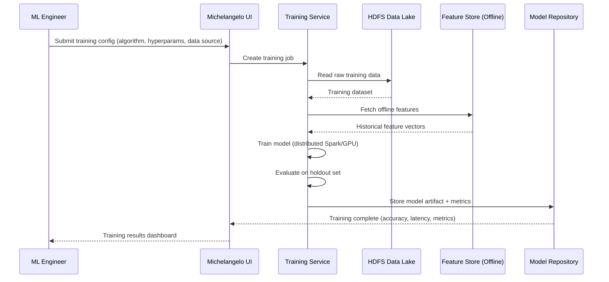
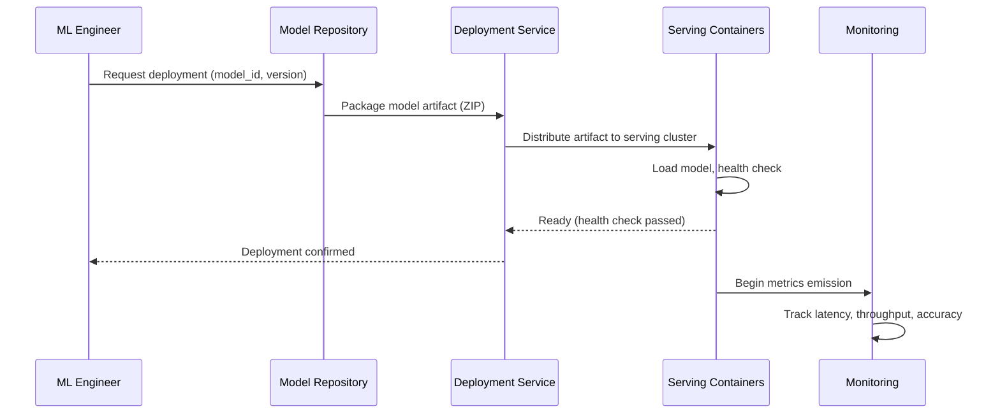
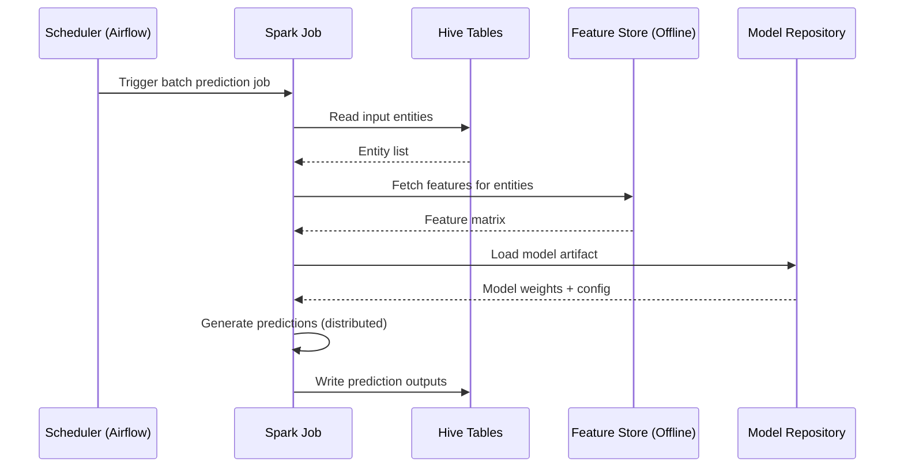

# Runtime View

> **Standard arc42 S6 -- Runtime View**

## Purpose

This section documents the runtime behavior of Michelangelo through key interaction scenarios. Following standard arc42 conventions, these are presented as sequences of interactions between components during specific use cases.

## Scenario 1: Online Prediction Request (ETA Estimation)

A product microservice (e.g., the Rides service) requests an ETA prediction for a trip.

**Latency budget:**

| Step | Target | Notes |
|------|--------|-------|
| Feature lookup (Cassandra) | < 5ms P95 | Pre-computed features; single key lookup |
| Model inference | < 5ms P95 | Optimized tree model or Triton serving |
| Total end-to-end | < 10ms P95 | Network overhead included |

## Scenario 2: Batch Model Training

An ML engineer submits a training job for a new model version.

**Duration:** Training jobs range from minutes (small GBM models) to hours (large deep learning models).

## Scenario 3: Model Deployment

A trained model is deployed to production serving infrastructure.

## Scenario 4: Batch Prediction

A scheduled batch prediction job generates scores for downstream consumption.

## Limitations

This standard arc42 Runtime View captures the interaction patterns of Michelangelo's key scenarios. However, the ML-specific runtime behavior that makes this platform architecturally distinct is invisible:

1. **Training-serving skew is not represented.** The training scenario uses offline features from Hive, while the serving scenario uses online features from Cassandra. Whether these feature values are consistent is an architectural concern with no documentation home. Michelangelo addresses this with a Feature Processing DSL that applies identical transformations, but this critical invariant is not visible in runtime diagrams.

2. **Model lifecycle transitions are missing.** Gallery manages models through exploration, training, evaluation, and production stages, with automated promotion rules (e.g., `WHEN metrics[mae] <= 5`). This lifecycle orchestration is a runtime behavior, but it does not fit the request-response or batch processing patterns that standard runtime views document.

3. **Drift detection and retraining are invisible.** D3 continuously monitors 100,000+ data quality indicators. When drift is detected, it triggers alerts and potentially retraining. This monitoring-reaction loop is a critical runtime behavior with no representation.

4. **Canary deployments and A/B testing are absent.** Uber deploys models with gradual traffic shifting and automated canary analysis. The deployment scenario above shows a simple binary deployment, not the nuanced rollout with safety checks.

5. **Feedback loops are not shown.** Model predictions influence user behavior, which generates new training data. The pricing model's predictions affect demand, which feeds back into demand forecasting models. These feedback loops are architecturally significant runtime behaviors invisible in standard sequence diagrams.

6. **No confidence or uncertainty propagation.** The prediction response shows "ETA: 12.4 min" but does not show the confidence score, prediction interval, or what happens when the model's confidence is low. Degraded-mode operation and fallback strategies are runtime behaviors with no documentation home.

7. **Feature freshness enforcement is invisible.** Some online features may be stale (Cassandra value not updated recently). The runtime behavior when features exceed their freshness SLA (use stale value? use default? reject request?) is architecturally significant but undocumented.
