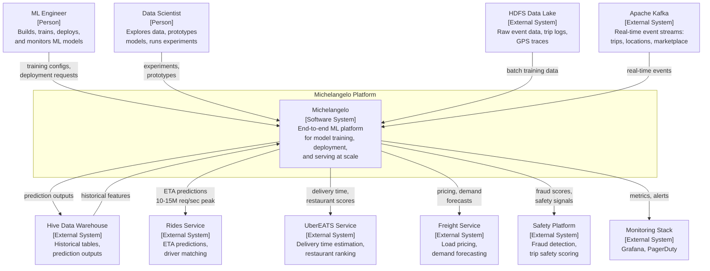

# C4 System Context Diagram -- Uber Michelangelo

> **Diagram type:** C4 Level 1 -- System Context (Standard)

## Purpose

This diagram shows Michelangelo in its operational environment: the users who interact with it, the external systems it depends on, and the systems that consume its outputs. This is a standard C4 system context diagram without AI-specific extensions.

## Actors and External Systems

| Actor / System | Type | Interaction |
|----------------|------|-------------|
| ML Engineers | Person | Configure, train, evaluate, deploy, and monitor models |
| Data Scientists | Person | Explore data, prototype models, run experiments |
| Product Services (Rides, Eats, Freight, Safety) | External System | Consume real-time predictions and batch scores |
| HDFS Data Lake | External System | Provides raw data for training and feature computation |
| Apache Kafka | External System | Provides real-time event streams |
| Hive Data Warehouse | External System | Provides historical data; receives prediction outputs |
| Monitoring Infrastructure | External System | Receives metrics and alerts |

## System Context Diagram

## Key Observations

### Scale

Michelangelo serves 10-15 million real-time predictions per second at peak, with 5,000+ models in production across 400+ active ML projects. The system processes training data from HDFS at petabyte scale and serves features from Cassandra with P95 latency under 5ms.

### Multiple Consumer Types

Product services consume Michelangelo's outputs in different modes: synchronous real-time predictions (Rides, Safety), asynchronous batch predictions (some Freight use cases), and model-embedded predictions (library deployment mode).

### What This Diagram Does Not Show

At this level of abstraction, Michelangelo appears as a single "Software System" box. The diagram correctly shows system-level boundaries and interactions, but provides no indication that:

- The system contains thousands of independently versioned ML models
- Predictions are probabilistic with varying confidence levels
- The Feature Store is architecturally distinct from a regular database
- Data drift monitoring is a continuous architectural concern
- Model lifecycle management involves multi-stage promotion with automated gates
