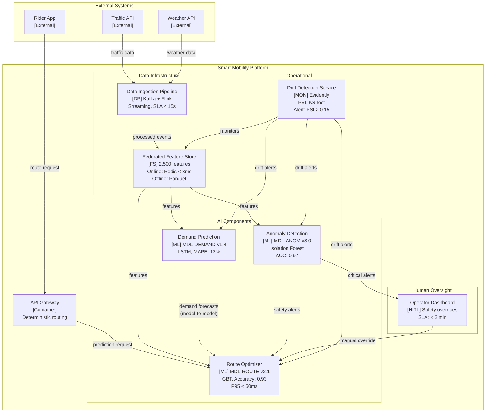
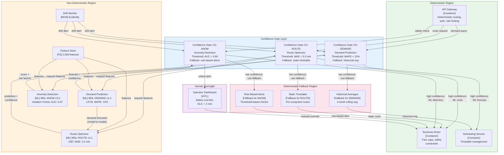

# C4 Model Extensions Reference

**Detailed specification of RAD-AI's three extensions to the C4 hierarchical diagram system**

---

## Introduction

The C4 model, introduced by Simon Brown, provides a hierarchical approach to visualizing software architecture at four levels of abstraction: (1) System Context, showing how the system fits into its environment; (2) Container, decomposing the system into deployable units; (3) Component, decomposing containers into structural building blocks; and (4) Code, showing implementation detail within components. In addition, the C4 model defines supplementary diagram types including Dynamic, Deployment, and System Landscape diagrams. The model is commonly implemented through Structurizr DSL and PlantUML notation, and has become a de facto standard alongside arc42 for communicating software architecture.

The C4 model assumes that all containers and components represent deterministic code modules with stable, well-defined interfaces. This assumption breaks down for AI-augmented ecosystems, where components exhibit probabilistic behavior, evolve through data changes rather than code commits, and follow independent lifecycles. RAD-AI addresses these limitations through three backward-compatible extensions:

| Extension | Name | Key Artifact | Gaps Addressed |
|-----------|------|--------------|----------------|
| C4-E1 | AI Component Stereotypes | 5 new C4 stereotypes | G2 |
| C4-E2 | Data Lineage Overlay | Provenance overlay diagram | G2, G5 |
| C4-E3 | Non-Determinism Boundary Diagram | Boundary partition diagram | G2 |

All three extensions are compatible with Structurizr DSL and PlantUML notation. Because Mermaid lacks native C4 stereotypes, this reference uses Mermaid conventions (subgraphs, labels, and color styling) to render the extensions in a widely accessible format. The C4 extensions complement the eight arc42 extensions (E1 through E8); in particular, C4-E3 relates closely to arc42 extension E1 (AI Boundary Delineation), and C4-E2 connects with E3 (Data Pipeline View).

---

## C4-E1: AI Component Stereotypes

### Purpose

Visually distinguish AI components from traditional software containers and components in C4 diagrams. In standard C4 notation, a Feature Store is indistinguishable from a regular database, and an ML model is indistinguishable from any other service. AI Component Stereotypes make these architectural distinctions explicit.

### Addresses Gap

**G2:** No C4 diagram types for ML components or non-determinism boundaries.

### The Five Stereotypes

RAD-AI introduces five new stereotypes for use in C4 Container and Component diagrams.

#### 1. `<<ML Model>>` (shorthand: `[ML]`)

An inference endpoint serving predictions. ML Models are the core non-deterministic components in an AI-augmented system. Their outputs are probabilistic, their behavior changes with retraining, and they require distinct lifecycle management.

**Required properties:**

| Property | Description | Example |
|----------|-------------|---------|
| Model ID | Unique identifier with version | MDL-ETA v2.1 |
| Accuracy | Primary evaluation metric with value or range | MAE: ~2 min; AUC: 0.95-0.98 |
| Confidence range | Expected confidence interval | 0.72-0.96 |
| Latency | Serving latency target | P95 < 10ms |

**Annotation format:** `Component Name [ML] Model-ID, Key-Metric`

**Example:** `DeepETA [ML] MDL-ETA, MAE: ~2 min, P95 < 10ms`

#### 2. `<<Data Pipeline>>` (shorthand: `[DP]`)

A data flow component with transformation logic, encompassing ingestion, preprocessing, feature engineering, and training orchestration. Data Pipelines are architecturally significant because they determine data quality, freshness, and schema conformance for downstream models.

**Required properties:**

| Property | Description | Example |
|----------|-------------|---------|
| Schedule | Execution frequency or trigger type | Streaming (continuous); Batch (15-min cycle) |
| SLA | Latency or freshness commitment | Processing latency < 30s |
| Data quality gates | Quality checks applied at this stage | Schema conformance; null rate < 1% |

**Annotation format:** `Component Name [DP] Schedule, SLA`

**Example:** `Data Ingestion [DP] Kafka + Samza, Streaming + Batch`

#### 3. `<<Feature Store>>` (shorthand: `[FS]`)

A shared feature computation and serving layer. Feature Stores are architecturally distinct from standard databases because they serve semantically curated features (not raw data), enforce training-serving consistency through feature DSLs, and propagate changes to all consuming models.

**Required properties:**

| Property | Description | Example |
|----------|-------------|---------|
| Feature count | Number of managed features | 20,000+ features |
| Refresh rate | How frequently features are updated | Online: real-time; Offline: daily |
| Consumers | Models or services that consume features | MDL-ETA, MDL-PRICE, MDL-FRAUD |

**Annotation format:** `Component Name [FS] Feature-Count, Serving-Mode`

**Example:** `Palette [FS] 20,000+ features, Online: Cassandra < 5ms, Offline: Hive`

#### 4. `<<Monitor>>` (shorthand: `[MON]`)

A drift detection and model health monitoring component. Monitors are architecturally significant because they trigger retraining, activate fallbacks, and serve as the primary defense against silent model degradation.

**Required properties:**

| Property | Description | Example |
|----------|-------------|---------|
| Metrics tracked | What the monitor observes | Feature distributions, prediction accuracy, latency |
| Alert thresholds | Conditions that trigger alerts or actions | PSI > 0.2; accuracy drop > 5% |

**Annotation format:** `Component Name [MON] Detection-Method, Monitor-Count`

**Example:** `D3 Drift Monitor [MON] Prophet, 100K+ monitors, TTD: ~2 days`

#### 5. `<<Human-in-the-Loop>>` (shorthand: `[HITL]`)

A manual review or override intervention point. HITL components are architecturally significant because they introduce latency paths, create feedback loops (human decisions become training labels), and represent deterministic overrides of non-deterministic outputs.

**Required properties:**

| Property | Description | Example |
|----------|-------------|---------|
| Trigger condition | When human intervention is required | Fraud score in ambiguous range (0.4-0.6) |
| Response SLA | Required turnaround time for human decision | < 5 min for high-value transactions |

**Annotation format:** `Component Name [HITL] Trigger, SLA`

**Example:** `Fraud Review Queue [HITL] Ambiguous scores (0.4-0.6), SLA: < 5 min`

### Usage in Container Diagrams

At the Container level, stereotypes distinguish AI containers from traditional infrastructure. A Feature Store is immediately recognizable as architecturally distinct from a standard database, even though both store data. Without the `[FS]` stereotype, a C4 Container diagram would show both as generic data stores, obscuring the Feature Store's role in training-serving consistency, feature versioning, and cross-model impact propagation.

### Usage in Component Diagrams

At the Component level, stereotypes distinguish ML Models from regular services. A route optimization service annotated with `[ML]` communicates that its outputs are probabilistic, it has a model version, and it requires monitoring and retraining, all of which are invisible when the same component is shown as a generic service.

### Annotation Guidelines

1. Always include the stereotype shorthand in brackets after the component name: `Name [Stereotype]`.
2. Include the model ID or component ID for traceability to the Model Registry View (arc42 E2).
3. Include at least one key metric that characterizes the component's quality or performance.
4. For `[ML]` components, annotate model-to-model dependencies (e.g., "Consumes MDL-DEMAND output").
5. For `[HITL]` components, annotate the trigger condition and response SLA.
6. Use consistent color coding when rendering diagrams: distinct colors for each stereotype type improve visual parsing.

### Mermaid Diagram Example

The following diagram shows all five stereotypes in a simplified smart mobility ecosystem.



### Communication Bridge

AI Component Stereotypes bridge the communication gap between data scientists and software architects (Amershi et al., 2019). In organizations building AI-augmented systems, data scientists think in terms of models, features, and training pipelines, while software architects think in terms of containers, interfaces, and deployment. Standard C4 diagrams use only the architect's vocabulary, rendering AI concerns invisible. By introducing stereotypes that carry meaning for both disciplines, RAD-AI enables shared diagrams where a data scientist can identify their model, its features, and its monitoring, while the architect can see deployment boundaries, interface contracts, and dependency graphs.

---

## C4-E2: Data Lineage Overlay

### Purpose

Trace data provenance from source through transformation to model consumption. Standard C4 diagrams show data stores and data flows but do not capture where data originates, how it is transformed, what quality constraints apply at each stage, or how data freshness affects downstream model behavior. The Data Lineage Overlay makes these dependencies explicit.

### Addresses Gaps

- **G2:** No C4 diagram types for ML components or non-determinism boundaries.
- **G5:** No integration of Model/Data Cards into architecture documentation.

### Key Artifact

A provenance overlay diagram applied to Container or Component diagrams. The overlay adds a lineage layer showing data flow from sources through transformations to model consumption, annotated with schema expectations, freshness constraints, and privacy classifications.

### What It Documents

#### Data Source Inventory

Every data source feeding into the AI-augmented system is catalogued in a structured table.

| Field | Description | Example |
|-------|-------------|---------|
| Source ID | Unique identifier | DS-001 |
| Name | Human-readable name | Trip Events |
| Type | Stream, batch, API, or static | Kafka Stream |
| Owner | Team or organization responsible | Data Engineering |
| Freshness | How current the data is | Real-time; Daily refresh |
| Privacy Classification | Data sensitivity level | Confidential; Public; Sensitive |

#### Lineage Diagram

The lineage diagram shows the complete data flow from sources through ingestion, transformation, and feature engineering to model consumption. Each stage is a node; edges carry schema and freshness annotations. The diagram reveals data dependencies that are invisible in standard C4, including:

- Which models share data sources (creating coupled evolution)
- Where data transformations occur (creating potential points of schema breakage)
- How data freshness degrades through the pipeline (creating staleness risk)
- Where privacy-sensitive data is anonymized (creating compliance boundaries)

#### Schema Expectations at Each Stage

Each transformation stage documents the expected input schema and the guaranteed output schema. Schema changes at any stage propagate downstream, and the lineage overlay makes this propagation visible. Recommended documentation includes:

- Input schema (field names, types, constraints)
- Output schema (field names, types, constraints)
- Schema validation method (Avro, JSON Schema, or custom)
- Breaking change policy (versioned schemas, backward compatibility)

#### Data Freshness Constraints

A freshness requirements table captures the gap between what each consuming model needs and what each source provides, along with the risk and mitigation.

| Field | Description | Example |
|-------|-------------|---------|
| Consumer | Model or component that consumes the data | MDL-ETA |
| Required Freshness | Maximum acceptable data age | < 30s for traffic features |
| Source Freshness | How current the source data is | GPS: sub-second |
| Gap Risk | What can go wrong if freshness is not met | Stale features degrade prediction accuracy |
| Mitigation | How the system handles freshness violations | Confidence penalty for stale features; fallback if > 60s stale |

#### Privacy Classifications and Anonymization Flow

The overlay documents where privacy-sensitive data enters the system, where anonymization occurs, what method is applied, and what classification applies downstream. This is critical for EU AI Act Annex IV compliance (Section 2(d): data governance and provenance).

| Field | Description | Example |
|-------|-------------|---------|
| Data Element | What data is privacy-sensitive | GPS traces (driver location) |
| Source Classification | Sensitivity at point of entry | Confidential |
| Anonymization Point | Where in the pipeline anonymization occurs | Samza stream processing |
| Method | How anonymization is performed | Aggregated to zone level; driver ID stripped |
| Downstream Classification | Sensitivity after anonymization | Internal (zone-level, no individual tracking) |

#### Schema Registry with Versioning

For systems with multiple data sources and consumers, a schema registry documents versioned schemas and their compatibility status. This prevents silent breakage when upstream schema changes propagate to downstream models.

### Integration with Data Cards

Data Cards (Google, 2022) attach as sub-artifacts at data source nodes in the lineage overlay. Each data source node in the diagram can link to a Data Card that documents the dataset's purpose, composition, collection process, recommended uses, and limitations. This integration connects data governance documentation to the architectural data flow, addressing Gap G5.

### Mermaid Diagram Example

The following diagram illustrates a simplified data lineage overlay for a smart mobility ecosystem.

```mermaid
graph LR
    subgraph Sources ["Data Sources"]
        direction TB
        DS1["DS-001: Vehicle GPS<br/>[Kafka Stream]<br/>Real-time, Confidential"]
        DS2["DS-002: Passenger Demand<br/>[Kafka Stream]<br/>Real-time, Internal"]
        DS3["DS-003: Weather Forecast<br/>[Batch API]<br/>15-min refresh, Public"]
        DS4["DS-004: Historical Trips<br/>[Data Lake]<br/>Daily append, Confidential"]
    end

    subgraph Ingestion ["Ingestion Layer"]
        direction TB
        KFK["Kafka Topics<br/>gps.raw, demand.raw"]
        FLINK["Flink Stream Processing<br/>Schema validation,<br/>dedup, aggregation"]
        BATCH["Batch Processing<br/>Daily joins,<br/>historical aggregation"]
    end

    subgraph Transform ["Feature Engineering"]
        direction TB
        ANON["Anonymization<br/>Zone-level aggregation,<br/>ID removal"]
        DSL["Feature DSL<br/>Identical transforms<br/>for train + serve"]
    end

    subgraph FeatureStore ["Feature Store [FS]"]
        direction TB
        ONLINE["Online Store<br/>[Redis] < 3ms<br/>2,500 features"]
        OFFLINE["Offline Store<br/>[Parquet]<br/>Point-in-time correct"]
    end

    subgraph Consumption ["Model Consumption"]
        direction TB
        ROUTE["Route Optimizer<br/>[ML] MDL-ROUTE<br/>Freshness: < 30s"]
        DEMAND["Demand Prediction<br/>[ML] MDL-DEMAND<br/>Freshness: < 15 min"]
        ANOMALY["Anomaly Detection<br/>[ML] MDL-ANOM<br/>Freshness: < 60s"]
    end

    subgraph Feedback ["Feedback Loops"]
        direction TB
        OUTCOMES["Trip Outcomes<br/>Actual durations,<br/>actual demand"]
        RETRAIN["Retraining Pipelines"]
    end

    DS1 --> KFK
    DS2 --> KFK
    DS3 --> BATCH
    DS4 --> BATCH

    KFK --> FLINK
    FLINK --> ANON
    BATCH --> DSL
    ANON --> DSL

    DSL -->|"streaming features<br/>(online path, < 30s)"| ONLINE
    DSL -->|"batch features<br/>(offline path, daily)"| OFFLINE

    ONLINE -->|"real-time features"| ROUTE
    ONLINE -->|"real-time features"| ANOMALY
    OFFLINE -->|"historical features"| DEMAND
    OFFLINE -->|"training features"| RETRAIN

    ROUTE -->|"route predictions"| OUTCOMES
    DEMAND -->|"demand forecasts"| OUTCOMES

    OUTCOMES -->|"ground truth labels"| RETRAIN
    RETRAIN -->|"updated models"| ROUTE
    RETRAIN -->|"updated models"| DEMAND
    RETRAIN -->|"updated models"| ANOMALY
```



### What the Overlay Reveals

Applying the Data Lineage Overlay to an existing C4 Container or Component diagram reveals dependencies that are structurally invisible in standard C4:

1. **Shared data sources** between models create coupled evolution: if DS-001 schema changes, all consuming models are affected.
2. **Freshness cascades** propagate through the pipeline: a 15-minute batch cycle at the source means the consuming model can never have features fresher than 15 minutes, regardless of serving latency.
3. **Feedback loops** where model outputs become training inputs create potential for distributional shift amplification.
4. **Privacy boundaries** where anonymization occurs determine what data is available to downstream components.
5. **Quality gate placement** determines where data issues are caught and where they propagate silently.

---

## C4-E3: Non-Determinism Boundary Diagram

### Purpose

Partition the architecture into deterministic and non-deterministic regions, making explicit where probabilistic behavior enters the system and what guarantees exist at each boundary crossing. Standard C4 diagrams treat all components uniformly; this extension visually and structurally separates components whose outputs are predictable from those whose outputs are probabilistic.

### Addresses Gap

**G2:** No C4 diagram types for ML components or non-determinism boundaries.

### Key Artifact

A boundary partition diagram applied as a system-level overlay. The diagram uses color-coded regions to distinguish deterministic components (e.g., API gateways, business rules engines, payment services) from non-deterministic components (e.g., ML models, feature stores with real-time data, drift detectors). Boundary interfaces at each crossing point are annotated with contracts specifying confidence, fallback, and degradation behavior.

### What It Documents

#### Boundary Overview Diagram

The boundary overview uses two visually distinct regions:

- **Deterministic region:** Components whose outputs are fully determined by their inputs and configuration. Examples: API gateways, routing engines, business rules, payment processors.
- **Non-deterministic region:** Components whose outputs are probabilistic, vary across model versions or retraining cycles, or depend on data distributions that may shift. Examples: ML models, feature stores (when feature freshness affects output), drift detectors.

A dashed or colored boundary line separates the two regions. Every arrow crossing this boundary passes through a confidence gate.

#### Boundary Interfaces

Each point where the deterministic and non-deterministic regions interact is documented as a boundary interface. Each interface specifies the data exchanged and the three-property contract.

| Field | Description | Example |
|-------|-------------|---------|
| Interface ID | Unique identifier | BI-001 |
| From (Region) | Originating region and component | API Gateway (Deterministic) |
| To (Region) | Destination region and component | CG-ETA (Boundary) |
| Data Exchanged | What crosses the boundary | Trip request: origin, destination, request time |
| Contract | Confidence, fallback, and degradation terms | Confidence threshold, timeout, fallback target |

#### Three-Property Contract per Boundary

Every boundary crossing is annotated with the same three properties used in arc42 extension E1 (AI Boundary Delineation), applied here at the diagram level:

**1. Confidence Specification**

Defines the conditions under which the non-deterministic component's output is trusted. The specification includes the metric used (e.g., confidence score, MAE, AUC), the threshold values for different trust levels, and the action taken at each level.

**2. Fallback Strategy**

Defines what happens when the non-deterministic component's output does not meet the confidence specification. Three fallback types are common:

- **Rule-based default:** A deterministic algorithm produces a lower-quality but predictable output.
- **Cached last-known-good:** The most recent output that met the confidence threshold is reused.
- **Human escalation:** The decision is routed to a human-in-the-loop component.

**3. Degradation Profile**

Defines how system quality degrades when the non-deterministic component is unavailable or producing low-confidence outputs. The profile specifies:

- User-facing impact (e.g., "ETAs are less accurate but still provided")
- Business impact (e.g., "Revenue reduced by estimated 5-10% due to less granular pricing")
- Maximum acceptable duration in degraded state
- Recovery procedure

#### Confidence Thresholds per Model

Each ML model component documents its confidence bands:

| Band | Criteria | Action |
|------|----------|--------|
| High confidence | Metric well above threshold | ML output used directly |
| Medium confidence | Metric near threshold | ML output used with logging or wider bounds |
| Low confidence | Metric below threshold | Fallback activated |
| Rejection | Model unavailable or metric far below threshold | Deterministic fallback only |

#### Degradation Behavior

The boundary diagram documents what happens when non-deterministic components fail or produce low-confidence outputs. This includes both single-component failures and correlated failures (e.g., Feature Store outage affecting all models simultaneously).

#### Propagation Rules

Non-determinism propagates through the system in predictable ways. The boundary diagram documents these propagation patterns:

| Rule | Description |
|------|-------------|
| Confidence composition | When upstream data freshness or quality degrades, downstream model confidence is penalized proportionally |
| Cascade fallback | A shared dependency failure (e.g., Feature Store) triggers simultaneous fallback for all dependent models |
| Model-to-model propagation | When an upstream model enters fallback, downstream models that consume its output lose that signal |
| Deterministic wrapper | Business rules or constraint engines apply hard limits after ML output, bounding non-deterministic behavior |
| Audit completeness | Every boundary crossing decision (ML, fallback, or human override) is logged for traceability |

#### Testing Implications

The boundary diagram informs a testing strategy for the deterministic/non-deterministic interface:

| Test Type | Purpose |
|-----------|---------|
| Boundary threshold testing | Verify correct routing at each confidence threshold |
| Fallback activation testing | Verify seamless transition to fallback when models are unavailable |
| Fallback quality testing | Verify that fallback output quality is acceptable |
| Cascade testing | Verify system behavior when shared dependencies fail |
| Model-to-model propagation testing | Verify graceful degradation when upstream models enter fallback |
| Recovery testing | Verify clean transition from fallback back to ML serving |
| HITL integration testing | Verify human review queues handle volume during degraded operation |

### Mermaid Diagram Example

The following diagram illustrates a Non-Determinism Boundary for a smart mobility ecosystem.



### Relationship to E1 (AI Boundary Delineation)

C4-E3 and arc42 extension E1 (AI Boundary Delineation) share the same three-property contract (confidence specification, fallback strategy, degradation profile) but operate at different levels of abstraction:

- **E1 (arc42 level):** Annotates the Context and Scope diagram with boundary markers per interface. Documents contracts in tabular form as part of the arc42 section.
- **C4-E3 (C4 diagram level):** Provides a full visual partition of the architecture into regions, with confidence gates as explicit architectural components. Enables visual reasoning about cascade failures, propagation paths, and testing boundaries.

Together, E1 and C4-E3 provide both the textual specification (E1) and the visual representation (C4-E3) of the deterministic/non-deterministic boundary.

---

## Summary Table

| Extension ID | Name | Key Artifact | Gaps Addressed | Primary Use Level |
|-------------|------|--------------|----------------|-------------------|
| C4-E1 | AI Component Stereotypes | 5 new C4 stereotypes (`[ML]`, `[DP]`, `[FS]`, `[MON]`, `[HITL]`) | G2 | Container, Component |
| C4-E2 | Data Lineage Overlay | Provenance overlay diagram with freshness, privacy, and schema annotations | G2, G5 | Container, Component |
| C4-E3 | Non-Determinism Boundary Diagram | Boundary partition diagram with confidence gates, fallbacks, and degradation profiles | G2 | System-level overlay |

---

## Compatibility Notes

### Structurizr DSL

All three extensions are compatible with Structurizr DSL. Stereotypes can be expressed using the `tags` mechanism:

```
container "DeepETA" {
    tags "ML Model"
    description "Travel time prediction"
    technology "PyTorch, Triton"
    properties {
        "model_id" "MDL-ETA"
        "accuracy" "MAE: ~2 min"
        "latency" "P95 < 10ms"
    }
}
```

Custom element styles can be defined per stereotype to provide visual distinction:

```
styles {
    element "ML Model" {
        background "#bbdefb"
        shape "RoundedBox"
        icon "ml-icon"
    }
    element "Feature Store" {
        background "#c8e6c9"
        shape "Cylinder"
    }
}
```

### PlantUML

PlantUML supports stereotypes natively through the `<<Stereotype>>` syntax:

```
rectangle "DeepETA\n<<ML Model>>\nMDL-ETA v2.1\nMAE: ~2 min" as ETA #BBDEFB
database "Palette\n<<Feature Store>>\n20,000+ features" as FS #C8E6C9
```

### Mermaid

Mermaid does not support native C4 stereotypes. This reference uses the following conventions:

- Stereotypes are rendered as part of the node label: `[ML]`, `[DP]`, `[FS]`, `[MON]`, `[HITL]`.
- Regions are rendered as `subgraph` blocks with `style` directives for color coding.
- Boundary interfaces are represented as labeled edges between subgraphs.

These conventions ensure that RAD-AI C4 extensions are renderable in any toolchain that supports Mermaid, Structurizr DSL, or PlantUML.
