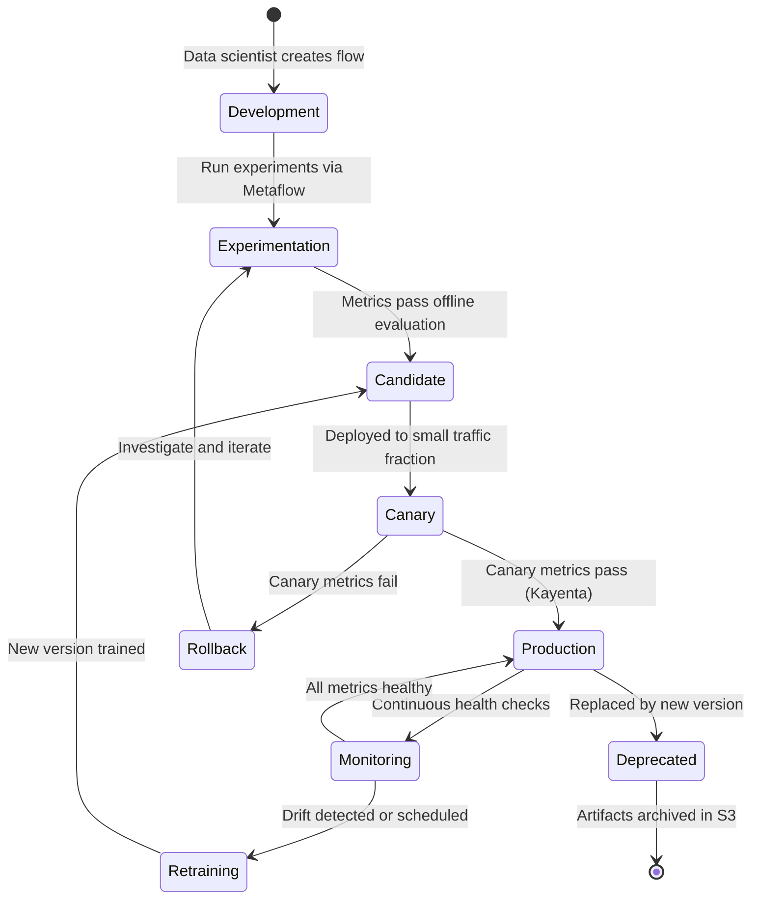

# Model Registry View

> **Extends:** arc42 S5 -- Building Block View

## Purpose

Netflix's ML platform treats models as first-class architectural building blocks, each with its own lifecycle, versioning, dependency graph, and performance contract. Unlike traditional software components that evolve through code commits, these 3,000+ ML projects evolve through retraining on new data, hyperparameter tuning, architecture changes, and experiment-driven iteration. Metaflow manages the experiment-to-production lifecycle, tracking every run, step, and artifact. This view captures the model inventory, version history, training lineage, and performance baselines that enable architectural traceability across Netflix's massive ML ecosystem.

## Model Inventory

| Model ID | Name | Task | Framework | Current Version | Status | Serving Mode |
|----------|------|------|-----------|----------------|--------|-------------|
| MDL-REC | Recommendation Ensemble | Content ranking and homepage personalization | PyTorch (DNN), custom CF, DGL (GNN) | v12.4 | Production | Real-time + batch pre-compute |
| MDL-PERS | Personalization Models | UI layout, artwork selection, notification targeting | PyTorch (multi-task) | v8.2 | Production | Real-time |
| MDL-QUAL | Content Quality Predictor | Video/audio quality assessment, encoding optimization | PyTorch (SemanticGNN) | v5.1 | Production | Batch |
| MDL-SEARCH | Search Ranking | Query understanding, result ranking, intent classification | PyTorch (Transformer) | v6.7 | Production | Real-time |
| MDL-EXP | Experimentation Engine | Treatment effect estimation, adaptive allocation | Statsmodels + custom | v3.0 | Production | Batch analysis |

## Model Details

### Recommendation Ensemble (MDL-REC)

**Purpose:** Core recommendation engine that generates personalized content rankings for every Netflix member. Combines multiple modeling approaches: collaborative filtering (member-member and item-item similarity), deep neural networks (learning complex interaction patterns), and graph neural networks (SemanticGNN for content understanding). The ensemble aggregates these signals to produce ranked content rows for the homepage, "Because You Watched," "Top Picks For You," and genre rows.

*Note: Netflix has publicly described consolidating from many specialized models to a single multi-task architecture to improve maintainability. Version numbers and specific metrics below are illustrative based on public performance disclosures.*

**Versioning:**

| Version | Training Period | Key Change | Status | Notes |
|---------|----------------|-----------|--------|-------|
| v10.0 | 2024-Q1 | Consolidated multi-model ensemble into unified multi-task architecture | Retired | Major architecture change; reduced operational complexity |
| v11.0 | 2024-Q3 | Added SemanticGNN for richer content understanding | Retired | Improved cold-start content recommendations |
| v12.0 | 2025-Q1 | Contextual bandit integration for real-time exploration | Retired | Better balance of exploration vs. exploitation |
| v12.4 | 2025-Q4 | Multi-task learning refinements, updated content embeddings | Production | Current production version |

**Architecture:**

| Component | Role | Framework |
|-----------|------|-----------|
| Collaborative Filtering module | Member-member and item-item similarity signals | Custom matrix factorization on Spark |
| Deep Neural Network module | Complex interaction pattern learning from behavioral sequences | PyTorch with distributed training (Horovod) |
| Graph Neural Network module (SemanticGNN) | Semantic content understanding via knowledge graph | DGL (Deep Graph Library) on PyTorch |
| Contextual Bandit module | Exploration strategy for new content and cold-start members | Custom implementation |
| Ensemble Aggregator | Combines module outputs into final ranking | Learned weights via online optimization |

**Training Data Lineage:**

| Dataset | Source | Scale | Features | Refresh |
|---------|--------|-------|----------|---------|
| Member interaction history | Kafka event streams, processed by Flink | Billions of interaction events; years of history | ~1,000+ features (member, content, contextual, behavioral) | Continuous ingestion; training on rolling windows |
| Content metadata | Content Management System | 15,000+ titles with rich metadata | Genre, cast, director, synopsis, maturity, language | Updated on content catalog changes |
| Content embeddings | SemanticGNN pre-training | All available titles | Dense vector representations (dim: 256) | Re-computed quarterly |
| Member profiles | Aggregated from interaction history | 200M+ member profiles | Demographic inferences, taste clusters, viewing patterns | Updated daily via batch pipeline |

**Dependencies:**

- Upstream: Kafka (interaction events), Flink (feature computation), Amber (feature serving), Content Management System (metadata), S3 (training data snapshots)
- Downstream: API Gateway (serves recommendations), Playback Service (content pre-fetching), ABlaze (A/B test allocation), Notification Service (push targeting)

**Performance Baselines:**

| Metric | Description | Alert Threshold |
|--------|-------------|----------------|
| Engagement rate | Fraction of recommended titles that receive a play action | Monitored via A/B testing; no public threshold disclosed |
| Member retention correlation | Statistical association between recommendation quality and member retention | Tracked at cohort level; proprietary |
| Homepage load latency (P95) | End-to-end time from request to rendered homepage | < 250ms (inferred from Netflix's public latency targets) |
| Content diversity (intra-row) | Number of distinct genres represented per recommendation row | Internal fairness metric; ensures variety |

---

### Content Quality Predictor (MDL-QUAL)

**Purpose:** Predicts video and audio perceptual quality to optimize encoding parameters. Netflix encodes each title at multiple bitrates and resolutions; this model predicts which encoding settings maximize perceptual quality for a given piece of content (action scenes need higher bitrate than talking heads). Used in the encoding pipeline to make per-shot encoding decisions.

**Architecture:** SemanticGNN architecture that processes video segments as graph-structured data, capturing spatial-temporal relationships between frames and scenes.

**Training Data Lineage:**

| Dataset | Source | Scale | Refresh |
|---------|--------|-------|---------|
| Subjective quality ratings | Netflix internal quality assessment program | Millions of quality labels across thousands of titles | Continuous collection; model retrained quarterly |
| Video features | Per-shot complexity metrics (temporal, spatial, color) | All encoded content | Computed at encoding time |
| Network conditions | Member device and network telemetry | Aggregated bandwidth/latency profiles | Daily aggregation |

---

### Search Ranking (MDL-SEARCH)

**Purpose:** Powers Netflix search by understanding query intent, matching queries to content, and ranking results by relevance and personalization signals. Uses a transformer-based architecture for query understanding and a learned-to-rank model for result ordering.

**Training Data Lineage:**

| Dataset | Source | Scale | Refresh |
|---------|--------|-------|---------|
| Search query logs | Member search sessions with click-through data | Millions of queries per day | Continuous; model retrained monthly |
| Content index | Full-text index of titles, descriptions, cast, directors | All available content per region | Updated on catalog changes |
| Query reformulations | Member query refinement patterns (query -> refined query -> click) | Aggregated session data | Monthly reprocessing |

## Integration with Metaflow

Metaflow serves as the model lifecycle management layer at Netflix. Key integrations:

| Capability | Metaflow Feature | Description |
|------------|-----------------|-------------|
| Experiment tracking | Flow runs + metadata service | Every training run is a Metaflow flow; all parameters, metrics, and artifacts are versioned and queryable |
| Artifact management | Metaflow Datastore (S3) | Model weights, training data snapshots, evaluation reports stored with content-addressed hashing |
| Reproducibility | `@conda` / `@pypi` decorators + pinned dependencies | Exact environment recreation for any historical training run |
| Configuration | Configurable Metaflow (Config objects) | Runtime configuration management; parameter sweeps without code changes |
| Lineage | Flow graph + artifact provenance | From raw data through feature engineering to trained model, every transformation is traceable |
| Model Cards | Custom metadata attached to flow runs | Standardized model documentation generated as part of training pipeline; includes intended use, limitations, fairness assessment |

## Model Lifecycle States

## Scale Context

| Metric | Value | Source |
|--------|-------|-------|
| Total ML projects on Metaflow | 3,000+ | Netflix Tech Blog, 2024 |
| Compute jobs executed | Hundreds of millions | Netflix Tech Blog, 2024 |
| Data processed by ML jobs | Petabytes | Netflix Tech Blog, 2024 |
| Model artifacts managed | Tens of petabytes | Netflix Tech Blog, 2024 |
| Distinct model serving endpoints | Hundreds (inferred from project count and serving patterns) | Inference |
