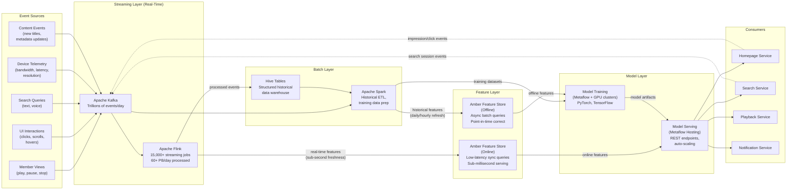
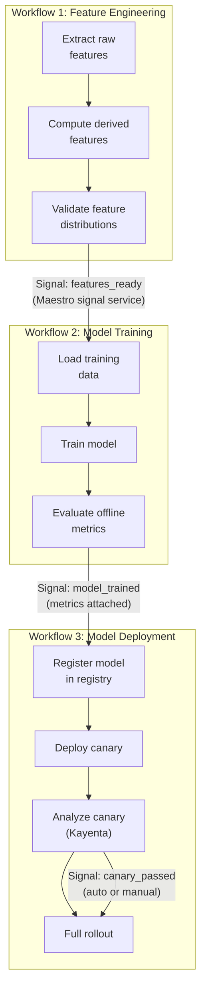

# Data Pipeline View

> **Extends:** arc42 S6 -- Runtime View

## Purpose

Data flows are the circulatory system of Netflix's ML platform. This view documents the complete data lifecycle from member interaction events through real-time stream processing (15,000+ Flink jobs), feature computation, model training (batch), and real-time serving -- with quality checkpoints at every stage. Critically, it makes the streaming vs. batch distinction explicit: Flink streaming jobs provide real-time features (sub-second freshness) for online serving, while Spark batch jobs prepare historical training datasets. This distinction, invisible in standard runtime views, is fundamental to understanding how Netflix's ML models operate.

## Pipeline Architecture Overview

## Pipeline Inventory

| Pipeline ID | Name | Type | Processing Engine | Freshness SLA | Scale | Owner |
|-------------|------|------|------------------|---------------|-------|-------|
| PL-001 | Member Interaction Ingestion | Streaming | Flink | < 1s from event generation | ~500K events/sec peak | Data Engineering |
| PL-002 | Real-Time Feature Computation | Streaming | Flink | < 5s from raw event to feature | 15,000+ Flink jobs | Data Engineering + ML Platform |
| PL-003 | Batch Feature Engineering | Batch | Spark | Daily refresh (nightly pipeline) | Petabytes per run | Data Engineering |
| PL-004 | Training Data Preparation | Batch | Spark + Metaflow | On-demand (per training run) | Variable (days to months of history) | ML Platform |
| PL-005 | Model Training Pipeline | Batch | Metaflow + Maestro | Varies by model (daily to quarterly) | GPU hours to GPU days | ML Engineering |
| PL-006 | Model Deployment Pipeline | Event-driven | Spinnaker + Kayenta | < 2 hours from training to canary | Per model deployment | ML Platform + SRE |
| PL-007 | Feedback Collection | Streaming + Batch | Flink (streaming) + Spark (aggregation) | Streaming: < 1s; Aggregation: hourly | Billions of feedback events/day | Data Engineering |

## Pipeline Details

### Member Interaction Ingestion (PL-001)

**Stages:**

| Stage | Input | Output | Processing | Quality Gate |
|-------|-------|--------|-----------|-------------|
| Event capture | Raw member actions (play, pause, stop, click, scroll, search, rate) from Netflix client apps | Structured event records in Kafka topics | Client-side event schema validation; server-side deduplication by event ID + timestamp | Schema conformance 100%; duplicate rate < 0.01% |
| Schema validation | Raw Kafka events | Validated events in downstream topics | Avro schema validation via Confluent Schema Registry; reject malformed events to dead-letter topic | Rejection rate < 0.001%; schema version compatibility check |
| Event enrichment | Validated events | Enriched events with member context and content metadata | Join event with member profile (cached) and content metadata (cached); add server-side timestamp | Enrichment coverage > 99.5%; latency < 50ms per event |
| Topic routing | Enriched events | Domain-specific Kafka topics (views, clicks, search, device) | Route by event type to dedicated downstream topics; partition by member ID for ordering guarantees | All events routed; no data loss (exactly-once Kafka semantics) |

### Real-Time Feature Computation (PL-002)

This is where the 15,000+ Flink jobs operate. Netflix uses a 1:1 mapping from Kafka source topic to consuming Flink job for operational simplicity.

**Stages:**

| Stage | Input | Output | Processing | Quality Gate |
|-------|-------|--------|-----------|-------------|
| Event consumption | Domain-specific Kafka topics | Raw event streams in Flink | Each Flink job consumes from one Kafka topic; watermark-based event-time processing | Consumer lag < 1 minute; backpressure monitoring |
| Windowed aggregation | Raw event streams | Time-windowed aggregates (1-min, 5-min, 1-hour, 24-hour) | Tumbling and sliding window computations: view counts, click rates, session durations, genre affinity scores | Window completeness > 99%; late event handling (allowed lateness: 5 minutes) |
| Feature computation | Windowed aggregates + enrichment context | Feature vectors per member, per content, per context | Join windowed aggregates with member profiles; compute derived features (engagement rate, recency-weighted preferences, diversity scores) | Feature null rate < 0.1%; value range validation per feature |
| Feature materialization | Computed feature vectors | Amber Feature Store (online) | Write features to online store with TTL and versioning; features keyed by (member_id, feature_group) | Write latency < 10ms; feature freshness < 5s from source event |

**Key distinction: streaming vs. batch features**

| Aspect | Streaming (Flink) | Batch (Spark) |
|--------|-------------------|---------------|
| Freshness | Sub-second to seconds | Hours to daily |
| Use case | Real-time serving (what to show right now) | Training data (what patterns exist over time) |
| Scale | 15,000+ concurrent jobs, 60+ PB/day | Scheduled nightly runs, petabytes per run |
| State management | Flink managed state (RocksDB backend) | Stateless transformations on immutable data |
| Failure recovery | Checkpoint-based recovery (< 30s) | Job restart from last successful stage |
| Cost model | Continuous resource allocation | Burst resource allocation during scheduled windows |

### Training Data Preparation (PL-004)

**Stages:**

| Stage | Input | Output | Processing | Quality Gate |
|-------|-------|--------|-----------|-------------|
| Historical data extraction | Hive tables (interaction history, content metadata) | Training-ready partitions in S3 | Time-range selection, member sampling strategy, negative sampling for implicit feedback | Coverage: all active members in time range; sampling consistency verified |
| Feature join | Raw interaction records + Amber offline features | Feature-enriched training examples | Point-in-time-correct feature joins (prevent data leakage: only features available before the interaction timestamp) | Point-in-time correctness verified; no future feature leakage |
| Label construction | Interaction events with outcomes | Labeled training examples (positive/negative/implicit) | Construct training labels: explicit (ratings), implicit (views > X minutes = positive; skip = negative), engagement-weighted | Label distribution logged; class imbalance metrics computed |
| Dataset validation | Labeled, feature-enriched examples | Validated training dataset in S3 (Parquet) | Schema validation, null checks, feature distribution analysis, train/validation/test split | Feature completeness > 98%; no label leakage; distribution report generated |

### Maestro Workflow Orchestration

Maestro's signal-based coordination enables complex multi-stage ML pipelines that cannot be represented in standard runtime views:

This signal-based chaining means that Workflow 2 (Model Training) does not start on a fixed schedule but is triggered by the completion signal from Workflow 1 (Feature Engineering). The signal carries metadata (e.g., feature version, row count, quality metrics) that the downstream workflow uses to configure itself. This event-driven orchestration pattern is what standard arc42 runtime views cannot represent.

## Feature Store (Amber)

| Feature Group | Features (approx.) | Source Pipeline | Online Refresh | Offline Refresh | Consumers |
|---------------|-------------------|----------------|---------------|----------------|-----------|
| Member behavioral features | 200+ | PL-002 (Flink streaming) | Real-time (< 5s) | Daily | MDL-REC, MDL-PERS, MDL-SEARCH |
| Content features | 150+ | PL-003 (Spark batch) + catalog events | On catalog update | Daily | MDL-REC, MDL-SEARCH, MDL-QUAL |
| Contextual features | 50+ | PL-002 (Flink streaming) | Real-time | Hourly | MDL-REC, MDL-PERS |
| Member-content interaction features | 300+ | PL-002 (Flink) + PL-003 (Spark) | 5-minute windows | Daily | MDL-REC |
| Device and network features | 30+ | PL-002 (Flink from device telemetry) | Real-time | Daily | MDL-QUAL |

Amber provides two serving interfaces:
- **Synchronous (online):** Low-latency key-value lookups for real-time model serving. Optimized for sub-millisecond response time.
- **Asynchronous (offline):** Batch feature retrieval for training data construction. Supports point-in-time-correct joins to prevent data leakage.

## Feedback Loops

| Loop | From | To | Mechanism | Risk | Mitigation |
|------|------|----|-----------|------|------------|
| Recommendation feedback | Member viewing behavior (influenced by recommendations) -> Kafka -> Flink -> Amber -> MDL-REC training data | MDL-REC (next retrain) | Implicit feedback: content shown and clicked/played becomes positive training signal; content shown but not clicked becomes negative signal | Popularity bias amplification: frequently recommended content accumulates more positive signals, crowding out niche content. Filter bubble: members receive increasingly narrow recommendations. | Exploration budget via contextual bandits (explore 5--10% of recommendations). Diversity constraints in recommendation post-processing. Counterfactual evaluation during model training. |
| Search feedback | Search result clicks -> Kafka -> training data for search ranking | MDL-SEARCH (next retrain) | Click-through rate on search results provides relevance labels | Position bias: higher-ranked results get more clicks regardless of true relevance | Inverse propensity weighting in training; randomized search result experiments (1% traffic) |
| A/B test feedback | Experiment metrics -> model selection decision -> new model version deployed | All models via ABlaze | Winning A/B test variant becomes new production model | Multiple testing problem: running many simultaneous experiments increases false positive rate | Sequential testing (Netflix has published extensively on this); always-valid confidence intervals |
