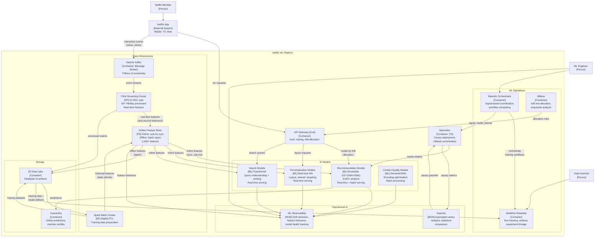

# C4 Container Diagram — Netflix ML Platform

> **Diagram type:** C4 Level 2 -- Container Diagram
>
> **RAD-AI extensions:** AI component stereotypes `[ML]`, `[FS]`, `[DP]`, `[MON]`

## Purpose

This diagram decomposes the Netflix ML Platform into its runtime containers, applying RAD-AI stereotypes to distinguish ML models, feature stores, data pipelines, and monitors from conventional software containers. Each AI container is annotated with its type, scale, and key characteristics. This view makes visible what the standard C4 container diagram hides: the 3,000+ ML projects, the feature store mediating between data and models, the streaming vs. batch distinction in data processing, and the experimentation infrastructure.

## Container Inventory

| Container | Stereotype | Technology | Description |
|-----------|-----------|------------|-------------|
| API Gateway (Zuul) | -- | Java/Zuul | Request routing, auth, rate limiting, A/B test allocation |
| Recommendation Models | `[ML]` | PyTorch, DGL | Ensemble: CF + DNN + GNN for content ranking |
| Personalization Models | `[ML]` | PyTorch | Multi-task NN for UI layout, artwork, notifications |
| Search Models | `[ML]` | PyTorch (Transformer) | Query understanding and result ranking |
| Content Quality Models | `[ML]` | PyTorch (SemanticGNN) | Video/audio quality prediction, encoding optimization |
| Amber Feature Store | `[FS]` | Custom (online + offline) | Feature serving: sync (sub-ms) and async (batch) |
| Flink Streaming Cluster | `[DP]` | Apache Flink | 15,000+ streaming jobs; real-time feature computation |
| Spark Batch Cluster | `[DP]` | Apache Spark | Batch ETL, training data preparation |
| Metaflow Metadata Service | -- | Python/Flask | Experiment tracking, artifact management, run lineage |
| Maestro Orchestrator | -- | Java/Spring | Workflow scheduling, signal-based coordination |
| ABlaze Experimentation | -- | React/Node.js | A/B test management, allocation, analysis |
| ML Observability | `[MON]` | Custom + Grafana | Drift detection, model health, feature freshness |
| Kayenta Canary Analysis | `[MON]` | Kayenta (open-source) | Automated canary deployment analysis |
| Apache Kafka | -- | Kafka | Event streaming backbone (trillions of events/day) |
| S3 Data Lake | -- | AWS S3 | Model artifacts, training data (petabytes) |
| Cassandra | -- | Apache Cassandra | Online storage, prediction cache |
| Spinnaker | -- | Spinnaker | Continuous delivery, canary orchestration |

## Container Diagram

## Stereotype Annotations

### ML Components

| Model ID | Container | Serving Mode | Key Characteristic |
|----------|-----------|-------------|-------------------|
| MDL-REC | Recommendation Models | Real-time (synchronous) + batch (pre-compute) | Ensemble of CF + DNN + GNN; multi-task architecture serving multiple recommendation surfaces |
| MDL-PERS | Personalization Models | Real-time (synchronous) | Multi-task NN; personalizes UI layout, artwork selection, and notification targeting per member |
| MDL-SEARCH | Search Models | Real-time (synchronous) | Transformer-based; query understanding + content retrieval + personalized ranking |
| MDL-QUAL | Content Quality Models | Batch | SemanticGNN; predicts perceptual quality per encoding configuration |

### Feature Store [FS]

Amber serves as the central feature mediation layer between data infrastructure and ML models:

- **Online serving:** Sub-millisecond synchronous lookups for real-time model inference. Features keyed by member ID, content ID, or context.
- **Offline serving:** Batch feature retrieval for model training with point-in-time correctness (prevents data leakage).
- **Feature groups:** 1,000+ features organized by domain (member behavioral, content, contextual, device).
- **Freshness contract:** Online features refreshed in real-time by Flink (< 5s from source event); offline features refreshed daily by Spark.

### Data Pipeline [DP]

| Pipeline | Type | Scale | Freshness |
|----------|------|-------|-----------|
| Flink Streaming Cluster | Continuous streaming | 15,000+ concurrent jobs; 60+ PB/day | Sub-second to seconds |
| Spark Batch Cluster | Scheduled batch | Nightly runs; petabytes per run | Daily |

The streaming/batch distinction is architecturally significant: Flink provides real-time features that make recommendations responsive to current member behavior, while Spark provides historical features that capture long-term patterns for model training.

### Monitoring [MON]

| Monitor | Scope | Key Capabilities |
|---------|-------|-----------------|
| ML Observability | All production models and features | Drift detection (data, concept, prediction), feature freshness tracking, model performance degradation alerting |
| Kayenta | Model deployments | Automated canary analysis comparing candidate model metrics against baseline using configurable statistical tests |

## Data Flow Summary

1. **Ingestion path:** Member interactions -> Netflix App -> Kafka -> Flink (streaming) -> Amber (online features) + S3 (raw events).
2. **Feature computation (real-time):** Kafka -> Flink (15,000+ jobs) -> Amber online store. Sub-second freshness.
3. **Feature computation (batch):** S3 -> Spark -> Amber offline store. Daily refresh.
4. **Real-time inference:** API Gateway -> ML Model -> Amber (feature lookup) -> prediction with confidence.
5. **Training:** S3 (training data) + Amber (offline features) -> Metaflow training workflow -> S3 (model artifacts).
6. **Deployment:** Metaflow -> Maestro (signal: model_trained) -> Spinnaker (canary deploy) -> Kayenta (analysis) -> production.
7. **Experimentation:** ABlaze (allocation) -> API Gateway (routing) -> ML Model variants -> ABlaze (metric collection + analysis).
8. **Monitoring loop:** All ML containers -> ML Observability -> Grafana/alerts -> Maestro (retraining trigger if drift detected).
