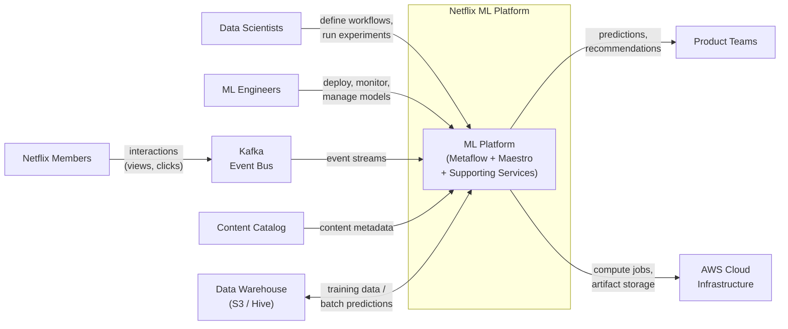
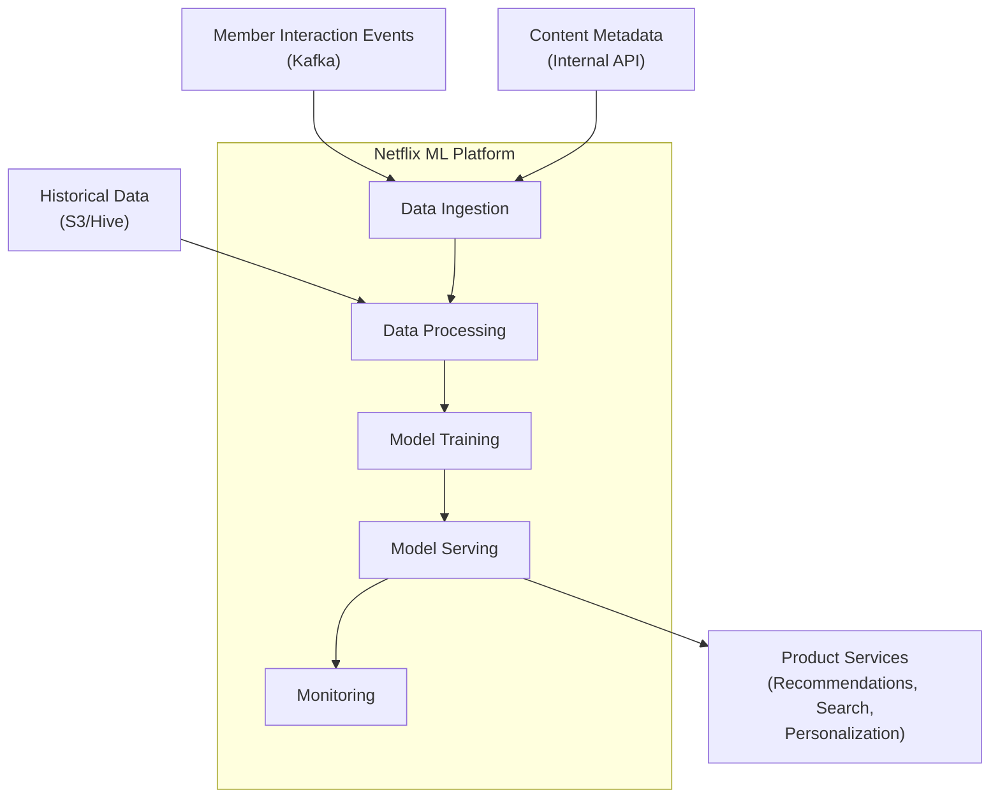

# arc42 Section 3: Context and Scope

> **Standard arc42** -- no RAD-AI extensions applied

## 3.1 Business Context

The Netflix ML Platform serves as the central infrastructure layer enabling machine learning across Netflix's product ecosystem. It provides tools and services for data scientists and ML engineers to build, train, deploy, and monitor ML models at scale.

### External Actors

| Actor | Description | Interaction |
|-------|-------------|-------------|
| Data Scientists | Internal users who build and iterate on ML models using Metaflow | Define workflows, run experiments, analyze results |
| ML Engineers | Internal users who productionize and maintain ML pipelines | Deploy models, configure monitoring, manage retraining |
| Product Teams | Internal consumers of ML model outputs | Consume recommendations, personalization signals, content quality scores |
| Netflix Members | End users whose interactions generate training data and consume ML-driven experiences | Stream content, provide implicit feedback (views, clicks, dwell time) |
| Content Catalog | Internal system providing metadata about titles, genres, artwork | Provides content features for recommendation and search models |
| Data Warehouse | Internal storage (S3, Hive tables) for historical interaction data | Source of training data; destination for batch predictions |
| Cloud Infrastructure (AWS) | Compute and storage provider | GPU/CPU instances for training, S3 for artifacts, EKS for serving |

### System Context Diagram

## 3.2 Technical Context

### Interfaces

| Interface | Technology | Direction | Protocol | Description |
|-----------|-----------|-----------|----------|-------------|
| Metaflow Client API | Python SDK | Inbound | Python API | Data scientists define and execute ML workflows |
| Maestro REST API | REST/HTTP | Inbound | JSON over HTTPS | Workflow scheduling, triggering, and management |
| Model Serving Endpoints | REST/HTTP | Outbound | JSON over HTTPS | Serve predictions to product microservices |
| Kafka Topics | Apache Kafka | Inbound | Avro/Protobuf | Consume member interaction events, publish predictions |
| S3 Storage | AWS S3 | Bidirectional | S3 API | Model artifacts, training data, experiment logs |
| Hive Metastore | Hive/Spark SQL | Bidirectional | JDBC/Thrift | Structured data access for training and batch inference |
| Spinnaker Pipelines | REST/HTTP | Outbound | JSON over HTTPS | Trigger deployment pipelines for model updates |
| Monitoring APIs | Prometheus/Grafana | Outbound | PromQL | Emit model and infrastructure metrics |

### Data Flows

## Limitations

This standard arc42 context and scope section captures the system's external boundaries and interfaces but leaves several critical architectural concerns undocumented:

1. **No distinction between ML and non-ML components.** The "ML Platform" appears as a single box. There is no way to indicate which components produce deterministic outputs (API gateway, data warehouse queries) versus non-deterministic outputs (recommendation models, personalization models). Stakeholders cannot see where probabilistic behavior begins.

2. **DAG dependencies invisible.** Metaflow workflows are Python-native DAGs where steps have explicit data dependencies (each step consumes artifacts produced by previous steps). These intra-workflow dependencies, and the event-triggered chaining between workflows via Maestro's `@trigger_on_finish` decorator, have no representation in this view. A workflow completing can trigger an entirely separate workflow, but this coordination pattern is invisible.

3. **Streaming vs. batch not distinguished.** The 15,000+ Flink streaming jobs (processing 60+ PB/day for real-time features) and the batch Spark/Hive jobs (processing historical data for model training) appear identically as "Data Processing." The fundamentally different latency profiles, freshness guarantees, and failure modes of these two processing paradigms cannot be expressed.

4. **Signal-based coordination absent.** Maestro's signal service allows workflows to publish signals that other workflows subscribe to, creating cross-workflow dependencies based on data availability rather than scheduled times. This event-driven orchestration pattern has no counterpart in standard context diagrams.

5. **No confidence or quality metadata.** The data flows show what data moves between components but cannot express the quality characteristics: model confidence ranges, prediction freshness requirements, or fallback behavior when ML components are unavailable.

6. **Feature store invisible.** The Amber feature store, which mediates between raw data and model inputs with both online (low-latency serving) and offline (batch training) interfaces, does not appear as a distinct architectural element. It is subsumed into the generic "Data Processing" box.
