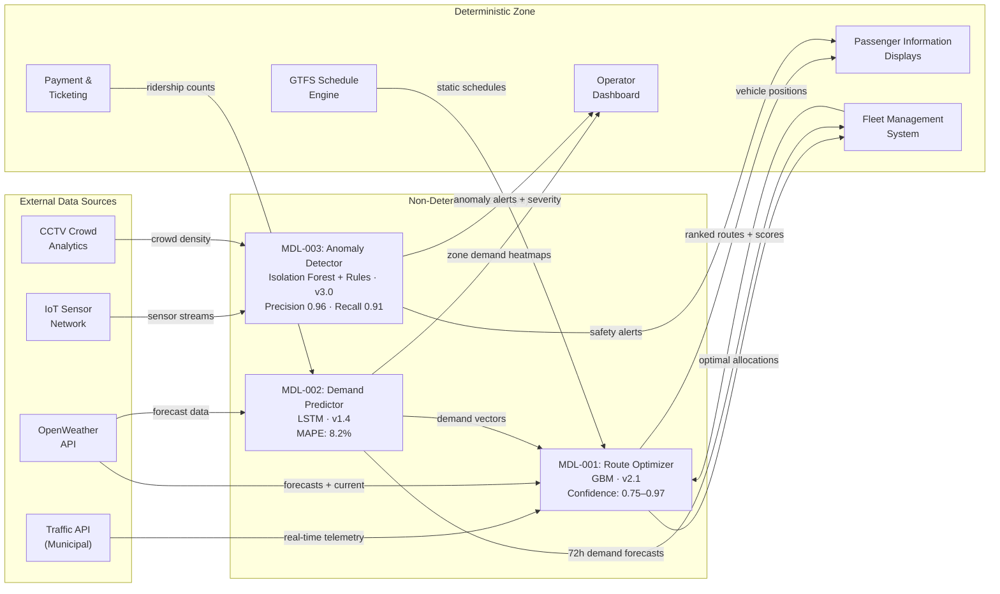

# AI Boundary Delineation

> **Extends:** arc42 §3 — Context & Scope

## Purpose

The Smart Urban Mobility (SUM) platform integrates three AI components into a broader deterministic ecosystem of scheduling engines, payment systems, and passenger information displays. This section delineates the boundary between deterministic and non-deterministic behavior so that all stakeholders — from the city transport authority to individual commuters — understand where probabilistic outputs are produced, what confidence guarantees apply, and how the system degrades when AI components are unavailable.

## AI Components Inventory

| Component | Type | Input Domain | Output Domain | Confidence Range | Fallback Strategy |
|-----------|------|-------------|---------------|-----------------|-------------------|
| Route Optimizer (MDL-001) | Multi-objective optimization (GBM) | Real-time traffic telemetry, weather feeds (OpenWeather), demand vectors from MDL-002, transit schedules, user origin/destination | Ranked list of multimodal routes with ETA, cost, CO₂ estimates, and selection scores | 0.75–0.97 | Static shortest-path routing from pre-computed GTFS timetables; no real-time optimization |
| Demand Predictor (MDL-002) | Time-series forecasting (LSTM) | Historical ridership (3 years), event calendars, school/holiday schedules, weather forecasts, zone-level demographics | Demand forecast per transport mode, zone, and 30-minute time window (72-hour horizon) | MAPE 6.1%–12.4% (varies by zone density) | 8-week rolling average per zone/mode/timeslot; updated daily |
| Anomaly Detector (MDL-003) | Ensemble detection (Isolation Forest + rule engine) | IoT sensor streams (vibration, temperature, load), CCTV crowd density estimates, SCADA alerts, vehicle telemetry | Anomaly classification (infrastructure failure, crowd surge, hazardous condition) with severity score and contributing factors | Precision 0.96, Recall 0.91 at operating threshold | Rule-based alerting on raw sensor thresholds only; no predictive detection; immediate escalation to human operator |

## System Boundary Diagram

## Failure Modes

| Component | Failure Condition | System Behavior | User Impact |
|-----------|------------------|-----------------|-------------|
| Route Optimizer (MDL-001) | Model service unavailable (health check fails for >30s) | Routing falls back to static GTFS-based shortest-path computation. Real-time traffic and weather adjustments disabled. PID displays routes marked as "scheduled times — live updates unavailable." | Routes may be suboptimal; ETAs based on timetable rather than real-time conditions. Commuters see a transparency notice on the app. |
| Route Optimizer (MDL-001) | Confidence score < 0.75 for top-ranked route | Low-confidence route suppressed from recommendations. Next highest-confidence route offered instead. If no route exceeds threshold, static GTFS fallback activated for that origin-destination pair. | Slightly fewer route options presented; user may not notice unless all routes are low-confidence. |
| Demand Predictor (MDL-002) | Model service unavailable or inference latency >5s | Fleet management switches to 8-week rolling average demand baseline. Forecast horizon shrinks from 72 hours to current-day only. | Fleet pre-positioning may be less responsive to sudden demand changes. Operators are alerted to manual review. |
| Demand Predictor (MDL-002) | MAPE exceeds 15% on rolling 24-hour window (drift detected) | Automatic model quarantine triggered. System reverts to rolling-average baseline and pages the ML engineering team. Retraining pipeline initiated on fresh data. | Same as model unavailability from operator perspective. Retraining typically completes within 4 hours. |
| Anomaly Detector (MDL-003) | Model service unavailable | Rule-based alerting activated using hardcoded sensor thresholds (vibration >2.5g, temperature >85°C, crowd density >6 persons/m²). Human operators receive all raw alerts without AI-based severity triage. | Higher volume of untriaged alerts to operators; increased false-positive rate. No predictive warning capability. Safety-critical: escalation to shift supervisor within 5 minutes. |
| Anomaly Detector (MDL-003) | Anomaly score in ambiguous zone (0.4–0.6 severity) | Alert flagged as "Requires Human Review" with full contributing-factor breakdown. Not auto-escalated but queued for operator within 15 minutes. | Potential delay in anomaly response if operator queue is saturated. Mitigated by queue-depth monitoring with automatic escalation at >5 pending reviews. |

## External AI Dependencies

| Service | Provider | SLA | Data Sent | Fallback |
|---------|----------|-----|-----------|----------|
| Traffic Telemetry API | Municipal Transport Authority (in-region) | 99.5% availability, <2s latency | Query parameters only (road segment IDs, timestamps); no personal data | Cached traffic state (last 10 minutes) used for routing; staleness indicator shown to users |
| OpenWeather API | OpenWeather Ltd. | 99.0% availability per commercial tier | GPS bounding box of metro area, timestamps | 24-hour weather forecast cache (refreshed hourly); fallback to national meteorological service RSS feed |
| CCTV Crowd Analytics | In-house edge compute (no external dependency) | N/A (local processing) | N/A (on-premise) | Direct CCTV frame analysis disabled; crowd density estimated from fare-gate throughput data instead |

All external data flows remain within the EEA. No personal or identifiable data is transmitted to external providers. The Traffic Telemetry API operates under a data-processing agreement with the municipal authority. The OpenWeather API receives only geographic bounding boxes without user-level information.
