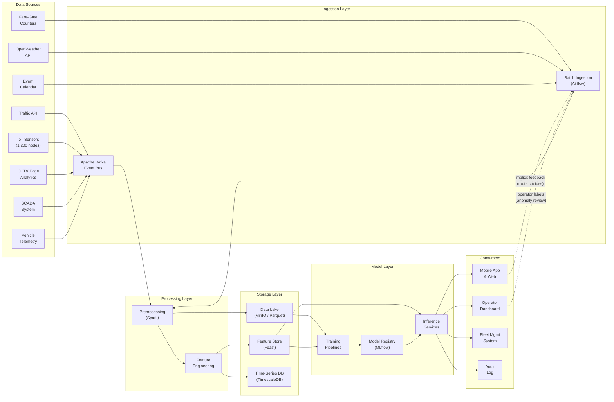

# Data Pipeline View

> **Extends:** arc42 §6 — Runtime View

## Purpose

Data flows are the circulatory system of the SUM platform's AI architecture. This view documents the complete data lifecycle from ingestion through preprocessing, feature engineering, model training, real-time inference, and feedback loops. It captures the data-centric runtime behavior that distinguishes AI systems from conventional software: the training-serving skew risks, data quality gates, feature store interactions, and the feedback mechanisms through which model outputs influence future training data.

## Pipeline Overview

## Pipeline Inventory

| Pipeline ID | Name | Type | Schedule | SLA | Owner |
|-------------|------|------|----------|-----|-------|
| PL-001 | Route Feature Pipeline | Hybrid (streaming ingestion, batch feature engineering) | Streaming ingestion; feature aggregation every 5 minutes | < 60s end-to-end for streaming; < 10 min for batch features | ML Engineering Team |
| PL-002 | Demand Data Pipeline | Batch | Hourly aggregation; daily feature engineering | < 15 min per hourly batch | ML Engineering Team |
| PL-003 | Anomaly Sensor Pipeline | Streaming | Real-time (continuous) | < 5s sensor-to-feature latency | ML Engineering Team + Safety Engineering |
| PL-004 | Route Model Training Pipeline | Batch (on-demand) | Quarterly scheduled; ad-hoc on drift detection | < 6 hours end-to-end | ML Engineering Team |
| PL-005 | Demand Model Training Pipeline | Batch (on-demand) | Monthly scheduled; ad-hoc on drift detection | < 4 hours end-to-end | ML Engineering Team |
| PL-006 | Anomaly Model Training Pipeline | Batch (on-demand) | Bi-monthly scheduled; ad-hoc on new incident labels | < 8 hours end-to-end (includes safety review) | ML Engineering Team + Safety Engineering |
| PL-007 | Feedback Collection Pipeline | Batch | Daily | < 30 min | ML Engineering Team |

## Pipeline Details

### Route Feature Pipeline (PL-001)

**Stages:**

| Stage | Input | Output | Processing | Quality Gate |
|-------|-------|--------|-----------|-------------|
| Streaming ingestion | Traffic API events, vehicle telemetry via Kafka | Raw traffic/telemetry events in data lake (Parquet) | Schema validation, timestamp normalization (UTC), deduplication by event ID | Schema conformance 100%; duplicate rate < 0.1% |
| Batch ingestion | OpenWeather forecasts, GTFS schedules (hourly refresh) | Raw weather and schedule records in data lake | API response validation, missing-field imputation for weather gaps | Weather completeness > 95%; GTFS version consistency check |
| Feature engineering | Raw traffic, weather, schedule, demand forecast data | 47-feature vector per route candidate | Zone-level traffic aggregation (5-min windows), weather encoding, demand feature join from MDL-002 outputs, temporal features (hour-of-day, day-of-week, holiday flag) | Feature value range validation; null rate < 0.5% per feature; distribution drift check (PSI < 0.1) |
| Feature store write | Engineered feature vectors | Online feature store (Feast) + offline store (Parquet) | Upsert to online store; append to offline store partition | Write success confirmation; online/offline consistency check |

**Data Quality Checkpoints:**

| Checkpoint | Location | Validation Rule | On Failure |
|------------|----------|----------------|------------|
| Schema validation | After Kafka ingestion | All required fields present; types match Avro schema; timestamps within ±5 min of current time | Reject event; log to dead-letter queue; alert if rejection rate > 1% in 5-min window |
| Completeness check | After batch ingestion | Weather data: all 8 features present for each hourly record; GTFS: valid feed with no expired service dates | Impute missing weather from 24h prior; block GTFS update if validation fails (retain previous version) |
| Feature drift monitor | After feature engineering | Population Stability Index (PSI) < 0.1 for each feature vs. training distribution baseline | PSI 0.1–0.2: warning to ML team. PSI > 0.2: block feature store update; trigger investigation |
| Null rate check | After feature engineering | Null values < 0.5% per feature column | Impute using zone-level median for numeric features; reject batch if >2% null in any critical feature |

**Schema (route feature vector):**

| Field | Type | Constraints | Description |
|-------|------|------------|-------------|
| route_id | string | not null, UUID format | Unique identifier for the route candidate |
| origin_zone | string | not null, one of 48 zone codes | Hexagonal zone of trip origin |
| dest_zone | string | not null, one of 48 zone codes | Hexagonal zone of trip destination |
| traffic_speed_avg | float | not null, range 0–120 km/h | Average traffic speed on route segments (5-min window) |
| traffic_congestion_idx | float | not null, range 0.0–1.0 | Normalized congestion index for route corridor |
| weather_temp_c | float | range -30 to 50 | Current temperature in Celsius |
| weather_precip_mm | float | range 0–100 | Precipitation in mm/h |
| demand_forecast_mode | float | not null, range 0–10000 | Predicted demand for primary mode in next 30-min window |
| hour_of_day | int | range 0–23 | Hour component of request time |
| is_holiday | boolean | not null | Whether the date is a public holiday |
| transit_frequency | float | not null, range 0–60 | Departures per hour for transit modes on route |

---

### Demand Data Pipeline (PL-002)

**Stages:**

| Stage | Input | Output | Processing | Quality Gate |
|-------|-------|--------|-----------|-------------|
| Fare-gate ingestion | Fare-gate tap-in/tap-out events (3 operators, hourly batch files via SFTP) | Standardized ridership records in data lake | Operator-specific format normalization, deduplication, fare-gate ID to zone mapping | Record count reconciliation with operator manifests (tolerance ±0.5%) |
| Event calendar sync | Municipal event API, permit database (weekly pull) | Structured event records with zone mapping and expected attendance | Geocoding, zone assignment, attendance estimation for unpopulated fields | All events geocoded to valid zone; attendance estimate present |
| Demand aggregation | Raw ridership + app trip completions | Demand counts per mode, zone, 30-min window | Aggregation by (mode, zone, time_window); outlier capping at 99.5th percentile | Completeness: all 48 zones × 5 modes × 48 windows represented per day |
| Feature engineering | Aggregated demand, event calendar, weather, demographics | 32-feature demand vector per (zone, mode, time_window) | Lag features (1d, 7d, 28d), rolling statistics, event proximity encoding, weather forecast join, demographic weighting | Feature completeness > 99%; lag feature availability check |

**Data Quality Checkpoints:**

| Checkpoint | Location | Validation Rule | On Failure |
|------------|----------|----------------|------------|
| Operator reconciliation | After fare-gate ingestion | Record count within ±0.5% of operator-provided manifest; no duplicate card IDs within 60s window | Reject batch; request retransmission from operator; use previous hour's data for time-sensitive consumers |
| Zone coverage check | After demand aggregation | All 48 zones have demand data for each mode where that mode operates | Impute missing zone-mode combinations from 4-week same-day average; flag for manual review |
| Temporal completeness | After demand aggregation | No gaps >2 consecutive 30-min windows per zone-mode | Interpolate gaps <2 windows; reject day partition if >5% gaps; alert data engineering |
| Stationarity test | After feature engineering (monthly) | Augmented Dickey-Fuller p-value < 0.05 for core demand features | Trigger retraining evaluation; investigate structural break (new transit line, zone boundary change) |

**Schema (demand feature vector):**

| Field | Type | Constraints | Description |
|-------|------|------------|-------------|
| zone_id | string | not null, one of 48 zone codes | Hexagonal zone identifier |
| mode | enum | not null, one of {bus, metro, tram, rideshare, escooter} | Transport mode |
| time_window | timestamp | not null, 30-min aligned | Start of the 30-minute prediction window |
| demand_current | int | not null, >= 0 | Observed demand in current window |
| demand_lag_1d | int | >= 0 | Demand same window yesterday |
| demand_lag_7d | int | >= 0 | Demand same window last week |
| demand_rolling_7d_avg | float | >= 0 | 7-day rolling average for this zone-mode-window |
| event_proximity_km | float | >= 0, nullable | Distance to nearest active event; null if none within 5km |
| event_expected_attendance | int | >= 0, nullable | Expected attendance of nearest event |
| weather_forecast_temp | float | range -30 to 50 | Forecast temperature for the window |
| weather_forecast_precip | float | range 0–100 | Forecast precipitation for the window |
| zone_population_density | float | not null, > 0 | Resident population density (persons/km²) |

---

### Anomaly Sensor Pipeline (PL-003)

**Stages:**

| Stage | Input | Output | Processing | Quality Gate |
|-------|-------|--------|-----------|-------------|
| Sensor ingestion | IoT sensor streams (vibration, temperature, load from 1,200 sensors), SCADA alerts, vehicle telemetry — all via Kafka | Validated sensor events in TimescaleDB | Schema validation, sensor ID resolution, unit normalization, timestamp synchronization (NTP-aligned) | Sensor heartbeat check: alert if any sensor silent >5 min; schema rejection rate < 0.01% |
| CCTV analytics ingestion | Crowd density estimates from edge compute nodes (30s intervals) | Normalized crowd density per station/platform zone | Edge model output validation, spatial resolution normalization to platform zones | Density values in plausible range (0–15 persons/m²); edge node health check |
| Feature engineering | Sensor time-series, CCTV density, SCADA alerts | 24-feature anomaly detection vector (sliding 60s window) | Rolling statistics (mean, std, max over 60s), rate-of-change computation, cross-sensor correlation features, SCADA alert encoding | Feature freshness < 5s; no stale sensor data (>30s old) in feature vector |
| Inference-ready buffer | Engineered feature vectors | Kafka topic for real-time inference | Buffering with exactly-once semantics; feature vector completeness check | All 24 features present; vector timestamp within 5s of wall clock |

**Data Quality Checkpoints:**

| Checkpoint | Location | Validation Rule | On Failure |
|------------|----------|----------------|------------|
| Sensor heartbeat | Continuous monitoring | Every sensor transmits at least 1 event per 5 minutes | Mark sensor as offline; exclude from feature engineering; alert infrastructure team; if >10% sensors offline in a zone, escalate to shift supervisor |
| Value range validation | After sensor ingestion | Vibration: 0–50g; Temperature: -40 to 150°C; Load: 0–200% rated capacity | Reject out-of-range values; if sustained out-of-range from single sensor, flag sensor malfunction |
| Feature freshness | After feature engineering | All features computed from data < 30s old | Drop stale features; degrade to rule-based detection only for affected zone until freshness restored |
| Cross-sensor consistency | After feature engineering | Correlated sensors (same platform) within expected correlation bounds | Flag potential sensor calibration drift; alert infrastructure team for recalibration |

**Schema (anomaly feature vector):**

| Field | Type | Constraints | Description |
|-------|------|------------|-------------|
| zone_id | string | not null | Infrastructure zone identifier |
| timestamp | timestamp | not null, within 5s of current time | Feature vector generation time |
| vibration_mean_60s | float | not null, >= 0 | Mean vibration across zone sensors (60s window) |
| vibration_max_60s | float | not null, >= 0 | Peak vibration in window |
| vibration_rate_of_change | float | not null | First derivative of vibration trend |
| temperature_mean_60s | float | not null | Mean temperature across zone sensors |
| temperature_max_60s | float | not null | Peak temperature in window |
| load_mean_60s | float | not null, >= 0 | Mean structural load (% rated capacity) |
| crowd_density_mean | float | not null, >= 0 | Mean crowd density (persons/m²) from CCTV |
| crowd_density_max | float | not null, >= 0 | Peak crowd density in window |
| crowd_density_rate | float | not null | Rate of change in crowd density |
| scada_alert_count | int | not null, >= 0 | Number of SCADA alerts in zone in last 5 min |
| scada_severity_max | int | range 0–4 | Highest SCADA alert severity in window |
| sensor_online_ratio | float | not null, range 0.0–1.0 | Fraction of zone sensors reporting |

## Feature Store

| Feature Group | Features | Source Pipeline | Refresh Rate | Consumers |
|---------------|----------|---------------|-------------|-----------|
| Route traffic features | traffic_speed_avg, traffic_congestion_idx, transit_frequency, segment_delay_minutes (12 features) | PL-001 | Every 5 minutes (online); daily (offline) | MDL-001 |
| Route context features | weather_temp_c, weather_precip_mm, hour_of_day, is_holiday, demand_forecast_mode (8 features) | PL-001 | Every 5 minutes (online); hourly (offline) | MDL-001 |
| Demand time-series features | demand_current, demand_lag_*, demand_rolling_*, demand_seasonal_* (18 features) | PL-002 | Hourly (online); daily (offline) | MDL-002 |
| Demand context features | event_proximity_km, event_expected_attendance, weather_forecast_*, zone_population_density (14 features) | PL-002 | Hourly (online); weekly (offline) | MDL-002 |
| Anomaly sensor features | vibration_*, temperature_*, load_*, crowd_density_*, scada_* (24 features) | PL-003 | Real-time / 5s (online only; no offline store) | MDL-003 |

The feature store is implemented using Feast, with Redis as the online store backend for low-latency serving and MinIO (Parquet) as the offline store for training dataset construction. Online-offline consistency is verified daily through automated reconciliation jobs that compare sampled online values against their offline counterparts, with a tolerance threshold of 0.1% divergence.

## Feedback Loops

| Loop | From | To | Mechanism | Risk | Mitigation |
|------|------|----|-----------|------|------------|
| Route selection feedback | User route choices in mobile app (implicit signal: which recommended route was selected) | PL-007 → DS-ROUTE training data | App logs selected route vs. alternatives shown; aggregated daily; used as ground-truth labels for route ranking quality in next retrain | Popularity bias: frequently recommended routes accumulate more positive signals, crowding out potentially better alternatives | Exploration budget: 5% of recommendations include a randomly promoted alternative route. Counterfactual evaluation on held-out set during retraining. Quarterly manual audit of route diversity metrics. |
| Anomaly review feedback | Operator anomaly review decisions (true positive, false positive, severity adjustment) | PL-007 → DS-ANOMALY labeled incident dataset | Operators review and label each alert via dashboard; labels ingested daily and incorporated in bi-monthly retrain | Label quality degradation: operator fatigue during high-alert periods may lead to hasty or inaccurate labels, particularly for ambiguous cases | Dual-labeling for severity >3 alerts (two independent operators). Monthly inter-annotator agreement audit (target Cohen's kappa > 0.8). Disagreements resolved by safety engineering team before inclusion in training data. |
| Demand actuals feedback | Actual observed demand (fare-gate counts, app trip completions) | PL-002 → DS-DEMAND training data | Actual demand automatically compared to forecast; error metrics computed per zone-mode-window; actuals become ground truth in next retrain | Distribution shift from self-fulfilling prophecy: if fleet allocation fully trusts demand forecasts, observed demand reflects supply-constrained ceiling rather than true demand | Holdout zones: 4 of 48 zones rotate quarterly where fleet allocation uses rolling-average baseline instead of MDL-002 forecasts, preserving unconstrained demand signal. Demand forecasts compared against unconstrained holdout actuals during retraining evaluation. |
