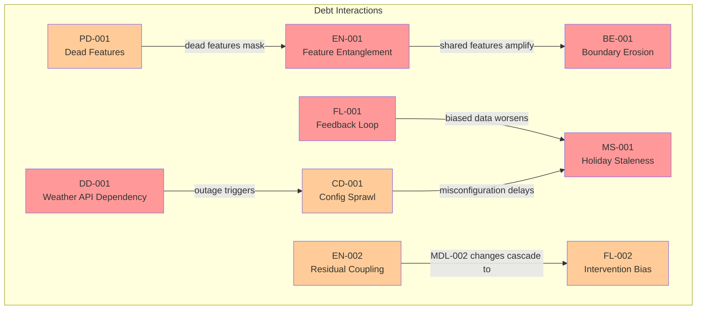

# AI Debt Register

> **Extends:** arc42 S11 -- Risks & Technical Debt
>
> **System:** Smart Urban Mobility (SUM) Ecosystem
>
> **Last Updated:** 2026-02-17

## Purpose

Structured tracking of ML-specific technical debt categories, based on Sculley et al.'s taxonomy. The SUM platform's three interacting AI components (Route Optimizer, Demand Predictor, Anomaly Detector) create debt patterns that traditional technical debt tracking misses -- through data dependencies, feedback loops, and configuration complexity.

## Debt Categories

### Boundary Erosion

*When the boundaries between ML components and the rest of the system become unclear, making changes risky.*

| ID | Description | Severity | Affected Components | Mitigation Plan | Owner | Status |
|----|-------------|----------|--------------------|--------------------|-------|--------|
| BE-001 | Route Optimizer (MDL-001) directly consumes raw demand forecasts from Demand Predictor (MDL-002) via shared in-memory cache, bypassing the defined API contract. Changes to MDL-002's output schema (e.g., adding confidence intervals in v1.5) risk breaking MDL-001 without any contract validation catching it. The coupling was introduced as a latency optimization during the v2.0 sprint but was never reverted. | High | MDL-001, MDL-002 | Reintroduce API gateway between MDL-001 and MDL-002 with schema validation (JSON Schema); add contract tests to CI pipeline; migrate shared cache to versioned message bus (Kafka topic with schema registry). Target: Q2 2026. | ML Platform Lead (J. van der Berg) | Open |
| BE-002 | Anomaly Detector (MDL-003) feature preprocessing logic is duplicated between the training pipeline (Python/pandas) and serving pipeline (Java/Flink). Feature definitions have diverged: the training pipeline applies z-score normalization per zone, while serving uses global normalization. This training-serving skew causes a measured 1.8% precision drop in production vs. offline evaluation. | Medium | MDL-003 | Consolidate feature logic into the shared Feature Store (Feast); implement feature parity tests that compare training and serving feature distributions weekly. Target: Q3 2026. | ML Engineer (A. Kowalski) | Open |

### Entanglement

*When changing one model's input features or behavior unexpectedly affects other models (CACE: Changing Anything Changes Everything).*

| ID | Description | Severity | Affected Components | Mitigation Plan | Owner | Status |
|----|-------------|----------|--------------------|--------------------|-------|--------|
| EN-001 | MDL-001 and MDL-002 share 14 of their input features through the Feature Store (e.g., `zone_congestion_index`, `weather_severity`, `time_of_day_sin`, `public_event_flag`). When the Feature Store team updated the `zone_congestion_index` calculation from a 15-minute rolling average to a 5-minute rolling average (to improve MDL-001 responsiveness), MDL-002's MAPE increased from 8.2% to 11.4% because its LSTM had been trained on the smoother 15-minute signal. The regression was not caught for 9 days. | High | MDL-001, MDL-002, Feature Store | (1) Implement feature versioning in Feature Store -- each model pins to a specific feature version. (2) Add automated impact analysis: any feature definition change triggers offline evaluation of all downstream models before promotion. (3) Establish feature change review board (ML Platform Lead + model owners). Target: Q2 2026. | ML Platform Lead (J. van der Berg) | Open |
| EN-002 | MDL-003 uses MDL-002's demand prediction residuals (actual - predicted) as an input feature for detecting demand anomalies. This creates a transitive dependency: any change to MDL-002 alters MDL-003's anomaly detection behavior. When MDL-002 was retrained in January 2026, its residual distribution shifted, causing MDL-003's false positive rate to increase from 4% to 9% for 3 days until recalibrated. | Medium | MDL-002, MDL-003 | Decouple MDL-003 from MDL-002 residuals by replacing the residual feature with an independent statistical baseline (zone-specific historical demand quantiles). Scheduled for MDL-003 v3.1. Target: Q2 2026. | ML Engineer (S. Okafor) | Open |

### Hidden Feedback Loops

*When model outputs indirectly influence future training data, creating self-reinforcing biases.*

| ID | Description | Severity | Affected Components | Mitigation Plan | Owner | Status |
|----|-------------|----------|--------------------|--------------------|-------|--------|
| FL-001 | Route Optimizer (MDL-001) recommendations directly influence commuter behavior, which shapes future traffic patterns collected by road sensors and transit turnstiles. These traffic patterns are then used as training data for the next MDL-001 retrain cycle. This creates a closed feedback loop: if MDL-001 underweights a viable route (e.g., through Zone F), fewer commuters take it, traffic data confirms low usage, and the model further deprioritizes the route. Over 6 months, Zone F bus route utilization dropped 23% while the model's accuracy metric appeared stable, masking the self-reinforcing bias. | High | MDL-001, traffic data pipeline | (1) Introduce exploration traffic: randomly assign 5% of route recommendations uniformly across viable alternatives to maintain counterfactual data. (2) Add causal impact monitoring: compare model-recommended routes vs. randomized exploration routes monthly. (3) Train on a blend of observational + exploration data with inverse propensity weighting. (4) Quarterly review of route utilization trends by zone with city authority. Target: Exploration pipeline in Q2 2026; causal monitoring by Q3 2026. | Data Scientist (M. Chen) | Open |
| FL-002 | Anomaly Detector (MDL-003) alerts trigger operator interventions (e.g., dispatching safety teams, rerouting crowds). Successful interventions prevent the anomaly from fully materializing, so historical data shows fewer severe outcomes after alerts. When MDL-003 is retrained on this intervention-influenced data, it learns that these patterns are "less dangerous than they appear," gradually increasing the detection threshold and reducing recall for genuinely dangerous scenarios. | Medium | MDL-003, operator intervention logs | (1) Maintain a separate "pre-intervention" feature set that captures the state at alert time, before any operator action. (2) Label training data with intervention status (intervened / not intervened) and train on pre-intervention features only. (3) Periodically validate recall using controlled non-intervention windows (with safety committee approval for low-risk anomaly types only). Target: Q3 2026. | ML Engineer (S. Okafor) | Open |

### Data Dependency Debt

*Unstable, underutilized, or poorly understood data dependencies.*

| ID | Description | Severity | Affected Components | Mitigation Plan | Owner | Status |
|----|-------------|----------|--------------------|--------------------|-------|--------|
| DD-001 | All three models depend on real-time weather data from a third-party API (WeatherCorp Pro). The API has no SLA guarantee below 99.5% uptime, has changed its response schema twice in the past 12 months (breaking the ingestion pipeline each time), and rate-limits to 10K requests/hour. During the December 2025 outage (14 hours), MDL-001 fell back to stale 6-hour-old weather data, causing a 12% accuracy drop during a snowstorm -- precisely when weather sensitivity is highest. | High | MDL-001, MDL-002, MDL-003 | (1) Implement secondary weather provider (OpenMeteo) as automatic failover with unified adapter layer. (2) Cache weather data with 30-minute TTL and graceful degradation strategy. (3) Add schema validation on ingestion with alerting on any schema change. (4) Negotiate improved SLA or evaluate self-hosted weather station network for core city zones. Target: Secondary provider by Q2 2026; schema validation immediate. | Data Engineer (L. Petrov) | Open |
| DD-002 | MDL-002 uses historical ridership data from three transit operators, each with different data formats, latency profiles, and quality standards. Operator C (micro-mobility) provides data with a 45-minute lag and 8% missing value rate, vs. Operators A and B at 5-minute lag and <1% missing values. This inconsistency means demand predictions for micro-mobility zones are systematically less accurate (MAPE 12.1% vs. 7.4% for bus/metro zones). | Medium | MDL-002 | (1) Establish data quality SLA with all operators (target: <5 minute lag, <2% missing). (2) In the interim, implement a separate imputation model for micro-mobility data gaps. (3) Weight training loss inversely to data quality to prevent the model from overfitting to high-quality sources. Target: Q3 2026. | Data Engineer (L. Petrov) | Open |

### Pipeline Debt

*Complexity and fragility in data pipelines, feature engineering, and preprocessing logic.*

| ID | Description | Severity | Affected Components | Mitigation Plan | Owner | Status |
|----|-------------|----------|--------------------|--------------------|-------|--------|
| PD-001 | The Feature Store serves 47 features to three models but has accumulated 12 "dead" features that no current model version uses (left over from MDL-001 v1.x and MDL-002 v1.0-v1.2 experiments). These dead features still consume compute in the real-time feature pipeline (Flink jobs), adding approximately 15% unnecessary processing overhead and complicating debugging when pipeline errors occur. | Medium | Feature Store, all models | (1) Audit feature usage: cross-reference model configs against Feature Store catalog. (2) Deprecate unused features with a 30-day warning period. (3) Implement automatic dead feature detection in CI: any feature not referenced by an active model version for 60 days is flagged. Target: Q2 2026. | ML Platform Lead (J. van der Berg) | Open |
| PD-002 | Feature engineering for MDL-001 involves a 6-stage transformation pipeline (raw GPS -> map-matched trajectories -> segment travel times -> zone aggregation -> temporal encoding -> feature vector). Stages 2 and 3 are implemented in a legacy C++ microservice with no test coverage, maintained by a single engineer. A bug in the map-matching stage went undetected for 3 weeks in November 2025, producing subtly incorrect travel time estimates for 4 zones. | High | MDL-001, feature pipeline | (1) Add integration tests with known-good golden datasets for each pipeline stage. (2) Implement data quality assertions (Great Expectations) between stages. (3) Begin incremental rewrite of stages 2-3 in Python with the geospatial team. (4) Cross-train second engineer on C++ codebase. Target: Golden tests immediate; rewrite Q3 2026. | ML Engineer (A. Kowalski) | Open |

### Configuration Debt

*Sprawling configuration (hyperparameters, feature flags, thresholds) that is hard to manage, test, and audit.*

| ID | Description | Severity | Affected Components | Mitigation Plan | Owner | Status |
|----|-------------|----------|--------------------|--------------------|-------|--------|
| CD-001 | The three models collectively have 127 configuration parameters (MDL-001: 43, MDL-002: 38, MDL-003: 46) spread across YAML files, environment variables, and Feature Store metadata. There is no single source of truth: MDL-001's learning rate is set in the training YAML but overridden by an environment variable in the retraining pipeline, leading to a discrepancy that went unnoticed for two retraining cycles. | Medium | All models | (1) Consolidate all model configuration into a centralized config management system (Hydra or MLflow config tracking). (2) Implement config validation on pipeline startup: reject runs where config sources conflict. (3) Version all configs alongside model artifacts in the model registry. Target: Q2 2026. | ML Platform Lead (J. van der Berg) | Open |
| CD-002 | MDL-003 has 18 threshold parameters (anomaly score cutoffs per anomaly type, confidence thresholds for rule activations, alert severity mappings) that were manually tuned during initial deployment and have not been systematically re-evaluated since v2.0. Three thresholds are suspected to be suboptimal based on the current false-positive rate analysis, but there is no automated threshold tuning or A/B testing infrastructure for safety-critical thresholds. | High | MDL-003 | (1) Implement threshold sensitivity analysis as part of each retraining cycle. (2) Establish a threshold review board (ML team + safety officer) that reviews all MDL-003 thresholds quarterly. (3) Develop a shadow-mode threshold testing capability to evaluate candidate thresholds against production traffic before promotion. Target: Q2 2026. | ML Engineer (S. Okafor) | Open |

### Model Staleness

*Models that have not been retrained despite data distribution changes.*

| ID | Description | Severity | Affected Components | Mitigation Plan | Owner | Status |
|----|-------------|----------|--------------------|--------------------|-------|--------|
| MS-001 | Demand Predictor (MDL-002) performance degrades predictably during holiday seasons, major city events, and transit strikes because training data is dominated by "normal" weekday commute patterns (78% of training samples). During the December 2025 holiday period, MAPE rose from 8.2% to 18.7%, causing fleet allocation errors that resulted in 12% of scheduled buses running empty while 3 routes exceeded capacity by 40%. The current monthly retraining cadence does not account for these foreseeable distribution shifts. | High | MDL-002 | (1) Implement calendar-aware retraining triggers (see QS-02) that initiate preemptive retraining 7 days before known events. (2) Maintain a curated "special events" training dataset with labeled historical holiday/event data. (3) Implement model ensemble: blend standard model with event-specific model during identified periods. (4) Add real-time MAPE monitoring with tighter thresholds during known high-variance periods (warning at MAPE > 10%, critical at > 14%). Target: Calendar triggers Q2 2026; ensemble approach Q3 2026. | Data Scientist (M. Chen) | Open |
| MS-002 | Route Optimizer (MDL-001) was last retrained with data that predates the opening of the new East-West metro line (opened January 15, 2026). For 3 weeks post-opening, MDL-001 continued recommending bus routes that the new metro line made suboptimal, because the model had no training signal for the new transit option. Accuracy in affected zones (Zones E, F, G) dropped to 0.81 vs. 0.93 system-wide. The drift monitor eventually triggered retraining, but the 3-week lag was unacceptable. | Medium | MDL-001 | (1) Establish a "planned infrastructure change" notification protocol with the city transport authority: known changes trigger immediate retraining. (2) Implement warm-start retraining that can incorporate new transit network topology within 24 hours of infrastructure changes. (3) Add city infrastructure change events to the retraining trigger conditions alongside drift and schedule triggers. Target: Notification protocol immediate; warm-start Q2 2026. | ML Platform Lead (J. van der Berg) | Mitigated (notification protocol in place; warm-start pending) |

## Debt Summary Dashboard

| Category | Open | Mitigated | Accepted | Total |
|----------|------|-----------|----------|-------|
| Boundary Erosion | 2 | 0 | 0 | 2 |
| Entanglement | 2 | 0 | 0 | 2 |
| Hidden Feedback Loops | 2 | 0 | 0 | 2 |
| Data Dependency Debt | 2 | 0 | 0 | 2 |
| Pipeline Debt | 2 | 0 | 0 | 2 |
| Configuration Debt | 2 | 0 | 0 | 2 |
| Model Staleness | 1 | 1 | 0 | 2 |
| **Total** | **13** | **1** | **0** | **14** |

## Debt Dependency Map

## Review Cadence

- **Debt review frequency:** Bi-weekly during sprint retrospective; full debt audit quarterly
- **Debt owner:** ML Platform Lead (J. van der Berg) with escalation to Head of Engineering
- **Escalation threshold:** Any High severity item open > 30 days; any item affecting MDL-003 (high-risk) open > 14 days
- **Reporting:** Quarterly debt report submitted to city transport authority as part of EU AI Act compliance documentation
