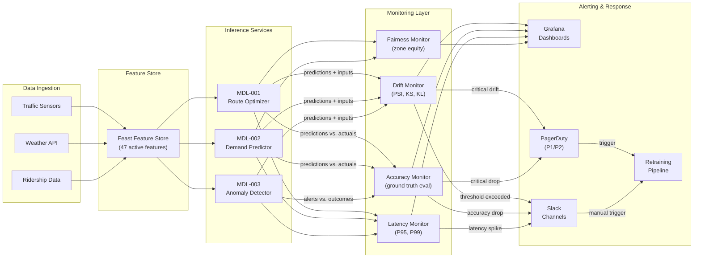
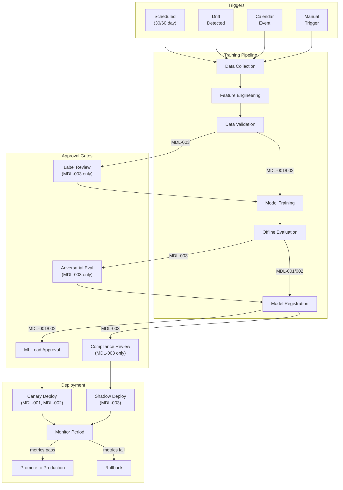
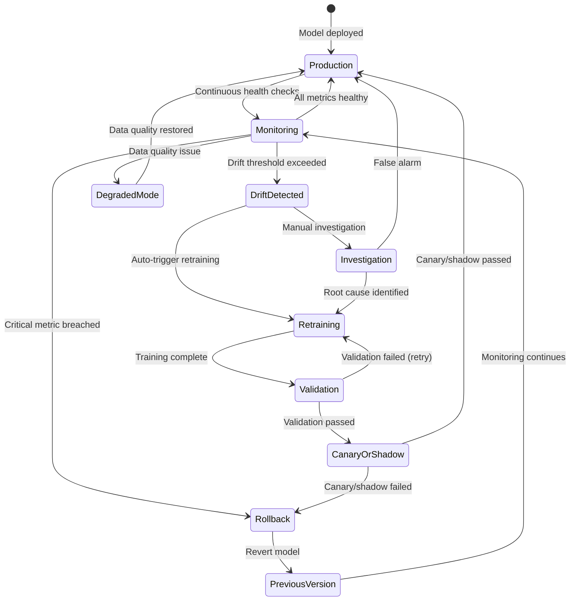

# Operational AI View

> **New section** -- extends arc42 beyond S11
>
> **System:** Smart Urban Mobility (SUM) Ecosystem
>
> **Last Updated:** 2026-02-17

## Purpose

Document the continuous operational concerns unique to the SUM platform's AI components that evolve post-deployment: drift monitoring, retraining pipelines, canary deployments for model updates, shadow mode testing, and rollback procedures. This section covers the operational lifecycle that no existing arc42 section addresses -- how the system's AI components are kept healthy, updated, and safe in production.

## Monitoring Architecture

### Drift Detection

| Model | Drift Type | Detection Method | Threshold | Check Frequency | Alert Channel |
|-------|-----------|-----------------|-----------|----------------|--------------|
| MDL-001 (Route Optimizer) | Data drift | PSI on top-10 input features | PSI > 0.2 on any feature | Hourly | Slack #sum-ml-alerts, PagerDuty (if PSI > 0.35) |
| MDL-001 (Route Optimizer) | Concept drift | Rolling 7-day accuracy vs. ground truth (actual travel times) | Accuracy < 0.90 (baseline: 0.93) | Daily (batch evaluation at 03:00 UTC) | Slack #sum-ml-alerts |
| MDL-002 (Demand Predictor) | Data drift | PSI on input feature distributions | PSI > 0.2 for 3 consecutive checks | Hourly | Slack #sum-ml-alerts |
| MDL-002 (Demand Predictor) | Concept drift | Rolling 7-day MAPE vs. actuals | MAPE > 11% (baseline: 8.2%) | Daily (batch evaluation at 03:30 UTC) | Slack #sum-ml-alerts, PagerDuty (if MAPE > 15%) |
| MDL-002 (Demand Predictor) | Prediction drift | KL divergence on output distribution | KL divergence > 0.15 | Daily | Slack #sum-ml-alerts |
| MDL-003 (Anomaly Detector) | Data drift | PSI on sensor input feature distributions | PSI > 0.15 (tighter for high-risk) | Every 30 minutes | PagerDuty (immediate), Slack #sum-safety-alerts |
| MDL-003 (Anomaly Detector) | Concept drift | Precision and recall on validated alert outcomes | Precision < 0.93 or Recall < 0.88 | Daily (batch evaluation at 04:00 UTC) | PagerDuty, Slack #sum-safety-alerts |

### Model Health Metrics

| Model | Metric | Baseline | Warning | Critical | Dashboard |
|-------|--------|----------|---------|----------|-----------|
| MDL-001 | Accuracy (route optimality) | 0.93 | < 0.91 | < 0.88 | Grafana: SUM ML / Route Optimizer |
| MDL-001 | P95 inference latency | 145ms | > 180ms | > 250ms | Grafana: SUM ML / Route Optimizer |
| MDL-001 | Throughput (requests/sec) | 850 | < 600 | < 400 | Grafana: SUM ML / Route Optimizer |
| MDL-001 | Feature store freshness | < 2 min | > 5 min | > 15 min | Grafana: SUM ML / Feature Store |
| MDL-002 | MAPE | 8.2% | > 11% | > 15% | Grafana: SUM ML / Demand Predictor |
| MDL-002 | Prediction coverage (% zones with forecast) | 100% | < 95% | < 85% | Grafana: SUM ML / Demand Predictor |
| MDL-002 | Forecast horizon completeness | 24h ahead | < 18h | < 12h | Grafana: SUM ML / Demand Predictor |
| MDL-003 | Precision | 0.96 | < 0.93 | < 0.90 | Grafana: SUM ML / Anomaly Detector |
| MDL-003 | Recall | 0.91 | < 0.88 | < 0.85 | Grafana: SUM ML / Anomaly Detector |
| MDL-003 | P99 inference latency | 85ms | > 120ms | > 200ms | Grafana: SUM ML / Anomaly Detector |
| MDL-003 | Alert volume (daily) | ~45 | > 80 (false positive concern) | > 150 or < 10 (detector failure) | Grafana: SUM ML / Anomaly Detector |

### Monitoring Architecture Diagram

## Retraining Pipeline

### Trigger Conditions

| Trigger | Type | Condition | Applicable Models | Action |
|---------|------|-----------|-------------------|--------|
| Scheduled retrain | Scheduled | Every 30 days (MDL-001, MDL-002) or 60 days (MDL-003) | MDL-001, MDL-002, MDL-003 | Full retrain with latest 90 days of labeled data (MDL-001/002) or 180 days (MDL-003) |
| Data drift trigger | Event-driven | PSI > 0.2 sustained for 3 consecutive hourly checks | MDL-001, MDL-002 | Incremental retrain with emphasis on recent 14-day window; human approval before deploy |
| Data drift trigger (high-risk) | Event-driven | PSI > 0.15 sustained for 2 consecutive 30-minute checks | MDL-003 | Full retrain initiated; safety officer approval required before deploy; shadow mode mandatory |
| Concept drift trigger | Event-driven | Accuracy below warning threshold for 3 consecutive daily evaluations | MDL-001, MDL-002 | Full retrain; canary deployment mandatory |
| Concept drift trigger (high-risk) | Event-driven | Precision < 0.93 or Recall < 0.88 for 2 consecutive daily evaluations | MDL-003 | Full retrain; safety officer and ML lead approval; extended shadow mode (7 days minimum) |
| Calendar event trigger | Event-driven | Known distribution shift approaching (holiday, city event, infrastructure change) | MDL-002 (primary), MDL-001 | Preemptive retrain with event-augmented training data; deploy 48 hours before event |
| Infrastructure change | Event-driven | New transit line, station closure, major road change notified by city authority | MDL-001 | Warm-start retrain incorporating updated network topology; canary deployment |
| Manual trigger | Manual | ML team initiates via CI/CD pipeline | All | Full or incremental retrain as specified; standard validation gates apply |

### Retraining Process -- MDL-001 (Route Optimizer)

| Step | Description | Automated? | Duration | Approval Required? |
|------|-------------|-----------|----------|-------------------|
| 1. Data collection | Extract latest 90 days of route data, travel times, traffic patterns, weather from data warehouse | Yes | ~45 min | No |
| 2. Feature engineering | Compute features via Feature Store; validate feature distributions against training baseline | Yes | ~30 min | No |
| 3. Data validation | Run Great Expectations suite: completeness > 98%, no schema drift, no label leakage | Yes | ~15 min | No (blocks on failure) |
| 4. Training | Train GBM with hyperparameters from config store; 5-fold cross-validation | Yes | ~3 hours | No |
| 5. Offline evaluation | Evaluate on held-out test set: accuracy >= 0.92, P95 latency <= 180ms, fairness checks (zone disparity < 1.15) | Yes | ~30 min | No (blocks on failure) |
| 6. Registration | Register candidate model in MLflow model registry with full lineage metadata | Yes | ~5 min | No |
| 7. Deployment approval | ML lead reviews evaluation report, approves promotion to canary | No | ~2 hours (SLA) | Yes -- ML Lead |
| 8. Canary deployment | Deploy to 5% of production traffic; monitor for 24 hours | Yes (deploy); monitored | 24 hours | No (auto-promotes if metrics pass) |
| 9. Full rollout | Promote to 100% traffic; archive previous model version | Yes | ~10 min | No (auto on canary success) |

### Retraining Process -- MDL-003 (Anomaly Detector, High-Risk)

| Step | Description | Automated? | Duration | Approval Required? |
|------|-------------|-----------|----------|-------------------|
| 1. Data collection | Extract latest 180 days of sensor data, validated anomaly labels, operator feedback | Yes | ~1 hour | No |
| 2. Label review | Sample 200 recent labels for manual verification by safety team; correct any mislabels | No | ~4 hours | Yes -- Safety Officer |
| 3. Feature engineering | Compute features via Feature Store; validate against training baseline with tighter tolerances | Yes | ~30 min | No (blocks on failure) |
| 4. Data validation | Extended validation suite: completeness > 99%, class balance within 1:20, no intervention-biased labels (FL-002 check) | Yes | ~20 min | No (blocks on failure) |
| 5. Training | Train Isolation Forest + rules ensemble; optimize recall at precision >= 0.94 | Yes | ~4 hours | No |
| 6. Offline evaluation | Evaluate on held-out test set: precision >= 0.95, recall >= 0.90, P99 latency <= 150ms, explainability fidelity >= 0.90 | Yes | ~45 min | No (blocks on failure) |
| 7. Adversarial evaluation | Run adversarial test suite (OOD inputs, edge cases, spoofed sensor data): 0% silent failures | Yes | ~1 hour | No (blocks on failure) |
| 8. Registration | Register in model registry with full lineage, evaluation reports, and compliance artifacts | Yes | ~5 min | No |
| 9. Compliance review | Safety officer and ML lead review evaluation report, adversarial results, and explainability samples | No | ~1 day (SLA) | Yes -- Safety Officer + ML Lead |
| 10. Shadow deployment | Deploy in shadow mode alongside production model; compare outputs for 7 days minimum | Yes (deploy); monitored | 7 days | No |
| 11. Shadow evaluation | Compare shadow model vs. production: precision/recall parity or improvement; alert concordance >= 95% | Yes | ~2 hours | No (blocks on failure) |
| 12. Promotion approval | ML lead + safety officer approve promotion based on shadow results | No | ~4 hours (SLA) | Yes -- Safety Officer + ML Lead |
| 13. Production cutover | Swap shadow model to production; previous version retained as immediate rollback target | Yes | ~5 min | No |

### Retraining Pipeline Diagram

## Deployment Strategy

### Model Update Rollout

| Model | Strategy | Description | Traffic Split | Monitoring Duration | Promotion Criteria |
|-------|----------|-------------|---------------|---------------------|--------------------|
| MDL-001 (Route Optimizer) | Canary | Route 5% of production traffic to candidate model via feature flag in API gateway; remaining 95% continues on current model | 5% canary / 95% stable | 24 hours | Accuracy >= 0.92 on canary traffic; P95 latency <= 180ms; no zone disparity increase; error rate < 0.1% |
| MDL-002 (Demand Predictor) | Canary | Route 10% of forecast requests to candidate; compare predictions side-by-side against actuals | 10% canary / 90% stable | 48 hours | MAPE <= 9% on canary traffic; prediction coverage 100%; no per-zone MAPE > 12% |
| MDL-003 (Anomaly Detector) | Shadow mode | Candidate model runs in parallel on identical production inputs but does not generate live alerts; outputs logged for comparison | 100% shadow (0% live) | 7 days minimum | Precision >= 0.95 on shadow; recall >= 0.90 on shadow; alert concordance >= 95% with production model; explainability fidelity >= 0.90; safety officer sign-off |

### A/B Testing

| Test | Models Compared | Metric | Sample Size | Duration | Decision Criteria |
|------|----------------|--------|-------------|----------|------------------|
| Route quality improvement (v2.1 vs. v2.2) | MDL-001 v2.1 (control) vs. MDL-001 v2.2 (treatment) | Average travel time deviation from predicted optimal | 50K route requests per arm | 14 days | p < 0.05 (two-sided t-test); > 2% reduction in travel time deviation; no zone equity degradation |
| Demand forecast horizon extension | MDL-002 v1.4 (24h) vs. MDL-002 v1.5-beta (48h) | MAPE at 24h and 48h horizons | 30K forecast windows per arm | 21 days | 24h MAPE non-inferior (delta < 0.5%); 48h MAPE < 12%; fleet allocation improvement > 3% |

## Rollback Procedures

| Scenario | Detection | Rollback Step | Recovery Time | Owner | Auto/Manual |
|----------|-----------|--------------|---------------|-------|-------------|
| MDL-001 canary accuracy drops below 0.88 | Automated monitoring (Grafana alert) | Terminate canary; route 100% traffic to stable model via feature flag toggle | < 2 min (feature flag) | ML Platform (automated) | Auto |
| MDL-001 P95 latency exceeds 250ms | Automated monitoring (Grafana alert) | Terminate canary; revert to previous model version in serving infrastructure | < 5 min | ML Platform (automated) | Auto |
| MDL-002 MAPE exceeds 15% in production | Automated monitoring + PagerDuty alert | Revert to previous model version in model registry; redeploy previous version | < 15 min | ML Engineer on-call | Manual (auto-alert) |
| MDL-002 prediction coverage drops below 85% | Automated monitoring | Switch to historical average fallback model; alert ML team | < 5 min (automated failover) | ML Platform (automated) | Auto |
| MDL-003 precision drops below 0.90 in production | Automated monitoring + immediate PagerDuty | Revert to previous model version; retain current version's outputs for forensic review; notify safety officer | < 5 min | ML Engineer on-call + Safety Officer | Manual (requires two-person confirmation) |
| MDL-003 recall drops below 0.85 in production | Automated monitoring + immediate PagerDuty | Revert to previous model version; lower anomaly threshold on reverted model as precaution; full incident review | < 5 min | ML Engineer on-call + Safety Officer | Manual (requires two-person confirmation) |
| MDL-003 alert volume spikes (> 150/day or < 10/day) | Automated anomaly on alert volume metric | Investigate root cause; if detector malfunction confirmed, revert model; if genuine spike, escalate to operations | < 15 min (investigation); < 5 min (rollback if needed) | ML Engineer on-call | Manual |
| Feature Store outage (serving stale features) | Feature freshness monitor | All models switch to degraded mode with last-known-good features; alert data engineering team | < 1 min (automated degraded mode) | Data Engineering on-call | Auto |

### Rollback State Diagram

## Incident Response

### Severity Definitions

| Severity | Condition | Scope | Response Time |
|----------|-----------|-------|---------------|
| **P1 -- Critical** | Safety-impacting failure: MDL-003 serving errors > 1%, recall drop below 0.85, or complete model serving outage for any component | All hands | Acknowledge: 5 min; Mitigate: 15 min; Resolve: 4 hours |
| **P2 -- High** | Significant quality degradation: MDL-001 accuracy < 0.88, MDL-002 MAPE > 15%, MDL-003 precision < 0.90, or sustained P95 latency > 250ms | ML team + on-call | Acknowledge: 15 min; Mitigate: 1 hour; Resolve: 24 hours |
| **P3 -- Medium** | Noticeable degradation: drift detected, accuracy approaching warning thresholds, or single-zone service quality issues | ML team | Acknowledge: 1 hour; Mitigate: 4 hours; Resolve: 1 week |
| **P4 -- Low** | Minor issues: configuration warnings, non-critical dead features, monitoring flakiness | Sprint backlog | Acknowledge: 1 business day; Resolve: next sprint |

### Incident Response Procedures

| Severity | Detection | Immediate Response | Escalation Path | Post-Incident |
|----------|-----------|-------------------|-----------------|---------------|
| **P1** | Automated PagerDuty alert; Grafana critical alarm | Auto-rollback for MDL-003 (if available); page on-call ML engineer and safety officer; activate incident war room; notify city transport authority within 30 min | ML Engineer on-call -> ML Lead (15 min) -> Head of Engineering (30 min) -> CTO + city authority (1 hour) | Mandatory blameless post-mortem within 48 hours; root cause analysis report to city authority within 5 business days; update runbooks |
| **P2** | Automated PagerDuty alert; Grafana warning alarm | Page on-call ML engineer; begin investigation; prepare rollback; notify transit operators of potential service quality reduction | ML Engineer on-call -> ML Lead (1 hour) -> Head of Engineering (4 hours) | Post-mortem within 1 week; action items tracked in AI Debt Register |
| **P3** | Slack alert (#sum-ml-alerts); Grafana warning | ML team investigates during business hours; schedule retraining if drift-related; monitor for escalation to P2 | ML team -> ML Lead (next business day) | Brief incident report; add to sprint retrospective |
| **P4** | Slack notification; Grafana info | Log in issue tracker; address in next sprint planning | None (standard sprint process) | Track in backlog |

### On-Call Rotation

| Role | Rotation | Coverage | Escalation |
|------|----------|----------|------------|
| ML Engineer on-call | Weekly rotation (3 engineers) | 24/7 for P1/P2; business hours for P3 | ML Lead |
| Safety Officer on-call | Bi-weekly rotation (2 officers) | 24/7 for MDL-003 P1; business hours otherwise | Head of Safety |
| Data Engineer on-call | Weekly rotation (2 engineers) | 24/7 for Feature Store / data pipeline incidents | Data Engineering Lead |
