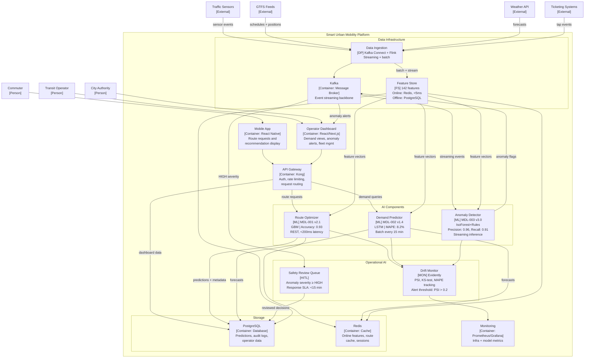

# C4 Container Diagram — Smart Urban Mobility

> **Diagram type:** C4 Level 2 — Container Diagram
>
> **RAD-AI extensions:** AI component stereotypes `[ML]`, `[FS]`, `[MON]`, `[HITL]`

## Purpose

This diagram decomposes the SUM platform into its runtime containers, applying RAD-AI stereotypes to distinguish ML models, feature stores, monitors, and human-in-the-loop intervention points from conventional software containers. Each AI container is annotated with its model ID, version, and primary performance metric.

## Container Inventory

| Container | Stereotype | Technology | Description |
|-----------|-----------|------------|-------------|
| Mobile App | -- | React Native | Commuter-facing route request and display |
| Operator Dashboard | -- | React, Next.js | Operator-facing demand forecasts, anomaly alerts, fleet management |
| API Gateway | -- | Kong | Request routing, rate limiting, authentication |
| Route Optimizer | `[ML]` | Python, scikit-learn, FastAPI | MDL-001: GBM model for multi-modal route selection |
| Demand Predictor | `[ML]` | Python, PyTorch, Celery | MDL-002: LSTM forecasting of transport demand |
| Anomaly Detector | `[ML]` | Python, scikit-learn, Faust | MDL-003: Isolation Forest + rules for safety anomaly detection |
| Feature Store | `[FS]` | Feast, Redis (online), PostgreSQL (offline) | 142 features with online/offline serving |
| Drift Monitor | `[MON]` | Evidently, Grafana | Statistical drift detection across all 3 models |
| Safety Review Queue | `[HITL]` | Custom UI, PostgreSQL | Human review for high-severity anomaly flags |
| Data Ingestion | `[DP]` | Kafka Connect, Flink | Streaming and batch data ingestion from all sources |
| PostgreSQL | -- | PostgreSQL 15 | Persistent storage: predictions, audit logs, operator data |
| Redis Cache | -- | Redis 7 | Online feature serving, route cache, session state |
| Kafka | -- | Apache Kafka | Event streaming backbone for real-time data flows |
| Monitoring Stack | -- | Prometheus, Grafana | Infrastructure and application metrics |

## Container Diagram

## Stereotype Annotations

### ML Components

| Model ID | Container | Version | Key Metric | Serving Mode | Latency Target |
|----------|-----------|---------|------------|-------------|----------------|
| MDL-001 | Route Optimizer | v2.1 | Accuracy: 0.93 | Synchronous REST | < 200ms p99 |
| MDL-002 | Demand Predictor | v1.4 | MAPE: 8.2% | Batch (15-min cycle) | < 30s per batch |
| MDL-003 | Anomaly Detector | v3.0 | Precision: 0.96, Recall: 0.91 | Streaming (Kafka consumer) | < 500ms per event |

### Feature Store [FS]

The feature store manages 142 features across two serving layers:
- **Online store** (Redis): Sub-5ms lookup for real-time inference (Route Optimizer, Anomaly Detector). Features are pre-computed and materialized.
- **Offline store** (PostgreSQL): Historical feature values for batch inference (Demand Predictor) and model training. Point-in-time-correct joins to prevent data leakage.

### Drift Monitor [MON]

Tracks three categories of drift across all models:
- **Data drift:** Population Stability Index (PSI) on input feature distributions. Alert threshold: PSI > 0.2.
- **Prediction drift:** Kolmogorov-Smirnov test on output distributions. Alert threshold: p-value < 0.01.
- **Performance drift:** Rolling metric degradation (accuracy for MDL-001, MAPE for MDL-002, precision/recall for MDL-003). Alert when metric degrades > 10% from baseline.

### Safety Review Queue [HITL]

Human-in-the-loop intervention for the high-risk Anomaly Detector (MDL-003):
- **Trigger:** Anomaly severity >= HIGH (flagged by MDL-003 or confidence < 0.80 on medium-severity anomalies).
- **Response SLA:** < 15 minutes for HIGH severity, < 60 minutes for medium-severity review.
- **Reviewers:** City transport authority safety officers (3 FTE, rotating shifts).
- **Outcome:** Confirm, dismiss, or escalate. All decisions logged for EU AI Act audit trail.

## Data Flow Summary

1. **Ingestion path:** External sources -> Data Ingestion (Kafka Connect + Flink) -> Kafka (streaming) + Feature Store (batch/online).
2. **Real-time inference:** Kafka -> Anomaly Detector -> Kafka (anomaly events) -> Safety Review Queue / Operator Dashboard.
3. **Synchronous inference:** API Gateway -> Route Optimizer -> Feature Store lookup -> response with confidence score.
4. **Batch inference:** Celery scheduler -> Demand Predictor -> Feature Store (offline) -> predictions stored in PostgreSQL and Redis.
5. **Monitoring loop:** All ML containers -> Drift Monitor -> Monitoring Stack (Grafana dashboards, PagerDuty alerts).
