# Data Lineage Overlay — Smart Urban Mobility

> **Diagram type:** C4 Data Lineage Overlay (RAD-AI extension)
>
> **Purpose:** Trace data provenance from source through transformation to model consumption, annotated with freshness requirements, privacy classifications, and feedback loops.

## Data Source Inventory

| Source ID | Name | Type | Owner | Freshness | Volume | Privacy Classification |
|-----------|------|------|-------|-----------|--------|----------------------|
| DS-001 | Traffic Sensor Network | IoT Stream | City Transport Authority | Real-time (30s intervals) | ~80K events/min | Internal |
| DS-002 | GTFS Static Feeds | File (GTFS) | Transit Operators (x3) | Daily refresh (03:00 UTC) | ~15K stops, ~4K routes | Public |
| DS-003 | GTFS Real-Time Feeds | Stream (GTFS-RT) | Transit Operators (x3) | Real-time (10s intervals) | ~3K position updates/min | Internal |
| DS-004 | Weather API | REST API | Third-party (WeatherCo) | 15-min refresh | ~100 data points/refresh | Public |
| DS-005 | Ticketing Systems | Event Stream | Transit Operators (x3) | Near real-time (<60s delay) | ~25K tap events/min (peak) | Confidential |
| DS-006 | User Route Requests | Application Events | SUM Platform | Real-time | ~8K requests/min (peak) | Confidential |
| DS-007 | Operator Fleet Data | REST API | Transit Operators (x3) | 5-min refresh | ~500 vehicles | Internal |

## Data Lineage Diagram

```mermaid
graph LR
    subgraph Sources ["Data Sources"]
        direction TB
        DS1["DS-001: Traffic Sensors<br/>[IoT Stream] 30s intervals<br/>Privacy: Internal"]
        DS2["DS-002: GTFS Static<br/>[File] Daily refresh<br/>Privacy: Public"]
        DS3["DS-003: GTFS Real-Time<br/>[Stream] 10s intervals<br/>Privacy: Internal"]
        DS4["DS-004: Weather API<br/>[REST] 15-min refresh<br/>Privacy: Public"]
        DS5["DS-005: Ticketing<br/>[Event Stream] &lt;60s delay<br/>Privacy: Confidential"]
        DS6["DS-006: Route Requests<br/>[App Events] Real-time<br/>Privacy: Confidential"]
        DS7["DS-007: Fleet Data<br/>[REST] 5-min refresh<br/>Privacy: Internal"]
    end

    subgraph Ingestion ["Ingestion Layer"]
        direction TB
        KafkaIn["Kafka Topics<br/>traffic.raw, gtfs.rt,<br/>ticketing.events,<br/>weather.updates"]
        BatchIn["Batch Ingestion<br/>[DP] Kafka Connect<br/>Daily GTFS, fleet sync"]
        StreamIn["Stream Processing<br/>[DP] Apache Flink<br/>Dedup, schema validation,<br/>late-event handling"]
    end

    subgraph Transform ["Feature Engineering"]
        direction TB
        Clean["Data Cleaning<br/>Null imputation, outlier<br/>removal, schema v3.2"]
        GeoEnrich["Geo-Enrichment<br/>Zone mapping, segment<br/>aggregation, H3 indexing"]
        TempAgg["Temporal Aggregation<br/>15-min / 1-hr / 24-hr<br/>rolling windows"]
        CrossFeat["Cross-Source Features<br/>Traffic-weather interaction,<br/>demand-supply ratio"]
        Anonymize["Anonymization<br/>User ID hashing,<br/>k-anonymity (k=50)<br/>on location data"]
    end

    subgraph FeatureStore ["Feature Store [FS]"]
        direction TB
        OnlineFS["Online Store<br/>[Redis] 142 features<br/>Freshness: &lt;30s<br/>Serving: &lt;5ms"]
        OfflineFS["Offline Store<br/>[PostgreSQL] 142 features<br/>Point-in-time correct<br/>90-day history"]
    end

    subgraph Consumption ["Model Consumption"]
        direction TB
        MDL1["Route Optimizer<br/>[ML] MDL-001 v2.1<br/>Consumes: 68 features<br/>Freshness req: &lt;30s"]
        MDL2["Demand Predictor<br/>[ML] MDL-002 v1.4<br/>Consumes: 94 features<br/>Freshness req: &lt;15min"]
        MDL3["Anomaly Detector<br/>[ML] MDL-003 v3.0<br/>Consumes: 51 features<br/>Freshness req: &lt;30s"]
    end

    subgraph Feedback ["Feedback Loop"]
        direction TB
        RouteChoices["Route Choice Logs<br/>Actual routes taken<br/>vs. recommended"]
        OutcomeLabels["Outcome Labels<br/>Anomaly confirmations,<br/>demand actuals"]
        RetrainPipe["Retraining Pipeline<br/>Triggered on drift<br/>or scheduled"]
    end

    DS1 -->|"~80K events/min"| KafkaIn
    DS3 -->|"~3K updates/min"| KafkaIn
    DS5 -->|"~25K events/min"| KafkaIn
    DS6 -->|"~8K requests/min"| KafkaIn

    DS2 -->|"daily export"| BatchIn
    DS4 -->|"every 15 min"| BatchIn
    DS7 -->|"every 5 min"| BatchIn

    KafkaIn --> StreamIn
    BatchIn --> StreamIn

    StreamIn -->|"validated events"| Clean
    Clean -->|"clean records"| GeoEnrich
    Clean -->|"user data"| Anonymize
    Anonymize -->|"anonymized records"| GeoEnrich
    GeoEnrich -->|"geo-enriched"| TempAgg
    TempAgg -->|"aggregated"| CrossFeat

    CrossFeat -->|"materialized features<br/>(online path, &lt;30s)"| OnlineFS
    CrossFeat -->|"feature snapshots<br/>(batch path, hourly)"| OfflineFS

    OnlineFS -->|"real-time features"| MDL1
    OnlineFS -->|"real-time features"| MDL3
    OfflineFS -->|"historical features"| MDL2
    OnlineFS -->|"recent features"| MDL2

    MDL1 -->|"route recommendations"| RouteChoices
    MDL2 -->|"demand forecasts"| OutcomeLabels
    MDL3 -->|"anomaly decisions"| OutcomeLabels

    RouteChoices -->|"implicit feedback:<br/>chosen routes affect<br/>future traffic patterns"| DS1
    OutcomeLabels -->|"labeled outcomes"| RetrainPipe
    RetrainPipe -->|"updated model<br/>weights"| MDL1
    RetrainPipe -->|"updated model<br/>weights"| MDL2
    RetrainPipe -->|"updated model<br/>weights"| MDL3
```

## Lineage Details

### DS-001 (Traffic Sensors) -> MDL-001 (Route Optimizer) Path

| Stage | Input | Transformation | Output | Schema Version | Quality Gate |
|-------|-------|---------------|--------|---------------|-------------|
| Kafka ingestion | Raw sensor JSON | Schema validation, dedup by sensor_id + timestamp | Validated sensor events | v3.2 | Reject if missing sensor_id, speed, or occupancy |
| Cleaning | Validated events | Null imputation (median fill for speed), outlier cap (speed > 200 km/h removed) | Clean sensor readings | v3.2 | < 5% null rate per 15-min window |
| Geo-enrichment | Clean readings | Map sensor_id to road segment, H3 hex cell (resolution 8), traffic zone | Geo-tagged readings | v3.2 | All sensors mapped (coverage > 98%) |
| Temporal aggregation | Geo-tagged readings | 15-min rolling avg speed, occupancy by segment; 1-hr trend | Segment-level aggregates | v3.2 | Minimum 10 readings per segment per window |
| Cross-source features | Segment aggregates + weather + demand | Traffic-weather interaction terms, congestion index, demand-supply ratio | Feature vectors (68 features for MDL-001) | v3.2 | Feature completeness > 95% |
| Online store materialization | Feature vectors | Write to Redis with TTL = 60s | Online features | v3.2 | Freshness < 30s, staleness alert at > 45s |

### DS-005 (Ticketing) -> MDL-002 (Demand Predictor) Path

| Stage | Input | Transformation | Output | Schema Version | Quality Gate |
|-------|-------|---------------|--------|---------------|-------------|
| Kafka ingestion | Tap event JSON (3 operators) | Schema normalization across operators, dedup | Unified tap events | v2.1 | Reject if missing stop_id, timestamp, or operator_id |
| Anonymization | Unified tap events | SHA-256 hash of card_id, k-anonymity (k=50) on stop_id + time_bucket | Anonymized events | v2.1 | k-anonymity verified per batch |
| Geo-enrichment | Anonymized events | Map stop_id to zone, add H3 index, compute origin-destination pairs | Geo-tagged demand events | v2.1 | Stop mapping coverage > 99.5% |
| Temporal aggregation | Geo-tagged events | 15-min / 1-hr / 24-hr demand counts by zone, mode, day-of-week | Demand time series | v2.1 | Minimum 100 events per zone per hour |
| Cross-source features | Demand series + weather + events calendar | Demand-weather correlation, holiday flags, event proximity features | Feature vectors (94 features for MDL-002) | v2.1 | No future data leakage (point-in-time enforced) |
| Offline store snapshot | Feature vectors | Append to PostgreSQL with event_timestamp | Offline features | v2.1 | Daily reconciliation with source counts |

### DS-001 (Traffic Sensors) -> MDL-003 (Anomaly Detector) Path

| Stage | Input | Transformation | Output | Schema Version | Quality Gate |
|-------|-------|---------------|--------|---------------|-------------|
| Kafka ingestion | Raw sensor JSON | Schema validation, dedup | Validated sensor events | v3.2 | Same as MDL-001 path |
| Cleaning + Anonymization | Validated events | Outlier flagging (not removal -- anomaly-relevant), anonymize any correlated user data | Clean events with outlier flags | v3.2 | Outlier flags preserved for anomaly detection |
| Geo-enrichment | Clean events | Zone + segment mapping, infrastructure proximity (bridges, tunnels, stations) | Enriched events with infrastructure context | v3.2 | Infrastructure database coverage > 99% |
| Streaming features | Enriched events | Real-time deviation from expected patterns (z-scores), rate-of-change, spatial clustering | Streaming feature vectors (51 features for MDL-003) | v3.2 | Feature computation < 100ms |
| Online store | Streaming features | Write to Redis, immediate consumption | Online features | v3.2 | End-to-end latency < 500ms from sensor event |

## Freshness Requirements

| Consumer | Required Freshness | Source Freshness | Gap Risk | Mitigation |
|----------|-------------------|-----------------|----------|------------|
| MDL-001 (Route Optimizer) | < 30s for traffic features, < 15 min for weather | Traffic: 30s, Weather: 15 min, GTFS-RT: 10s | Weather can be up to 15 min stale during rapid changes | 1-hour weather cache with staleness flag; confidence score reduced by 0.05 when weather data > 20 min old |
| MDL-002 (Demand Predictor) | < 15 min for all features (batch cycle) | Ticketing: < 60s, Traffic: 30s, GTFS static: daily | GTFS static data can be up to 24h stale | Schedule changes trigger mid-day re-ingestion; demand model tolerates schedule staleness via learned day-of-week patterns |
| MDL-003 (Anomaly Detector) | < 30s for streaming features | Traffic: 30s, GTFS-RT: 10s | Sensor dropout creates blind spots | Sensor liveness monitoring; alert on > 5% sensor dropout per zone; anomaly detector switches to rule-only mode for affected zones |

## Privacy Flow

| Data Element | Source Classification | Anonymization Point | Method | Downstream Classification |
|-------------|---------------------|--------------------|--------|--------------------------|
| Card ID (ticketing) | Confidential | Ingestion layer (Flink job) | SHA-256 irreversible hash | Internal (hashed, not reversible) |
| Trip origin/destination | Confidential | Ingestion layer (Flink job) | k-anonymity (k=50): bucket to zone + 15-min time window | Internal (zone-level, not individual) |
| Sensor readings | Internal | No anonymization needed | N/A (infrastructure data, no PII) | Internal |
| Route requests | Confidential | Feature engineering (after response served) | Drop user_id, retain only anonymized session hash + zone-level OD pair | Internal |
| Vehicle positions (GTFS-RT) | Internal | No anonymization needed | N/A (fleet data, not personal) | Internal |

## Feedback Loop: Route Choices -> Traffic Patterns

A critical data characteristic of the SUM system is the feedback loop between route recommendations and observed traffic:

1. MDL-001 recommends routes to commuters based on current traffic conditions.
2. Commuters follow (or deviate from) recommendations, creating actual traffic patterns.
3. Traffic sensors observe these patterns, which feed back into the feature store.
4. MDL-001 uses updated traffic features for subsequent route recommendations.

**Risks of this feedback loop:**
- **Herding effect:** If too many commuters follow the same recommendation, it creates congestion on the recommended route.
- **Distribution shift:** The model's own outputs change the input distribution it was trained on.
- **Self-fulfilling predictions:** Routes predicted as fast become slow due to overuse, creating oscillation.

**Mitigations implemented:**
- Route Optimizer adds stochastic diversification: top-3 routes are load-balanced (60/25/15 split) to prevent herding.
- Drift Monitor tracks correlation between recommendation concentration and route travel time degradation.
- Monthly A/B tests (10% holdout receiving rule-based routes) provide an uncontaminated baseline for model evaluation.

## Schema Registry

| Schema ID | Version | Fields (count) | Used By | Last Breaking Change |
|-----------|---------|----------------|---------|---------------------|
| SCH-001 | v3.2 | 12 | Traffic ingestion, MDL-001, MDL-003 | v3.0: added `infrastructure_type` field |
| SCH-002 | v2.1 | 8 | Ticketing ingestion, MDL-002 | v2.0: normalized operator-specific fields |
| SCH-003 | v1.5 | 6 | Weather ingestion, all models | v1.5: added `severe_weather_alert` boolean |
| SCH-004 | v2.0 | 15 | GTFS ingestion, MDL-001, MDL-002 | v2.0: added GTFS-RT position schema |
| SCH-005 | v1.0 | 142 | Feature Store -> all models | v1.0: initial feature schema (no breaking changes yet) |
