# Non-Determinism Boundary Diagram — Smart Urban Mobility

> **Diagram type:** C4 Non-Determinism Boundary (RAD-AI extension)
>
> **Purpose:** Explicitly delineate deterministic and non-deterministic regions of the SUM architecture, with confidence gates, fallback strategies, and degradation behavior for each AI component.

## Boundary Overview

The SUM platform has a clear architectural separation between components that always produce the same output for the same input (deterministic) and components whose outputs are probabilistic and may vary across model versions, retraining cycles, or input distributions (non-deterministic). This separation is enforced through confidence gates at every boundary crossing.

## Boundary Diagram

```mermaid
graph TB
    subgraph Det ["Deterministic Region"]
        style Det fill:#e8f5e9,stroke:#2e7d32
        MobileApp["Mobile App<br/>[Container]<br/>Deterministic UI rendering"]
        OpDash["Operator Dashboard<br/>[Container]<br/>Deterministic display logic"]
        APIGw["API Gateway<br/>[Container: Kong]<br/>Deterministic routing,<br/>auth, rate limiting"]
        BizRules["Business Rules Engine<br/>[Container]<br/>Fare calculation,<br/>schedule constraints,<br/>operator SLA enforcement"]
        AuditLog["Audit Logger<br/>[Container]<br/>Immutable decision log<br/>for EU AI Act compliance"]
    end

    subgraph BoundaryLayer ["Confidence Gate Layer"]
        style BoundaryLayer fill:#e3f2fd,stroke:#1565c0
        CG1["Confidence Gate CG-1<br/>Route Optimizer<br/>Threshold: 0.75<br/>Action: score-dependent routing"]
        CG2["Confidence Gate CG-2<br/>Demand Predictor<br/>Threshold: 0.70<br/>Action: interval widening"]
        CG3["Confidence Gate CG-3<br/>Anomaly Detector<br/>Threshold: 0.80<br/>Action: severity-dependent escalation"]
    end

    subgraph NonDet ["Non-Deterministic Region"]
        style NonDet fill:#fff3e0,stroke:#ef6c00
        RouteOpt["Route Optimizer<br/>[ML] MDL-001 v2.1<br/>Confidence: 0.65 - 0.99<br/>Output: ranked routes + scores"]
        DemandPred["Demand Predictor<br/>[ML] MDL-002 v1.4<br/>Confidence: 0.60 - 0.95<br/>Output: demand forecast +<br/>prediction interval"]
        AnomalyDet["Anomaly Detector<br/>[ML] MDL-003 v3.0<br/>Confidence: 0.55 - 0.99<br/>Output: anomaly flag +<br/>severity + explanation"]
        FeatureStore["Feature Store<br/>[FS] 142 features<br/>Non-deterministic due to<br/>real-time data freshness"]
        DriftMon["Drift Monitor<br/>[MON]<br/>Triggers fallback when<br/>drift exceeds thresholds"]
    end

    subgraph Fallback ["Deterministic Fallback Region"]
        style Fallback fill:#fce4ec,stroke:#c62828
        FB1["Rule-Based Router<br/>[Fallback for MDL-001]<br/>Shortest-path + schedule<br/>lookup, no ML"]
        FB2["Historical Average<br/>[Fallback for MDL-002]<br/>Same day-of-week/hour<br/>averages from past 4 weeks"]
        FB3["Manual Safety Protocol<br/>[Fallback for MDL-003]<br/>Conservative alerting:<br/>all anomalies -> operator review"]
        SafetyQueue["Safety Review Queue<br/>[HITL]<br/>Human review for<br/>high-severity anomalies"]
    end

    MobileApp -->|"route request"| APIGw
    OpDash -->|"demand query /<br/>anomaly review"| APIGw
    APIGw -->|"structured request"| CG1
    APIGw -->|"demand query"| CG2
    APIGw -->|"anomaly status"| CG3

    CG1 -->|"request features"| RouteOpt
    CG2 -->|"request forecast"| DemandPred

    FeatureStore -->|"feature vectors"| RouteOpt
    FeatureStore -->|"feature vectors"| DemandPred
    FeatureStore -->|"feature vectors"| AnomalyDet

    RouteOpt -->|"prediction +<br/>confidence score"| CG1
    DemandPred -->|"forecast +<br/>prediction interval"| CG2
    AnomalyDet -->|"anomaly flag +<br/>severity + confidence"| CG3

    CG1 -->|"conf >= 0.75:<br/>return ML route"| BizRules
    CG1 -->|"conf < 0.75:<br/>use fallback"| FB1
    FB1 -->|"rule-based route"| BizRules
    BizRules -->|"validated route<br/>(fare + schedule applied)"| APIGw

    CG2 -->|"conf >= 0.70:<br/>return forecast"| OpDash
    CG2 -->|"conf < 0.70:<br/>widen interval + flag"| FB2
    FB2 -->|"historical baseline"| OpDash

    CG3 -->|"conf >= 0.80 AND<br/>severity HIGH:<br/>escalate to HITL"| SafetyQueue
    CG3 -->|"conf >= 0.80 AND<br/>severity LOW/MED:<br/>auto-process"| OpDash
    CG3 -->|"conf < 0.80:<br/>conservative alert"| FB3
    FB3 -->|"all flagged to<br/>operator review"| SafetyQueue
    SafetyQueue -->|"human decision"| OpDash

    DriftMon -->|"drift alert:<br/>disable model"| CG1
    DriftMon -->|"drift alert:<br/>disable model"| CG2
    DriftMon -->|"drift alert:<br/>disable model"| CG3

    CG1 -->|"all decisions logged"| AuditLog
    CG2 -->|"all decisions logged"| AuditLog
    CG3 -->|"all decisions logged"| AuditLog
    SafetyQueue -->|"review outcomes"| AuditLog
```

## Boundary Interfaces

| Interface ID | From (Region) | To (Region) | Data Exchanged | Contract |
|-------------|--------------|------------|---------------|---------|
| BI-001 | API Gateway (Det) | CG-1 (Boundary) | Route request: origin, destination, mode preferences, time | JSON schema v2.0, timeout 300ms |
| BI-002 | CG-1 (Boundary) | Route Optimizer (NonDet) | Feature request + user context | Feature schema v3.2, response within 200ms |
| BI-003 | Route Optimizer (NonDet) | CG-1 (Boundary) | Ranked routes (top-5) + confidence scores per route + SHAP explanation | Prediction schema v1.1, confidence in [0, 1] |
| BI-004 | CG-1 (Boundary) | Business Rules (Det) | Selected route (ML or fallback) + source flag (ml/fallback) | Route schema v2.0, includes `decision_source` field |
| BI-005 | API Gateway (Det) | CG-2 (Boundary) | Demand query: zone, mode, time range | JSON schema v1.3, timeout 5s |
| BI-006 | CG-2 (Boundary) | Demand Predictor (NonDet) | Feature request for time-series context | Feature schema v3.2, response within 2s |
| BI-007 | Demand Predictor (NonDet) | CG-2 (Boundary) | Point forecast + 80% prediction interval + confidence | Forecast schema v1.0, interval bounds required |
| BI-008 | Kafka (Det) | CG-3 (Boundary) | Streaming sensor events with anomaly features | Event schema v3.2, within 500ms of sensor event |
| BI-009 | Anomaly Detector (NonDet) | CG-3 (Boundary) | Anomaly flag, severity (LOW/MED/HIGH/CRITICAL), confidence, top-3 contributing features | Anomaly schema v2.0, explanation required for HIGH+ |
| BI-010 | CG-3 (Boundary) | Safety Review Queue (HITL) | Anomaly details + model explanation + recommended action | Review schema v1.0, includes all data for human decision |

## Confidence Thresholds

| Model | High Confidence | Medium Confidence | Low Confidence | Rejection / Fallback |
|-------|----------------|------------------|---------------|---------------------|
| MDL-001 (Route Optimizer) | >= 0.90: auto-accept, no logging overhead | 0.75 - 0.90: accept with detailed logging | 0.60 - 0.75: return ML result but flag as "uncertain" to user | < 0.60: reject, use Rule-Based Router (FB1) |
| MDL-002 (Demand Predictor) | >= 0.85: return point forecast | 0.70 - 0.85: return forecast with widened prediction interval (90% CI) | 0.55 - 0.70: return forecast with "low confidence" warning + historical baseline comparison | < 0.55: reject, use Historical Average (FB2) |
| MDL-003 (Anomaly Detector) | >= 0.90: auto-process (LOW/MED) or auto-escalate (HIGH/CRITICAL) | 0.80 - 0.90: process with extra logging, escalate HIGH+ to HITL | 0.65 - 0.80: conservative -- all severities escalated to HITL | < 0.65: reject ML output, use Manual Safety Protocol (FB3) |

## Fallback Strategies

### FB1: Rule-Based Router (Fallback for MDL-001)

**Trigger:** Route Optimizer confidence < 0.60, model unavailable, or drift monitor disables model.

**Behavior:** Deterministic shortest-path routing using Dijkstra's algorithm on the transit network graph, weighted by scheduled travel times (not real-time predictions). Multi-modal transfers use fixed 5-minute interchange penalties.

**Limitations:** No real-time traffic awareness, no demand-based optimization, no weather adjustment. Routes are safe but may be 15-25% slower than ML-optimized routes during congestion.

**User experience:** Route returned with a "based on schedules" indicator instead of "AI-optimized." Latency is actually lower (< 50ms) since no feature lookup is needed.

### FB2: Historical Average (Fallback for MDL-002)

**Trigger:** Demand Predictor confidence < 0.55, model unavailable, or drift monitor disables model.

**Behavior:** Return the rolling 4-week average demand for the same zone, mode, day-of-week, and hour-of-day. Prediction intervals are based on historical standard deviation (mean +/- 1.5 SD for 80% CI).

**Limitations:** Cannot capture special events, weather impacts, or trend changes. Accuracy degrades during holidays, major events, or disruptions.

**User experience:** Operators see demand forecasts labeled "historical baseline" with wider confidence bands. Fleet allocation decisions remain possible but are less optimized.

### FB3: Manual Safety Protocol (Fallback for MDL-003)

**Trigger:** Anomaly Detector confidence < 0.65, model unavailable, or drift monitor disables model.

**Behavior:** All anomaly detection reverts to rule-based thresholds (e.g., sensor speed < 5 km/h for > 10 minutes on a highway segment triggers alert). Every triggered alert is routed to the Safety Review Queue regardless of severity. Alert volume increases approximately 8x compared to ML-filtered operation.

**Limitations:** High false positive rate (~40% vs. ~4% with ML). Operators experience alert fatigue. Not sustainable for more than 48 hours without additional staffing.

**User experience:** Operators receive more frequent alerts with a "manual review mode" banner. City authority is notified that the high-risk AI component is in fallback mode (EU AI Act incident reporting requirement).

## Degradation Behavior

| Scenario | Detection | System Behavior | User Experience | Max Duration |
|----------|-----------|-----------------|----------------|-------------|
| MDL-001 unavailable | Health check failure (3 consecutive) | CG-1 routes all requests to FB1 | Routes based on schedules, slightly slower | Indefinite (FB1 is stable) |
| MDL-001 low confidence (batch) | > 30% of requests below threshold in 5-min window | DriftMon alert, auto-switch to FB1 | Same as unavailable | Until model retrained and redeployed |
| MDL-002 unavailable | Celery task failure | CG-2 returns FB2 historical averages | Wider prediction intervals, "baseline" label | Indefinite (FB2 is stable) |
| MDL-003 unavailable | Kafka consumer lag > 60s or health check failure | CG-3 activates FB3, notifies city authority | 8x alert volume, manual mode banner | 48 hours (staffing constraint) |
| MDL-003 low confidence (sustained) | > 20% of anomaly decisions below threshold in 15-min window | DriftMon alert, auto-switch to FB3, EU AI Act incident log entry | Same as unavailable | Until root cause resolved |
| Feature Store (Redis) down | Redis health check failure | All models switch to fallback simultaneously | Degraded across all functions | Target recovery: < 15 min |
| Multiple models degraded | DriftMon detects correlated drift across 2+ models | System-wide "degraded mode" banner, ops team paged | All functions in fallback, dashboard warning | Until root cause resolved |

## Propagation Rules

| Rule | Description | Example |
|------|-------------|---------|
| Confidence composition | When Feature Store staleness > threshold, downstream model confidence is reduced by a staleness penalty (0.05 per minute past SLA) | Traffic features 2 min stale -> MDL-001 confidence reduced by 0.10 |
| Cascade fallback | If Feature Store is unavailable, all three models switch to fallback simultaneously, since none can compute features | Redis outage -> FB1 + FB2 + FB3 activated |
| Deterministic wrapper | Business Rules Engine applies hard constraints (fare caps, schedule validity, operator SLA) after ML output, ensuring deterministic post-processing | MDL-001 suggests a route violating an operator's last-departure constraint -> Business Rules substitutes the latest valid departure |
| Anomaly independence | MDL-003 operates on streaming features independently of MDL-001 and MDL-002; its fallback does not affect route or demand functions | MDL-003 in fallback -> routes and demand forecasts unaffected |
| Feedback isolation | When MDL-001 is in fallback (FB1), route diversification is not applied; this is acceptable because rule-based routes are already distributed by shortest-path geometry | FB1 does not create herding effect |

## Testing Implications

| Test Type | Purpose | Approach | Frequency |
|-----------|---------|----------|-----------|
| Boundary testing | Verify correct behavior at each confidence threshold | Inject synthetic predictions at threshold values (0.60, 0.65, 0.70, 0.75, 0.80) and verify gate routing | Every release |
| Fallback activation | Verify seamless transition to fallback for each model | Simulate model unavailability via circuit breaker; measure transition latency and user impact | Weekly automated |
| Fallback quality | Verify fallback output quality is acceptable | Compare FB1/FB2/FB3 outputs against ML outputs on historical data; ensure degradation is bounded | Monthly |
| Cascade testing | Verify system behavior when multiple components fail | Simulate Feature Store outage; verify all three models fall back correctly and independently | Monthly |
| Recovery testing | Verify clean transition back from fallback to ML | Restore model after simulated outage; verify confidence gates re-enable ML inference without errors | Every release |
| Drift-triggered fallback | Verify DriftMon correctly triggers fallback | Inject gradually drifting data; verify DriftMon detects drift and activates fallback before quality degrades | Quarterly |
| Audit completeness | Verify all boundary crossings are logged | Run full system test scenario; verify audit log contains entries for every CG decision | Every release |
