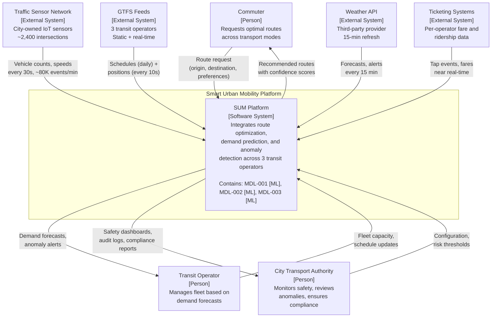

# C4 System Context Diagram — Smart Urban Mobility

> **Diagram type:** C4 Level 1 — System Context
>
> **RAD-AI extensions:** AI component stereotypes applied to system-level interactions

## Purpose

This diagram shows the Smart Urban Mobility (SUM) platform in its operational environment: the users who interact with it, the external systems it depends on, and the data flows that cross the system boundary. AI components are surfaced at the system level because their non-deterministic behavior affects the trust model for every external actor.

## Actors and External Systems

| Actor / System | Type | Interaction | Data Exchanged |
|----------------|------|-------------|----------------|
| Commuters | Person | Request routes, receive recommendations | Origin/destination, transport preferences, route suggestions |
| Transit Operators (x3) | Person / Org | View demand forecasts, receive anomaly alerts | GTFS schedules, fleet capacity, demand predictions, anomaly notifications |
| City Transport Authority | Person / Org | Monitor system health, review safety anomalies, access compliance reports | Aggregated KPIs, anomaly audit logs, EU AI Act documentation |
| Traffic Sensor Network | External System | Push real-time traffic flow data | Vehicle counts, speed measurements, occupancy per segment (every 30s) |
| GTFS Feeds | External System | Pull transit schedules and real-time vehicle positions | Static timetables (daily), real-time positions (every 10s) |
| Weather API | External System | Pull weather forecasts and current conditions | Temperature, precipitation, wind, severe weather alerts (every 15 min) |
| Ticketing Systems | External System | Pull ridership and revenue data | Tap-in/tap-out events, fare transactions (near real-time) |

## System Context Diagram

## Key Observations

### AI Visibility at System Level

The SUM platform is presented as a single system box at this level, but the notation `Contains: MDL-001 [ML], MDL-002 [ML], MDL-003 [ML]` signals to stakeholders that non-deterministic AI components exist within the boundary. This is a RAD-AI convention: AI presence is surfaced even at the highest abstraction level so that trust and liability discussions begin early.

### Data Flow Volumes

The system ingests approximately 80,000 traffic sensor events per minute, 3 GTFS real-time feeds at 10-second intervals, and weather data every 15 minutes. These volumes drive architectural decisions around streaming infrastructure (Kafka) and feature freshness requirements documented in the [Data Lineage Overlay](data-lineage-overlay.md).

### Multi-Stakeholder Trust Boundaries

Three distinct trust relationships exist:

1. **Commuters** receive route recommendations with confidence scores -- they need to understand that suggestions are AI-generated and may vary.
2. **Transit operators** receive demand forecasts that drive fleet allocation -- incorrect predictions have financial and service-level consequences.
3. **City transport authority** has oversight responsibility for the high-risk anomaly detection component (MDL-003) under EU AI Act Annex III. All safety-relevant decisions are logged and auditable.

### External System Dependencies

All four external data sources are outside the SUM team's control. Degradation of any source triggers fallback behavior documented in the [Non-Determinism Boundary](non-determinism-boundary.md) diagram. The weather API is the most fragile dependency (third-party, rate-limited), mitigated by a 1-hour cache with graceful staleness.
