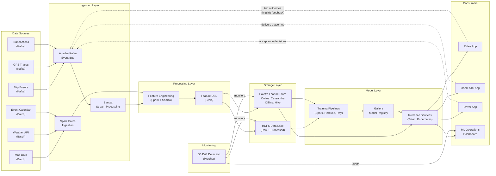

# Data Pipeline View

> **Extends:** arc42 S6 -- Runtime View

## Purpose

Data flows are the circulatory system of Michelangelo's ML architecture. This view documents the complete data lifecycle from raw event ingestion through feature engineering, model training, real-time inference, and feedback loops. It captures the data-centric runtime behavior that distinguishes Michelangelo from conventional software: the training-serving skew risks, data quality gates (D3), Feature Store interactions, and the feedback mechanisms through which model outputs influence future training data.

## Pipeline Overview

## Pipeline Inventory

| Pipeline ID | Name | Type | Schedule | SLA | Owner |
|-------------|------|------|----------|-----|-------|
| PL-001 | Trip Feature Pipeline | Streaming | Continuous (Samza) | < 30s event-to-feature | ML Platform Team |
| PL-002 | Geographic Feature Pipeline | Hybrid (streaming + batch) | Streaming for real-time; hourly batch aggregation | Streaming: < 30s; Batch: < 15 min | ML Platform Team |
| PL-003 | Historical Aggregate Pipeline | Batch | Daily (Spark on Airflow) | < 2 hours end-to-end | Data Engineering |
| PL-004 | External Data Pipeline | Batch | Weather: 15-min; Map: daily; Events: daily | < 5 min per refresh | Data Engineering |
| PL-005 | ETA Training Pipeline | Batch (on-demand) | Triggered by drift or schedule | < 8 hours end-to-end | DeepETA Model Team |
| PL-006 | Pricing Training Pipeline | Batch (on-demand) | Weekly scheduled; ad-hoc on drift | < 4 hours end-to-end | Pricing ML Team |
| PL-007 | Fraud Training Pipeline | Batch (on-demand) | Daily incremental; weekly full retrain | < 6 hours (full) | Safety ML Team |
| PL-008 | Feedback Collection Pipeline | Streaming + batch | Continuous (streaming); daily aggregation (batch) | < 60s for streaming; < 1 hour for daily aggregation | ML Platform Team |

## Pipeline Details

### Trip Feature Pipeline (PL-001)

**Stages:**

| Stage | Input | Output | Processing | Quality Gate |
|-------|-------|--------|-----------|-------------|
| Kafka ingestion | Trip start/end events, driver location pings, marketplace signals | Raw events in Kafka topics | Schema validation via Kafka schema registry (Avro); deduplication by event ID + timestamp | Schema conformance 100%; duplicate rate < 0.01% |
| Stream processing | Raw Kafka events | Computed streaming features (current supply, demand, congestion) | Samza jobs: zone-level aggregation over sliding windows (1-min, 5-min, 15-min), driver supply counting, request rate computation | Processing latency < 10s; completeness > 99% |
| Feature DSL application | Streaming aggregates + static features | Transformed feature vectors matching training schema | Scala Feature DSL applies identical transformations as training pipeline to prevent train-serve skew | DSL version parity check; transformation output within expected range |
| Online store write | Feature vectors | Updated Cassandra rows in Palette online store | Upsert with TTL based on feature freshness SLA | Write success rate > 99.99%; latency < 5ms |
| HDFS logging | Feature vectors + raw events | Parquet files in HDFS for training pipeline consumption | Async write; append to daily partitions | Eventual consistency; < 5 min lag |

**Data Quality Checkpoints (D3-integrated):**

| Checkpoint | Location | Validation Rule | On Failure |
|------------|----------|----------------|------------|
| Schema validation | Kafka ingestion | All required fields present; types match Avro schema | Reject event to dead-letter topic; alert if rejection rate > 0.5% in 5-min window |
| Null rate monitor | After stream processing | Null values < 1% per feature column (D3 monitor) | D3 flags anomaly; alert to data engineering; feature marked as potentially degraded |
| Distribution drift | After feature computation | PSI < 0.2 for each streaming feature vs. training baseline (D3 monitor) | D3 raises drift alert; ML team evaluates impact on downstream models |
| Freshness check | Online store write | Feature timestamp within 60s of current time | Stale feature flagged; consuming models apply confidence penalty |

---

### Historical Aggregate Pipeline (PL-003)

**Stages:**

| Stage | Input | Output | Processing | Quality Gate |
|-------|-------|--------|-----------|-------------|
| Data lake read | Raw trip records, transaction logs from HDFS (daily partitions) | Filtered and deduplicated records | Spark SQL: date-range selection, deduplication, join with dimension tables | Record count reconciliation vs. source system counts (tolerance +/- 0.5%) |
| Aggregation | Filtered records | Zone-level, driver-level, and rider-level aggregates (7-day, 30-day, 90-day windows) | Spark aggregation jobs: rolling averages, percentiles, counts, rates | All zones represented; no aggregate based on < 10 observations (statistical stability) |
| Feature computation | Aggregates + external data (weather, events) | Historical feature vectors (e.g., restaurant_avg_prep_time_7d, zone_avg_surge_30d) | Feature DSL application on batch data; identical transformations as streaming pipeline | DSL version match with streaming pipeline; feature distribution within expected bounds |
| Offline store write | Historical feature vectors | Hive tables partitioned by date; Cassandra batch update for semi-static features | Hive partition append; Cassandra batch insert for features needed online | Partition completeness check; Cassandra write confirmation |

---

### ETA Training Pipeline (PL-005)

**Stages:**

| Stage | Input | Output | Processing | Quality Gate |
|-------|-------|--------|-----------|-------------|
| Training data assembly | Completed trips from HDFS + features from Palette (offline) | Training dataset: (features, actual_trip_duration, routing_engine_estimate) | Point-in-time correct feature join (features as-of trip request time); route-segment decomposition | No future data leakage; feature coverage > 98% for training examples |
| Data validation | Training dataset | Validated training dataset | Completeness checks, outlier detection, class distribution analysis | Label distribution within expected bounds; < 1% missing labels |
| Feature engineering | Validated dataset | Feature matrix with bucketized continuous and embedded categorical features | Feature DSL transformation; continuous feature bucketization; categorical embedding lookup | Feature count matches model specification; no new unseen categories |
| Distributed training | Feature matrix + labels | Trained DeepETA model candidate | Horovod distributed training on GPU cluster; Linear Transformer architecture | Training converges; loss curve within expected trajectory |
| Evaluation | Trained model + holdout test set | Evaluation metrics (MAE, RMSE, latency, segment-level accuracy) | Inference on holdout set; metric computation; comparison to production baseline | MAE <= production baseline; P95 latency <= 10ms; no regression on any market segment |
| Model registration | Evaluated model + metrics | Gallery model entry with full lineage | Register in Gallery with training config, dataset version, metrics, feature list | All metadata fields populated; reproducibility verified |

## Feature Store

| Feature Group | Features (approx.) | Source Pipeline | Refresh Rate | Consumers |
|---------------|-------------------|---------------|-------------|-----------|
| Trip real-time | trip_distance, route_segments, trip_type, pickup_zone | PL-001 | Real-time (streaming) | MDL-ETA, MDL-MATCH |
| Supply-demand real-time | zone_driver_count, zone_request_count, zone_supply_demand_ratio | PL-001, PL-002 | Real-time (streaming) | MDL-PRICE, MDL-DEMAND, MDL-MATCH |
| Traffic real-time | segment_speed, segment_congestion, zone_avg_speed | PL-001, PL-002 | Real-time (streaming) | MDL-ETA |
| Driver historical | driver_acceptance_rate_7d, driver_avg_rating, driver_trip_count_30d | PL-003 | Daily (batch) | MDL-MATCH, MDL-FRAUD |
| Rider historical | rider_trip_count, rider_avg_rating, rider_payment_history | PL-003 | Daily (batch) | MDL-FRAUD, MDL-MATCH |
| Geographic aggregates | zone_avg_surge_7d, zone_avg_eta_7d, zone_demand_seasonality | PL-003 | Daily (batch) | MDL-PRICE, MDL-DEMAND |
| Restaurant features | restaurant_avg_prep_time_7d, restaurant_order_volume_7d | PL-003 | Daily (batch) | MDL-EATS-ETA |
| Weather features | weather_temp, weather_precip, weather_wind, weather_condition | PL-004 | 15-minute refresh | MDL-ETA, MDL-DEMAND |
| Event features | event_proximity, event_expected_attendance, event_type | PL-004 | Daily | MDL-DEMAND, MDL-PRICE |

The Feature Store is implemented using Palette, with Cassandra as the online store backend for low-latency serving and Hive/HDFS as the offline store for training dataset construction. The Scala-based Feature DSL ensures identical feature transformations in both online and offline paths, preventing training-serving skew. D3 monitors feature distributions across both paths.

## Feedback Loops

| Loop | From | To | Mechanism | Risk | Mitigation |
|------|------|----|-----------|------|------------|
| Pricing-demand feedback | Dynamic Pricing model (surge multiplier) -> rider behavior -> observed demand | MDL-DEMAND training data; MDL-PRICE training data | Surge pricing suppresses demand; lower demand leads to lower surge in future; model learns attenuated demand signal | Self-fulfilling prophecy: model predicts low demand because its own actions suppressed it; equilibrium may not reflect true latent demand | Price experimentation (randomized holdout regions with fixed pricing); counterfactual demand estimation; causal modeling for price elasticity |
| Matching-supply feedback | Marketplace Matching (driver assignment) -> driver repositioning -> observed supply distribution | MDL-DEMAND training data; MDL-MATCH training data | Optimal matching concentrates drivers in high-demand zones; observed supply distribution reflects matching decisions, not natural driver preferences | Supply signal is model-influenced: model cannot distinguish "drivers naturally concentrate here" from "we sent them here" | Driver-side randomization for a small fraction of assignments; supply-counterfactual estimation |
| ETA-routing feedback | DeepETA predictions -> route recommendations -> traffic patterns | MDL-ETA training data | If DeepETA predicts a route is fast, more riders are directed there, potentially creating congestion and making the route slower | Self-defeating prediction: accurate ETAs become inaccurate as rider behavior responds to them | ETA predictions do not directly route riders (routing engine makes separate decisions); natural traffic diversification mitigates concentration |
| Fraud-adaptation feedback | Fraud Detection (blocked transactions) -> fraudster behavior adaptation -> future fraud patterns | MDL-FRAUD training data | Blocked fraud patterns disappear from data; new fraud patterns emerge; model trained on historical patterns misses novel attacks | Concept drift due to adversarial adaptation: fraud distribution shifts specifically because of model actions | Continuous labeling with fraud operations team; synthetic fraud generation for training; ensemble that combines pattern-based and anomaly-based detection |
