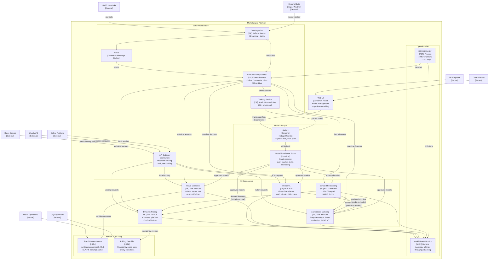

# C4 Container Diagram -- Uber Michelangelo (RAD-AI Extended)

> **Diagram type:** C4 Level 2 -- Container Diagram
>
> **RAD-AI extensions:** AI component stereotypes `[ML]`, `[FS]`, `[DP]`, `[MON]`, `[HITL]`

## Purpose

This diagram decomposes Michelangelo into its runtime containers, applying RAD-AI stereotypes to distinguish ML models, the Feature Store, data pipelines, monitors, and human-in-the-loop intervention points from conventional software containers. Each AI container is annotated with its model ID, key performance metric, and serving mode. Compared to the standard C4 container diagram, this version makes ML components, their characteristics, and their interdependencies architecturally visible.

## Container Inventory

| Container | Stereotype | Technology | Description |
|-----------|-----------|------------|-------------|
| Web UI | -- | React | ML engineer and data scientist interface |
| API Gateway | -- | Internal | Request routing, auth, rate limiting for prediction endpoints |
| DeepETA | `[ML]` | PyTorch, Linear Transformer, Triton | MDL-ETA: travel time residual prediction |
| Dynamic Pricing | `[ML]` | XGBoost/LightGBM, Triton | MDL-PRICE: surge multiplier estimation |
| Fraud Detection | `[ML]` | XGBoost + PyTorch, Triton | MDL-FRAUD: fraud probability scoring |
| Marketplace Matching | `[ML]` | PyTorch + custom solver | MDL-MATCH: driver-rider assignment |
| Demand Forecasting | `[ML]` | PyTorch (LSTM/DeepAR), Spark | MDL-DEMAND: spatiotemporal demand prediction |
| Feature Store (Palette) | `[FS]` | Cassandra (online), Hive (offline), Samza (streaming) | 20,000+ features with online/offline serving |
| Training Service | `[DP]` | Spark, Horovod, Ray | Distributed model training orchestration |
| Data Ingestion | `[DP]` | Kafka, Samza, Spark | Streaming and batch data pipelines |
| Gallery | -- | Custom | Model lifecycle management (4-stage) |
| D3 Drift Monitor | `[MON]` | Prophet, Spark | Data drift detection: 100,000+ monitors |
| Model Health Monitor | `[MON]` | Grafana, Prometheus | Model performance and serving health |
| Fraud Review Queue | `[HITL]` | Custom | Human review for ambiguous fraud decisions |
| Pricing Override Console | `[HITL]` | Custom | Emergency pricing override for operations |
| Cassandra | -- | Apache Cassandra | Online feature store backend, model artifacts |
| HDFS / Hive | -- | Hadoop, Hive | Data lake, offline feature store backend |
| Kafka | -- | Apache Kafka | Event streaming backbone |

## Container Diagram

## Stereotype Annotations

### ML Components

| Model ID | Container | Key Metric | Serving Mode | Model-to-Model Dependencies |
|----------|-----------|------------|-------------|----------------------------|
| MDL-ETA | DeepETA | MAE: ~2 min | Online (real-time, P95 < 10ms) | Output consumed by MDL-MATCH |
| MDL-PRICE | Dynamic Pricing | Confidence: 0.72--0.96 | Online (real-time, P95 < 15ms) | Consumes MDL-DEMAND output |
| MDL-FRAUD | Fraud Detection | AUC: 0.95--0.98 | Online (real-time, P95 < 20ms) | None (independent) |
| MDL-MATCH | Marketplace Matching | Optimality: 0.85--0.97 | Online (real-time, P95 < 50ms) | Consumes MDL-ETA + MDL-DEMAND outputs |
| MDL-DEMAND | Demand Forecasting | MAPE: 8--22% | Batch (15-min cycle) + online | Output consumed by MDL-PRICE + MDL-MATCH |

In the standard C4 container diagram, all five models appeared as a single "Prediction Service" container. The RAD-AI `[ML]` stereotype makes each model a distinct container with its own architecture, performance profile, and dependency graph.

### Feature Store [FS]

The `[FS]` stereotype distinguishes Palette from regular databases:

- **20,000+ semantically curated features** (not generic rows/columns)
- **Dual serving topology:** Online (Cassandra, < 5ms) for real-time inference; Offline (Hive) for training
- **Feature DSL:** Ensures identical transformations in training and serving to prevent skew
- **Feature versioning:** Features are versioned independently of consuming models
- **Impact propagation:** Feature changes cascade to all consuming models

### D3 Drift Monitor [MON]

The `[MON]` stereotype surfaces D3 as an architecturally significant component:

- **100,000+ monitors** tracking data quality across 300+ Tier 1 datasets
- **Prophet-based anomaly detection** with automatic seasonality and trend adjustment
- **20x improvement** in time-to-detect for data quality issues (from 45+ days to ~2 days)
- **Automated alerting** with tiered escalation based on dataset criticality

### Human-in-the-Loop [HITL]

Two `[HITL]` intervention points are visible that are invisible in the standard diagram:

1. **Fraud Review Queue:** Human fraud analysts review ambiguous fraud scores (0.4--0.6 range). This is architecturally significant because it creates a latency path for transactions and a feedback loop (analyst decisions become training labels).

2. **Pricing Override Console:** City operations managers can cap or disable surge pricing during emergencies. This is architecturally significant because it represents a deterministic override of ML output with real-time business rules.

## Data Flow Summary

1. **Ingestion path:** External sources -> Kafka -> Samza stream processing -> Palette Feature Store (online via Cassandra, offline via Hive).
2. **Real-time inference:** Product service -> API Gateway -> ML Model -> Palette feature lookup -> prediction with confidence.
3. **Batch inference:** Airflow scheduler -> MDL-DEMAND -> Palette (offline) -> demand forecasts consumed by MDL-PRICE and MDL-MATCH.
4. **Model-to-model:** MDL-DEMAND -> MDL-PRICE (demand forecasts as features); MDL-ETA -> MDL-MATCH (trip duration as feature); MDL-DEMAND -> MDL-MATCH (demand predictions as features).
5. **Training loop:** HDFS + Palette (offline) -> Training Service -> Gallery -> MES -> Shadow/Canary -> Production.
6. **Monitoring loop:** All ML containers -> Model Health Monitor -> Grafana/PagerDuty; Palette + HDFS -> D3 -> drift alerts.
7. **Human-in-the-loop:** MDL-FRAUD -> Fraud Review Queue -> analyst decision; MDL-PRICE -> Pricing Override -> operations override.
