# Data Lineage Overlay -- Uber Michelangelo

> **Diagram type:** C4 Data Lineage Overlay (RAD-AI extension)
>
> **Purpose:** Trace data provenance from source through transformation to model consumption, annotated with freshness requirements, quality gates (D3), and feedback loops.

## Data Source Inventory

| Source ID | Name | Type | Freshness | Volume (approx.) | Privacy Classification |
|-----------|------|------|-----------|--------|----------------------|
| DS-001 | Trip Events | Kafka Stream | Real-time | Millions of events/sec | Confidential (contains user data) |
| DS-002 | GPS Traces | Kafka Stream | Real-time (sub-second) | Millions of location pings/sec | Confidential (location data) |
| DS-003 | Transaction Records | Kafka Stream | Real-time | Millions of transactions/day | Sensitive (payment data) |
| DS-004 | Map Data | Batch (API) | Daily refresh | Road network for all markets | Public |
| DS-005 | Weather Data | Batch (API) | 15-minute refresh | All active markets | Public |
| DS-006 | Historical Trip Records | HDFS (Hive) | Daily partition append | Petabytes (multi-year history) | Confidential (anonymized) |
| DS-007 | Driver Supply Signals | Kafka Stream | Real-time | Millions of status updates/sec | Internal |
| DS-008 | Marketplace Events | Kafka Stream | Real-time | Request/acceptance/cancellation events | Internal |

## Data Lineage Diagram

```mermaid
graph LR
    subgraph Sources ["Data Sources"]
        direction TB
        DS1["DS-001: Trip Events<br/>[Kafka Stream]<br/>Real-time, Confidential"]
        DS2["DS-002: GPS Traces<br/>[Kafka Stream]<br/>Real-time, Confidential"]
        DS3["DS-003: Transactions<br/>[Kafka Stream]<br/>Real-time, Sensitive"]
        DS4["DS-004: Map Data<br/>[Batch API] Daily"]
        DS5["DS-005: Weather<br/>[Batch API] 15-min"]
        DS6["DS-006: Historical Trips<br/>[HDFS] Petabytes"]
        DS7["DS-007: Driver Supply<br/>[Kafka Stream]<br/>Real-time"]
        DS8["DS-008: Marketplace<br/>[Kafka Stream]<br/>Real-time"]
    end

    subgraph Ingestion ["Ingestion Layer"]
        direction TB
        KFK["Kafka Topics<br/>trips.raw, gps.raw,<br/>txn.raw, supply.raw,<br/>marketplace.raw"]
        SAMZA["Samza Stream<br/>Processing<br/>Schema validation,<br/>dedup, aggregation"]
        SPARK["Spark Batch<br/>Processing<br/>Daily aggregation,<br/>historical joins"]
    end

    subgraph Transform ["Feature Engineering"]
        direction TB
        DSL["Feature DSL<br/>(Scala)<br/>Identical transforms<br/>for train + serve"]
        ANON["Anonymization<br/>User ID removal,<br/>zone-level aggregation"]
        AGG["Temporal Aggregation<br/>1-min, 5-min, 15-min,<br/>1-hr, 1-day, 7-day, 30-day"]
    end

    subgraph FeatureStore ["Feature Store (Palette) [FS]"]
        direction TB
        ONLINE["Online Store<br/>[Cassandra]<br/>20,000+ features<br/>P95 &lt;5ms"]
        OFFLINE["Offline Store<br/>[Hive / HDFS]<br/>20,000+ features<br/>Point-in-time correct"]
    end

    subgraph Consumption ["Model Consumption"]
        direction TB
        ETA["DeepETA<br/>[ML] MDL-ETA<br/>Freshness: &lt;30s"]
        PRICE["Dynamic Pricing<br/>[ML] MDL-PRICE<br/>Freshness: &lt;30s"]
        FRAUD["Fraud Detection<br/>[ML] MDL-FRAUD<br/>Freshness: &lt;60s"]
        MATCH["Marketplace Matching<br/>[ML] MDL-MATCH<br/>Freshness: &lt;30s"]
        DEMAND["Demand Forecasting<br/>[ML] MDL-DEMAND<br/>Freshness: &lt;15min"]
    end

    subgraph Feedback ["Feedback Loops"]
        direction TB
        TRIPOUT["Trip Outcomes<br/>Actual durations,<br/>actual demand"]
        PRICERESP["Price Response<br/>Acceptance rates,<br/>demand at price"]
        FRAUDLAB["Fraud Labels<br/>Analyst decisions,<br/>chargeback outcomes"]
        RETRAIN["Retraining<br/>Pipelines"]
    end

    subgraph QualityGates ["Quality Gates (D3)"]
        D3MON["D3 Monitors<br/>100,000+ monitors<br/>PSI, null rate,<br/>distribution checks"]
    end

    DS1 --> KFK
    DS2 --> KFK
    DS3 --> KFK
    DS7 --> KFK
    DS8 --> KFK
    DS4 --> SPARK
    DS5 --> SPARK
    DS6 --> SPARK

    KFK --> SAMZA
    SAMZA --> DSL
    SPARK --> DSL
    DSL --> ANON
    ANON --> AGG

    AGG -->|"streaming features<br/>(online path, &lt;30s)"| ONLINE
    AGG -->|"batch features<br/>(offline path, daily)"| OFFLINE

    ONLINE -->|"real-time features"| ETA
    ONLINE -->|"real-time features"| PRICE
    ONLINE -->|"real-time features"| FRAUD
    ONLINE -->|"real-time features"| MATCH
    OFFLINE -->|"historical features"| DEMAND
    OFFLINE -->|"training features"| RETRAIN

    ETA -->|"ETA predictions"| TRIPOUT
    PRICE -->|"surge multipliers"| PRICERESP
    FRAUD -->|"fraud scores"| FRAUDLAB
    DEMAND -->|"demand forecasts"| TRIPOUT

    TRIPOUT -->|"ground truth labels"| RETRAIN
    PRICERESP -->|"price elasticity data"| RETRAIN
    FRAUDLAB -->|"labeled examples"| RETRAIN

    RETRAIN -->|"updated models"| ETA
    RETRAIN -->|"updated models"| PRICE
    RETRAIN -->|"updated models"| FRAUD
    RETRAIN -->|"updated models"| MATCH
    RETRAIN -->|"updated models"| DEMAND

    D3MON -->|"monitors feature<br/>distributions"| ONLINE
    D3MON -->|"monitors data<br/>quality"| OFFLINE
```

## Lineage Details

### DS-002 (GPS Traces) -> MDL-ETA (DeepETA) Path

| Stage | Input | Transformation | Output | Quality Gate (D3) |
|-------|-------|---------------|--------|-------------------|
| Kafka ingestion | Raw GPS pings (lat, lon, timestamp, driver_id, trip_id) | Schema validation (Avro); dedup by driver_id + timestamp (within 1s window) | Validated GPS events | Schema conformance 100%; duplicate rate < 0.01% |
| Stream processing (Samza) | Validated GPS events | Map-matching to road segments; speed computation per segment; aggregation to zone-level traffic metrics | Segment-level speeds; zone congestion indices | Map-matching coverage > 98%; speed values in plausible range (0-200 km/h) |
| Feature DSL | Segment speeds + zone metrics + map data + weather | Bucketized continuous features; categorical embedding lookup; temporal feature computation (hour, day_of_week) | DeepETA feature vector | D3: PSI < 0.2 for each feature vs. training baseline |
| Anonymization | GPS-derived features | Driver ID stripped; features aggregated to segment/zone level; no individual location retained in feature store | Anonymized feature vector | No PII in feature store entries |
| Online store write | Feature vector | Upsert to Cassandra with TTL = 60s | Online features for MDL-ETA | Freshness < 30s; write latency < 5ms |

### DS-003 (Transactions) -> MDL-FRAUD (Fraud Detection) Path

| Stage | Input | Transformation | Output | Quality Gate (D3) |
|-------|-------|---------------|--------|-------------------|
| Kafka ingestion | Raw transaction events (amount, payment_method, device_id, merchant_id) | Schema validation; dedup by transaction_id; PCI-DSS tokenization of card data | Validated, tokenized transaction events | Schema conformance 100%; tokenization verified |
| Stream processing (Samza) | Tokenized transaction events | Velocity computation (transactions per user per hour), amount pattern analysis, device fingerprint matching | Transaction-level behavioral features | Value ranges within expected bounds; no raw card data in output |
| Feature DSL | Transaction features + historical user features (from Palette) + device features | Feature vector combining real-time signals with historical user behavior | Fraud detection feature vector | D3: null rate < 0.5%; distribution within 2 sigma of training baseline |
| Anonymization | Feature vector | User ID replaced with anonymized hash; only derived behavioral features retained (not raw transaction details) | Anonymized fraud feature vector | PCI-DSS compliance verified; no raw payment data |
| Online store write | Feature vector | Upsert to Cassandra (Safety serving group, dedicated cluster) | Online features for MDL-FRAUD | Freshness < 60s; availability 99.99% |

### DS-001 (Trip Events) -> MDL-DEMAND (Demand Forecasting) Path

| Stage | Input | Transformation | Output | Quality Gate (D3) |
|-------|-------|---------------|--------|-------------------|
| Kafka ingestion | Trip request, acceptance, start, and completion events | Schema validation; event correlation (link request to completion) | Correlated trip lifecycle events | All events have valid trip_id; lifecycle completeness check |
| Batch aggregation (Spark) | Correlated trip events + historical trips from HDFS | Zone-level demand aggregation per 15-min window; mode breakdown; temporal features | Demand time series per zone | D3: zone coverage 100%; no gaps > 2 consecutive windows |
| Feature DSL | Demand time series + weather forecasts + event calendar | Lag features (1d, 7d, 28d); rolling statistics; event proximity encoding; seasonal decomposition | Demand forecasting feature vector | D3: stationarity test (ADF); no feature with > 3% null rate |
| Offline store write | Feature vectors | Append to Hive partitions by date | Offline features for MDL-DEMAND training and batch inference | Partition completeness check; feature count consistency |

## Freshness Requirements

| Consumer | Required Freshness | Source Freshness | Gap Risk | Mitigation |
|----------|-------------------|-----------------|----------|------------|
| MDL-ETA | < 30s for traffic features | GPS: sub-second; Traffic: real-time | Samza processing adds 5-15s | Feature freshness monitoring; confidence penalty for stale features; routing engine fallback if features > 60s stale |
| MDL-PRICE | < 30s for supply/demand features | Supply signals: real-time | Samza aggregation window (1-5 min for zone-level metrics) | Supply/demand computed at multiple granularities; fastest available used for real-time pricing |
| MDL-FRAUD | < 60s for transaction features | Transactions: real-time | Minimal lag (< 5s for streaming features) | Rule-based fraud checks as pre-filter (immediate, no feature lookup needed); ML scoring as second layer |
| MDL-MATCH | < 30s for driver and demand features | Driver supply: real-time; Demand forecasts: 15-min batch | Demand forecast is inherently 15-min stale (batch cycle) | Demand interpolation between batch cycles; real-time request rate used as correction signal |
| MDL-DEMAND | < 15 min for all features (batch cycle) | All sources: < 15 min | Hive partition availability (daily for historical aggregates) | Rolling computation windows ensure freshness; event-driven recomputation for known demand shocks |

## Privacy Flow

| Data Element | Source Classification | Anonymization Point | Method | Downstream Classification |
|-------------|---------------------|--------------------|---------|-----------------------|
| GPS traces (driver location) | Confidential | Samza stream processing | Aggregated to segment/zone level; driver ID stripped before feature store entry | Internal (zone-level, no individual tracking) |
| Trip origin/destination | Confidential | Feature engineering | Generalized to zone level for demand features; exact locations not in Feature Store | Internal (zone-level) |
| Payment card data | Sensitive | Kafka ingestion (immediate) | PCI-DSS tokenization; raw card data never enters ML pipeline | Internal (tokenized, behavioral features only) |
| Transaction amounts | Confidential | Feature engineering | Bucketed into ranges for fraud features; exact amounts used only in real-time fraud scoring (not stored) | Internal (bucketed for offline; real-time for scoring only) |
| User IDs | Confidential | Feature engineering | Replaced with anonymized hash for feature computation; stripped before training data assembly | Internal (hashed, no reverse mapping in ML pipeline) |
| Driver IDs | Confidential | Feature engineering | Used for real-time feature lookup (necessary for serving); anonymized in training datasets | Internal (anonymized for training; authenticated for serving) |

## Feedback Loop: Pricing -> Demand -> Pricing

The most architecturally significant feedback loop in Michelangelo flows through the pricing-demand cycle:

1. MDL-PRICE sets surge multipliers based on current supply-demand ratios and MDL-DEMAND forecasts.
2. Surge pricing affects rider behavior: some riders wait, take alternative transport, or cancel.
3. This price-influenced demand is observed by trip events and feeds into demand training data.
4. MDL-DEMAND learns from this demand-at-price-point data, not true latent demand.
5. MDL-DEMAND's forecasts influence MDL-PRICE in the next cycle.

**Risks:**
- **Equilibrium bias:** The system converges on a demand level that reflects the interaction of pricing and behavior, not true demand. Certain zones may be persistently underserved because observed demand (after pricing) appears low.
- **Amplification:** If MDL-DEMAND overestimates demand, MDL-PRICE surges higher, which suppresses demand, which makes MDL-DEMAND's prediction appear wrong, potentially causing oscillation.

**Mitigations:**
- Price experimentation (randomized holdout zones/windows)
- Causal demand estimation (instrumental variables for price elasticity)
- Separate demand signals: distinguish "demand at price" from "demand regardless of price" using cancellation and app-open data
