# Non-Determinism Boundary Diagram -- Uber Michelangelo

> **Diagram type:** C4 Non-Determinism Boundary (RAD-AI extension)
>
> **Purpose:** Explicitly delineate deterministic and non-deterministic regions of the Michelangelo architecture, with confidence gates, fallback strategies, and degradation behavior for each AI component.

## Boundary Overview

Michelangelo's architecture has a clear separation between deterministic infrastructure components (API gateway, routing engine, payment processing, logging) and non-deterministic ML components (trained models, feature computations, drift detectors) whose outputs are probabilistic and may vary across model versions, retraining cycles, or input distributions. This separation is enforced through confidence gates at every boundary crossing, with deterministic fallback strategies for each ML component.

## Boundary Diagram

```mermaid
graph TB
    subgraph Det ["Deterministic Region"]
        style Det fill:#e8f5e9,stroke:#2e7d32
        APIGW["API Gateway<br/>[Container]<br/>Deterministic routing,<br/>auth, rate limiting"]
        ROUTE["Routing Engine<br/>[Container]<br/>Deterministic segment-sum<br/>ETA, shortest path"]
        PAY["Payment Service<br/>[Container]<br/>Fare calculation,<br/>transaction processing"]
        LOG["Audit Logger<br/>[Container]<br/>Immutable prediction<br/>and override log"]
        RULES["Business Rules<br/>[Container]<br/>Fare caps, minimum fares,<br/>regulatory constraints"]
    end

    subgraph BoundaryLayer ["Confidence Gate Layer"]
        style BoundaryLayer fill:#e3f2fd,stroke:#1565c0
        CG1["Confidence Gate CG-ETA<br/>DeepETA<br/>Threshold: MAE-based<br/>per-market calibration"]
        CG2["Confidence Gate CG-PRICE<br/>Dynamic Pricing<br/>Threshold: 0.72<br/>Action: rule-based fallback"]
        CG3["Confidence Gate CG-FRAUD<br/>Fraud Detection<br/>Threshold: 0.4 / 0.6<br/>Action: human review / auto-block"]
        CG4["Confidence Gate CG-MATCH<br/>Matching<br/>Threshold: optimality score<br/>Action: nearest-driver"]
    end

    subgraph NonDet ["Non-Deterministic Region"]
        style NonDet fill:#fff3e0,stroke:#ef6c00
        ETA["DeepETA<br/>[ML] MDL-ETA<br/>Linear Transformer<br/>MAE: ~2 min"]
        PRICE["Dynamic Pricing<br/>[ML] MDL-PRICE<br/>XGBoost/LightGBM<br/>Conf: 0.72-0.96"]
        FRAUD["Fraud Detection<br/>[ML] MDL-FRAUD<br/>GBM + Neural Net<br/>AUC: 0.95-0.98"]
        MATCH["Marketplace Matching<br/>[ML] MDL-MATCH<br/>Deep Learning + Solver<br/>Optimality: 0.85-0.97"]
        DEMAND["Demand Forecasting<br/>[ML] MDL-DEMAND<br/>LSTM / DeepAR<br/>MAPE: 8-22%"]
        PALETTE["Feature Store (Palette)<br/>[FS] 20,000+ features<br/>Non-deterministic due to<br/>real-time data freshness"]
        D3["D3 Drift Monitor<br/>[MON] Prophet<br/>Triggers fallback when<br/>drift exceeds thresholds"]
    end

    subgraph Fallback ["Deterministic Fallback Region"]
        style Fallback fill:#fce4ec,stroke:#c62828
        FB1["Routing Engine Raw ETA<br/>[Fallback for MDL-ETA]<br/>Segment-sum estimate,<br/>no ML correction"]
        FB2["Rule-Based Surge Tiers<br/>[Fallback for MDL-PRICE]<br/>Supply/demand ratio<br/>mapped to discrete tiers"]
        FB3["Rule-Based Fraud Rules<br/>[Fallback for MDL-FRAUD]<br/>Velocity checks,<br/>amount thresholds"]
        FB4["Nearest-Driver Dispatch<br/>[Fallback for MDL-MATCH]<br/>Geographic proximity only,<br/>no value optimization"]
        FB5["Historical Averages<br/>[Fallback for MDL-DEMAND]<br/>4-week rolling average<br/>by zone, day, hour"]
    end

    subgraph HITL ["Human-in-the-Loop"]
        style HITL fill:#f3e5f5,stroke:#7b1fa2
        FRAUDQ["Fraud Review Queue<br/>[HITL]<br/>Analyst reviews<br/>ambiguous scores"]
        PRICEOV["Pricing Override<br/>[HITL]<br/>Operations caps<br/>surge during emergencies"]
    end

    APIGW -->|"prediction request"| CG1
    APIGW -->|"pricing request"| CG2
    PAY -->|"fraud check"| CG3
    APIGW -->|"match request"| CG4

    CG1 -->|"request features"| ETA
    CG2 -->|"request pricing"| PRICE
    CG3 -->|"request scoring"| FRAUD
    CG4 -->|"request match"| MATCH

    PALETTE -->|"feature vectors"| ETA
    PALETTE -->|"feature vectors"| PRICE
    PALETTE -->|"feature vectors"| FRAUD
    PALETTE -->|"feature vectors"| MATCH
    PALETTE -->|"feature vectors"| DEMAND
    DEMAND -->|"demand forecasts"| PRICE
    DEMAND -->|"demand predictions"| MATCH
    ETA -->|"predicted trip time"| MATCH

    ETA -->|"residual +<br/>confidence"| CG1
    PRICE -->|"surge +<br/>confidence"| CG2
    FRAUD -->|"fraud score +<br/>risk factors"| CG3
    MATCH -->|"assignment +<br/>optimality"| CG4

    CG1 -->|"high confidence:<br/>ML ETA"| RULES
    CG1 -->|"low confidence:<br/>use fallback"| FB1
    FB1 -->|"routing engine ETA"| RULES
    ROUTE -->|"baseline ETA"| FB1
    ROUTE -->|"baseline ETA"| ETA
    RULES -->|"validated fare"| PAY

    CG2 -->|"conf >= 0.72:<br/>ML surge"| RULES
    CG2 -->|"conf < 0.72:<br/>rule tiers"| FB2
    FB2 -->|"tier-based surge"| RULES

    CG3 -->|"score >= 0.6:<br/>auto-block"| PAY
    CG3 -->|"score 0.4-0.6:<br/>human review"| FRAUDQ
    CG3 -->|"score < 0.4:<br/>auto-approve"| PAY
    CG3 -->|"model unavailable"| FB3
    FB3 -->|"rule-based<br/>fraud check"| PAY
    FRAUDQ -->|"analyst decision"| PAY

    CG4 -->|"high optimality:<br/>ML match"| APIGW
    CG4 -->|"low optimality:<br/>nearest driver"| FB4
    FB4 -->|"proximity match"| APIGW

    PRICEOV -->|"emergency<br/>surge cap"| CG2

    D3 -->|"drift alert:<br/>evaluate model"| CG1
    D3 -->|"drift alert:<br/>evaluate model"| CG2
    D3 -->|"drift alert:<br/>evaluate model"| CG3
    D3 -->|"drift alert:<br/>evaluate model"| CG4

    CG1 -->|"all decisions logged"| LOG
    CG2 -->|"all decisions logged"| LOG
    CG3 -->|"all decisions logged"| LOG
    CG4 -->|"all decisions logged"| LOG
    FRAUDQ -->|"review outcomes"| LOG
    PRICEOV -->|"overrides logged"| LOG
```

## Boundary Interfaces

| Interface ID | From (Region) | To (Region) | Data Exchanged | Contract |
|-------------|--------------|------------|---------------|---------|
| BI-001 | API Gateway (Det) | CG-ETA (Boundary) | Trip request: origin, destination, trip_type, request_time | Request schema; timeout 15ms |
| BI-002 | CG-ETA (Boundary) | DeepETA (NonDet) | Feature request + routing engine baseline ETA | Feature schema; response within 5ms |
| BI-003 | DeepETA (NonDet) | CG-ETA (Boundary) | Residual prediction + per-market confidence indicator | Residual in minutes; confidence metric per market |
| BI-004 | CG-ETA (Boundary) | Business Rules (Det) | Final ETA (ML-corrected or routing-engine-only) + source flag (ml/fallback) | ETA schema; `decision_source` field |
| BI-005 | Payment Service (Det) | CG-FRAUD (Boundary) | Transaction details: amount, payment_method, user_hash, device_fingerprint | Transaction schema; timeout 20ms |
| BI-006 | CG-FRAUD (Boundary) | Fraud Detection (NonDet) | Feature request for transaction + user behavioral features | Feature schema; response within 15ms |
| BI-007 | Fraud Detection (NonDet) | CG-FRAUD (Boundary) | Fraud probability score (0.0--1.0) + top-3 risk factors | Score + explanation schema |
| BI-008 | CG-FRAUD (Boundary) | Fraud Review Queue (HITL) | Ambiguous transaction + score + risk factors + recommended action | Review schema; includes all data for human decision |
| BI-009 | API Gateway (Det) | CG-PRICE (Boundary) | Zone, time, current supply/demand metrics | Pricing request schema; timeout 15ms |
| BI-010 | CG-PRICE (Boundary) | Dynamic Pricing (NonDet) | Feature request for zone + demand forecast from MDL-DEMAND | Feature schema; response within 10ms |
| BI-011 | Dynamic Pricing (NonDet) | CG-PRICE (Boundary) | Surge multiplier + confidence + zone factors | Surge schema; multiplier range [1.0, N.0] |

## Confidence Thresholds

| Model | High Confidence | Medium Confidence | Low Confidence | Rejection / Fallback |
|-------|----------------|------------------|---------------|---------------------|
| MDL-ETA | Low MAE residual with consistent routing engine baseline | Moderate residual with some feature staleness | High residual or stale features (> 60s) | Model unavailable or Feature Store outage: use routing engine raw estimate (FB1) |
| MDL-PRICE | Confidence >= 0.85: direct surge application | 0.72--0.85: surge applied with wider bounds | < 0.72: flag as low confidence | Model unavailable: rule-based surge tiers (FB2); Emergency: pricing override (HITL) |
| MDL-FRAUD | Score >= 0.6: auto-block (high fraud probability) | Score 0.4--0.6: route to human review (HITL) | Score < 0.4: auto-approve (low fraud probability) | Model unavailable: rule-based fraud checks (FB3) |
| MDL-MATCH | Optimality >= 0.90: accept ML assignment | 0.80--0.90: accept with logging | < 0.80: consider nearest-driver fallback | Model unavailable: nearest-driver dispatch (FB4) |
| MDL-DEMAND | MAPE within expected bounds for zone/time | MAPE elevated but within 2x baseline | MAPE > 2x baseline | Model unavailable: 4-week rolling averages (FB5) |

## Fallback Strategies

### FB1: Routing Engine Raw ETA (Fallback for MDL-ETA)

**Trigger:** DeepETA unavailable, Feature Store outage, or confidence below threshold.

**Behavior:** Return the routing engine's deterministic segment-sum ETA. The routing engine computes travel time by summing predicted traversal times for each road segment along the best path, using current traffic measurements where available and historical averages otherwise.

**Limitations:** No learned correction for driver behavior, time-of-day effects, weather impact, or systematic routing engine biases. MAE is approximately 30--50% higher than DeepETA.

**User experience:** ETAs are still provided but are less accurate. Users are not explicitly notified of the fallback (ETAs are inherently approximate). Backend metrics track fallback rate for operational awareness.

### FB2: Rule-Based Surge Tiers (Fallback for MDL-PRICE)

**Trigger:** Pricing model unavailable, confidence below 0.72, or emergency pricing override by operations.

**Behavior:** Surge multiplier derived from real-time supply/demand ratio mapped to discrete tiers: 1.0x (ratio > 0.8), 1.25x (ratio 0.5--0.8), 1.5x (ratio 0.3--0.5), 2.0x (ratio < 0.3). No ML-driven granularity or forward-looking demand consideration.

**Limitations:** Less granular than ML pricing (4 tiers vs. continuous); no anticipatory pricing (responds only to current supply/demand, not predicted future demand); may over-surge in localized hotspots or under-surge in areas about to experience demand spikes.

**User experience:** Riders see surge pricing at rounded tier levels. Revenue impact is minor for short outages; significant if sustained.

### FB3: Rule-Based Fraud Rules (Fallback for MDL-FRAUD)

**Trigger:** Fraud model unavailable or Feature Store outage.

**Behavior:** Transaction screening via deterministic rules: velocity checks (>N transactions in T minutes), amount thresholds (>$X in category), known-bad device blocklist, geographic impossibility checks (transactions in two countries within minutes).

**Limitations:** ~3x higher false positive rate compared to ML model. Cannot detect novel fraud patterns. Rule set requires manual updates as fraud tactics evolve.

**User experience:** More legitimate transactions flagged for manual review or delayed. Not sustainable for more than a few hours without significant customer impact and fraud operations capacity.

### FB4: Nearest-Driver Dispatch (Fallback for MDL-MATCH)

**Trigger:** Matching model unavailable or optimality score below threshold.

**Behavior:** Assign the nearest available driver to each request based purely on geographic proximity. No consideration of predicted trip value, driver preferences, or system-level load balancing.

**Limitations:** Suboptimal for both efficiency and equity. May assign a driver 5 minutes away when a better-rated driver 6 minutes away would be preferred by both parties. No system-level supply balancing.

**User experience:** Riders may wait slightly longer in aggregate. Drivers receive assignments without value optimization. System functional but less efficient.

### FB5: Historical Averages (Fallback for MDL-DEMAND)

**Trigger:** Demand model unavailable or MAPE exceeding 2x baseline.

**Behavior:** Return 4-week rolling average demand per zone, day-of-week, and hour-of-day. Prediction intervals based on historical standard deviation.

**Limitations:** Cannot anticipate events, weather impacts, or trend changes. Accuracy degrades during anomalous periods (holidays, major events, weather events).

**User experience:** Downstream consumers (pricing, matching, driver incentives) receive less accurate demand signals, leading to suboptimal supply positioning. Operators see demand forecasts labeled as "historical baseline."

## Degradation Behavior

| Scenario | Detection | System Behavior | Impact | Max Duration |
|----------|-----------|-----------------|--------|-------------|
| MDL-ETA unavailable | Health check failure | CG-ETA routes to FB1 (routing engine raw ETA) | ETA accuracy degrades ~30--50% | Indefinite (FB1 is stable) |
| MDL-PRICE unavailable | Health check failure | CG-PRICE routes to FB2 (rule-based tiers) | Pricing less granular; revenue impact | Indefinite (FB2 is stable) |
| MDL-FRAUD unavailable | Health check failure | CG-FRAUD routes to FB3 (rule-based rules) | ~3x false positive rate; fraud ops overloaded | Hours (FP rate unsustainable long-term) |
| MDL-MATCH unavailable | Health check failure | CG-MATCH routes to FB4 (nearest driver) | Suboptimal matching efficiency | Indefinite (FB4 is functional) |
| Feature Store (Cassandra) degraded | Latency SLA breach | All online-serving models switch to fallbacks simultaneously | Platform-wide degradation | Target recovery: < 15 min |
| Feature Store partial outage | Subset of features unavailable | Models use available features with reduced confidence; missing features use defaults | Partial accuracy degradation per model | Until Feature Store recovery |
| D3 monitoring unavailable | D3 health check failure | Models continue serving without drift detection | Silent degradation risk: data quality issues undetected | Must be resolved within hours (risk of undetected data issues) |
| Multiple models degraded simultaneously | Correlated metric degradation across 2+ models | Investigate shared dependency (Feature Store, Kafka, external data); activate fallbacks per model | Potential platform-wide service quality reduction | Until root cause resolved |

## Propagation Rules

| Rule | Description | Example |
|------|-------------|---------|
| Confidence composition | When Feature Store freshness exceeds SLA, downstream model confidence is penalized proportionally | Traffic features 45s stale (SLA: 30s) -> MDL-ETA confidence reduced; if penalty pushes below threshold, fallback activated |
| Cascade fallback | Feature Store outage triggers simultaneous fallback for all online-serving models | Cassandra outage -> FB1 + FB2 + FB3 + FB4 activated; MDL-DEMAND unaffected (uses offline Hive store) |
| Model-to-model propagation | If MDL-DEMAND is in fallback (FB5), MDL-PRICE and MDL-MATCH lose forward-looking demand signal | MDL-DEMAND in FB5 -> MDL-PRICE operates without anticipatory pricing; MDL-MATCH loses demand-aware assignment |
| Deterministic wrapper | Business Rules Engine applies hard constraints after ML output | MDL-PRICE outputs surge of 8.0x -> Business Rules caps at regulatory maximum (varies by jurisdiction) |
| Audit completeness | Every confidence gate decision (ML, fallback, or human override) is logged to immutable audit log | CG-FRAUD routes to HITL -> logged with score, risk factors, and eventual human decision |

## Testing Implications

| Test Type | Purpose | Approach | Frequency |
|-----------|---------|----------|-----------|
| Boundary threshold testing | Verify correct routing at each confidence threshold | Inject synthetic predictions at threshold values; verify gate routing | Per model update |
| Fallback activation | Verify seamless transition to fallback for each model | Simulate model unavailability; measure transition latency and user impact | Weekly automated |
| Fallback quality | Verify fallback output quality is acceptable | Compare fallback outputs against ML outputs on historical data; bound degradation | Monthly |
| Cascade testing | Verify system behavior when Feature Store fails | Simulate Cassandra outage; verify all models fall back independently | Monthly |
| Model-to-model propagation | Verify behavior when upstream model enters fallback | Simulate MDL-DEMAND fallback; verify MDL-PRICE and MDL-MATCH degrade gracefully | Monthly |
| Recovery testing | Verify clean transition from fallback back to ML | Restore model after simulated outage; verify confidence gates re-enable ML | Per model update |
| HITL integration | Verify fraud review queue handles volume during degraded mode | Simulate MDL-FRAUD partial fallback; verify analyst queue SLAs under increased volume | Quarterly |
| D3 integration | Verify D3 correctly triggers model evaluation and potential fallback | Inject drifting data; verify D3 detects and confidence gates respond | Quarterly |
