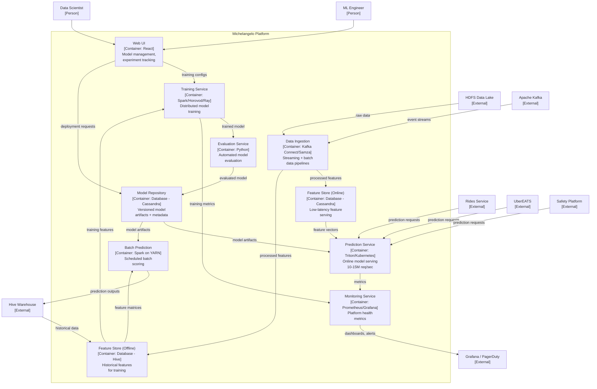

# C4 Container Diagram -- Uber Michelangelo

> **Diagram type:** C4 Level 2 -- Container Diagram (Standard)

## Purpose

This diagram decomposes Michelangelo into its runtime containers. Following standard C4 conventions, containers are runtime processes or data stores. There are no AI-specific stereotypes; all components use standard C4 container types.

## Container Inventory

| Container | Type | Technology | Description |
|-----------|------|------------|-------------|
| Web UI | Application | React | ML engineer and data scientist interface for model management |
| Training Service | Application | Spark, Horovod, Ray | Distributed model training orchestration |
| Evaluation Service | Application | Python, custom framework | Automated model evaluation against metrics |
| Model Repository | Database | Cassandra | Versioned storage of model artifacts and metadata |
| Feature Store (Online) | Database | Cassandra | Low-latency feature serving for real-time predictions |
| Feature Store (Offline) | Database | Hive / HDFS | Historical feature storage for batch training |
| Prediction Service | Application | Triton, Kubernetes | Online model serving for real-time predictions |
| Batch Prediction | Application | Spark on YARN | Scheduled batch scoring jobs |
| Data Ingestion | Application | Kafka Connect, Samza | Streaming and batch data ingestion |
| Monitoring Service | Application | Grafana, Prometheus | Platform health metrics and dashboards |

## Container Diagram

## Key Observations

### Feature Store Appears as Two Databases

In this standard C4 diagram, the Feature Store is represented as two database containers: "Feature Store (Online)" backed by Cassandra and "Feature Store (Offline)" backed by Hive. These containers are visually and semantically identical to any other database in the diagram. There is no indication that:

- The Feature Store manages 20,000+ semantically rich, curated features
- Features have defined freshness requirements and quality contracts
- Feature changes cascade to all consuming models
- The online and offline stores must maintain consistency to prevent training-serving skew

### Models Are Invisible

The 5,000+ production models are entirely invisible. The "Prediction Service" container serves all models, but individual models (DeepETA, fraud detection, pricing) with their different architectures, performance characteristics, and criticality levels are not represented. A reader cannot distinguish the fraud detection model (financial safety-critical) from a restaurant ranking model (user experience optimization).

### No Lifecycle Management

Gallery's model lifecycle management system is absent from this diagram. The 4-stage lifecycle (exploration, training, evaluation, production) with automated promotion rules collapses into a simple linear flow: Training Service -> Evaluation Service -> Model Repository -> Prediction Service.

### No Drift Monitoring

D3, which monitors 100,000+ data quality indicators across 300+ datasets, has no container representation. The Monitoring Service tracks infrastructure metrics, but there is no container for ML-specific monitoring (data drift, concept drift, model performance degradation).

### No Deployment Safety

Uber's deployment safety framework (canary analysis, shadow testing, Model Excellence Score, automated rollback) is invisible. Deployment appears as a direct promotion from Model Repository to Prediction Service, with no intermediate safety stages.
