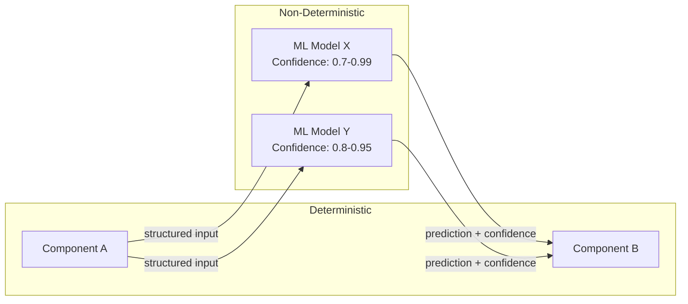

# AI Boundary Delineation

> **Extends:** arc42 §3 — Context & Scope

## Purpose

Explicitly identify where non-deterministic AI components exist within the system boundary. Stakeholders need to understand which parts of the system produce probabilistic outputs, where confidence levels vary, and what fallback behavior exists when AI components fail or produce low-confidence results.

## AI Components Inventory

<!-- List each AI component in the system -->

| Component | Type | Input Domain | Output Domain | Confidence Range | Fallback Strategy |
|-----------|------|-------------|---------------|-----------------|-------------------|
| *[Name]* | *[Classification / Regression / Generation / Detection]* | *[Description of inputs]* | *[Description of outputs]* | *[e.g., 0.7–0.99]* | *[e.g., rule-based default, human escalation, cached result]* |

## System Boundary Diagram

<!-- Provide a diagram showing deterministic and non-deterministic regions. Use Mermaid or reference an external diagram. -->

## Failure Modes

<!-- For each AI component, describe what happens when it is unavailable or produces low-confidence outputs -->

| Component | Failure Condition | System Behavior | User Impact |
|-----------|------------------|-----------------|-------------|
| *[Name]* | *[Model unavailable / confidence < threshold]* | *[Fallback description]* | *[Degraded accuracy / delayed response / manual fallback]* |

## External AI Dependencies

<!-- List any external AI services the system depends on (third-party APIs, hosted models) -->

| Service | Provider | SLA | Data Sent | Fallback |
|---------|----------|-----|-----------|----------|
| *[Service name]* | *[Provider]* | *[Availability %]* | *[What data leaves your system]* | *[Local model / cached / disabled]* |
