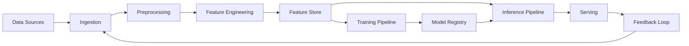

# Data Pipeline View

> **Extends:** arc42 §6 — Runtime View

## Purpose

Document the data flows that are the circulatory system of AI architectures: from collection through preprocessing, feature engineering, training, inference, and feedback loops. Standard runtime views show process interactions — this view captures the data-centric runtime behavior unique to AI systems.

## Pipeline Overview

<!-- High-level diagram of all data pipelines in the system -->

## Pipeline Inventory

| Pipeline ID | Name | Type | Schedule | SLA | Owner |
|-------------|------|------|----------|-----|-------|
| *[e.g., PL-001]* | *[Name]* | *[Batch / Streaming / Hybrid]* | *[e.g., hourly, real-time, on-demand]* | *[e.g., < 5 min latency]* | *[Team/person]* |

## Pipeline Details

<!-- Repeat this section for each pipeline -->

### [Pipeline Name] (PL-XXX)

**Stages:**

| Stage | Input | Output | Processing | Quality Gate |
|-------|-------|--------|-----------|-------------|
| *[e.g., Ingestion]* | *[Source description]* | *[Output description]* | *[Transformation logic]* | *[e.g., schema validation, null check < 1%]* |

**Data Quality Checkpoints:**

| Checkpoint | Location | Validation Rule | On Failure |
|------------|----------|----------------|------------|
| *[e.g., Schema validation]* | *[After ingestion]* | *[e.g., All required fields present, types match]* | *[e.g., Reject batch, alert, fallback to previous]* |

**Schema:**

<!-- Document the key schemas at pipeline boundaries -->

| Field | Type | Constraints | Description |
|-------|------|------------|-------------|
| *[field_name]* | *[type]* | *[e.g., not null, range 0-1]* | *[Description]* |

## Feature Store

<!-- If the system uses a feature store, document it here -->

| Feature Group | Features | Source Pipeline | Refresh Rate | Consumers |
|---------------|----------|---------------|-------------|-----------|
| *[Group name]* | *[Feature list]* | *[PL-XXX]* | *[e.g., hourly]* | *[Model IDs]* |

## Feedback Loops

<!-- Document any feedback loops where model outputs influence future training data -->

| Loop | From | To | Mechanism | Risk | Mitigation |
|------|------|----|-----------|------|------------|
| *[Name]* | *[Output of...]* | *[Input to...]* | *[e.g., user clicks logged as labels]* | *[e.g., Confirmation bias, distribution shift]* | *[e.g., Human review sample, holdout validation]* |
