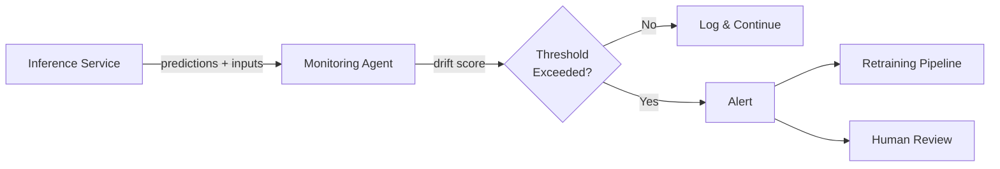

# Operational AI View

> **New section** — extends arc42 beyond §11

## Purpose

Document the continuous operational concerns unique to AI systems that evolve post-deployment: drift monitoring, retraining pipelines, canary deployments for model updates, A/B testing infrastructure, and rollback procedures. No existing arc42 section covers this.

## Monitoring Architecture

### Drift Detection

| Model | Drift Type | Detection Method | Threshold | Check Frequency | Alert Channel |
|-------|-----------|-----------------|-----------|----------------|--------------|
| *[Model name]* | *[Data drift / Concept drift / Prediction drift]* | *[e.g., PSI, KS test, accuracy monitoring]* | *[e.g., PSI > 0.2]* | *[e.g., hourly, daily]* | *[e.g., PagerDuty, Slack]* |

### Model Health Metrics

| Model | Metric | Baseline | Warning | Critical | Dashboard |
|-------|--------|----------|---------|----------|-----------|
| *[Model name]* | *[e.g., accuracy, latency, throughput]* | *[Baseline value]* | *[Warning threshold]* | *[Critical threshold]* | *[Link]* |

### Monitoring Diagram

## Retraining Pipeline

### Trigger Conditions

| Trigger | Type | Condition | Action |
|---------|------|-----------|--------|
| *[e.g., Scheduled retrain]* | *[Scheduled / Event-driven / Manual]* | *[e.g., Every 30 days]* | *[e.g., Full retrain with latest 90 days of data]* |
| *[e.g., Drift-triggered retrain]* | *[Event-driven]* | *[e.g., PSI > 0.25 for 3 consecutive checks]* | *[e.g., Incremental retrain, human approval before deploy]* |

### Retraining Process

| Step | Description | Automated? | Duration | Approval Required? |
|------|-------------|-----------|----------|-------------------|
| *[e.g., Data collection]* | *[Description]* | *[Yes/No]* | *[e.g., ~2 hours]* | *[No]* |
| *[e.g., Training]* | *[Description]* | *[Yes/No]* | *[e.g., ~4 hours]* | *[No]* |
| *[e.g., Validation]* | *[Description]* | *[Yes/No]* | *[e.g., ~1 hour]* | *[No]* |
| *[e.g., Deployment]* | *[Description]* | *[Yes/No]* | *[e.g., ~30 min]* | *[Yes — ML lead]* |

## Deployment Strategy

### Model Update Rollout

| Strategy | Description | When to Use |
|----------|-------------|------------|
| *[e.g., Canary]* | *[e.g., Route 5% traffic to new model, monitor for 24h]* | *[e.g., Major version updates]* |
| *[e.g., Blue-green]* | *[e.g., Run both versions, switch after validation]* | *[e.g., Minor updates with high confidence]* |
| *[e.g., Shadow mode]* | *[e.g., New model runs in parallel but doesn't serve]* | *[e.g., Experimental models]* |

### A/B Testing

| Test | Models Compared | Metric | Sample Size | Duration | Decision Criteria |
|------|----------------|--------|-------------|----------|------------------|
| *[Test name]* | *[A: current, B: candidate]* | *[e.g., click-through rate]* | *[e.g., 10K requests]* | *[e.g., 7 days]* | *[e.g., p < 0.05, > 2% lift]* |

## Rollback Procedures

| Scenario | Detection | Rollback Step | Recovery Time | Owner |
|----------|-----------|--------------|---------------|-------|
| *[e.g., New model accuracy drops]* | *[e.g., Monitoring alert]* | *[e.g., Revert to previous version in model registry]* | *[e.g., < 15 min]* | *[Team/person]* |

## Incident Response

| Severity | Condition | Response | Escalation |
|----------|-----------|----------|------------|
| **P1** | *[e.g., Model serving errors > 5%]* | *[e.g., Auto-rollback, page on-call]* | *[e.g., VP Engineering within 1h]* |
| **P2** | *[e.g., Accuracy degradation detected]* | *[e.g., Alert ML team, begin investigation]* | *[e.g., ML lead within 4h]* |
| **P3** | *[e.g., Minor drift detected]* | *[e.g., Log, schedule retrain]* | *[e.g., Next sprint planning]* |
