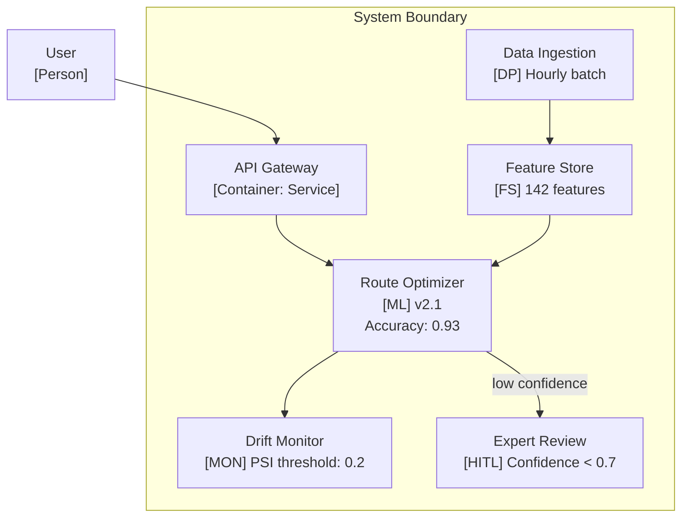
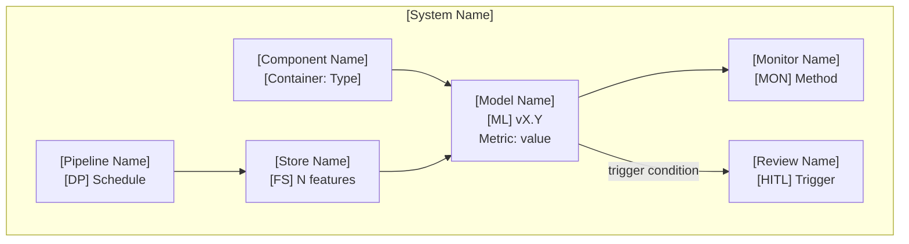

# AI Component Stereotypes for C4 Diagrams

> **Extends:** C4 Model — Component and Container diagrams

## Purpose

Standard C4 diagrams treat all components uniformly. AI systems need visual stereotypes that distinguish ML models, data pipelines, feature stores, monitors, and human-in-the-loop intervention points — each with distinct operational characteristics.

## Stereotype Definitions

| Stereotype | Icon/Label | Description | Key Properties |
|------------|-----------|-------------|---------------|
| `<<ML Model>>` | `[ML]` | Inference endpoint serving predictions | Version, accuracy, confidence range, latency |
| `<<Data Pipeline>>` | `[DP]` | Data flow component with transformation logic | Schedule, SLA, data quality gates |
| `<<Feature Store>>` | `[FS]` | Shared feature computation and serving | Feature count, refresh rate, consumers |
| `<<Monitor>>` | `[MON]` | Drift detection and model health monitoring | Metrics tracked, alert thresholds |
| `<<Human-in-the-Loop>>` | `[HITL]` | Manual review or override intervention point | Trigger condition, response SLA |

## Mermaid Conventions

Since Mermaid does not natively support C4 stereotypes, use these conventions:

### Container Diagram with AI Stereotypes



### Naming Convention

Use the stereotype label in brackets after the component name:

```
Component Name
[Stereotype] Additional metadata
```

Examples:
- `Route Optimizer [ML] v2.1, Accuracy: 0.93`
- `Traffic Data Pipeline [DP] Real-time, SLA: <5s`
- `Prediction Monitor [MON] PSI, KS-test`
- `Safety Review [HITL] Triggered on anomaly flags`

## Annotation Guidelines

### For `<<ML Model>>` Components

Always annotate with:
- **Version:** Current deployed model version
- **Key metric:** Primary performance metric and value
- **Confidence range:** Expected output confidence bounds

### For `<<Data Pipeline>>` Components

Always annotate with:
- **Schedule:** Batch frequency or "real-time"
- **SLA:** Maximum acceptable latency

### For `<<Monitor>>` Components

Always annotate with:
- **Detection method:** What drift/health metric is tracked
- **Threshold:** When alerts fire

### For `<<Human-in-the-Loop>>` Components

Always annotate with:
- **Trigger:** What condition routes to human review
- **Response SLA:** Expected human response time

## Template


