# Data Lineage Overlay

> **Extends:** C4 Model — supplementary diagram layer

## Purpose

Trace data provenance from source through transformation to model consumption. Analogous to C4's deployment diagram, this overlay shows how data flows, transforms, and is consumed — annotated with schema expectations, freshness requirements, and privacy classifications.

## Data Source Inventory

| Source ID | Name | Type | Owner | Freshness | Privacy Classification |
|-----------|------|------|-------|-----------|----------------------|
| *[DS-001]* | *[Name]* | *[Database / API / Stream / File / Manual]* | *[Team]* | *[Real-time / Hourly / Daily / Static]* | *[Public / Internal / Confidential / Restricted]* |

## Lineage Diagram

```mermaid
graph LR
    subgraph Sources ["Data Sources"]
        S1["Source A<br/>[DB] Daily refresh<br/>🔒 Internal"]
        S2["Source B<br/>[API] Real-time<br/>🔒 Confidential"]
    end

    subgraph Transform ["Transformation Layer"]
        T1["Clean & Validate<br/>Schema: v2.1"]
        T2["Feature Engineering<br/>142 features"]
    end

    subgraph Consumption ["Model Consumption"]
        M1["Model X<br/>[ML] v2.1"]
        M2["Model Y<br/>[ML] v1.4"]
    end

    S1 -->|"raw records<br/>~10K/day"| T1
    S2 -->|"events<br/>~500/min"| T1
    T1 -->|"cleaned records"| T2
    T2 -->|"feature vectors"| M1
    T2 -->|"feature vectors"| M2
```

## Lineage Details

<!-- Repeat for each data flow path -->

### [Source] → [Consumer] Path

| Stage | Input | Transformation | Output | Schema Version | Quality Gate |
|-------|-------|---------------|--------|---------------|-------------|
| *[Stage name]* | *[Input description]* | *[What happens]* | *[Output description]* | *[e.g., v2.1]* | *[Validation rule]* |

## Freshness Requirements

| Consumer | Required Freshness | Source Freshness | Gap Risk | Mitigation |
|----------|-------------------|-----------------|----------|------------|
| *[Model/Service]* | *[e.g., < 1 hour old]* | *[e.g., daily batch]* | *[e.g., up to 24h stale data]* | *[e.g., real-time supplement, cache invalidation]* |

## Privacy Flow

<!-- Track where sensitive data flows and where anonymization/pseudonymization occurs -->

| Data Element | Source Classification | Anonymization Point | Downstream Classification |
|-------------|---------------------|--------------------|--------------------------|
| *[e.g., user_id]* | *[Confidential]* | *[e.g., hashed at ingestion]* | *[Internal]* |

## Schema Registry

| Schema ID | Version | Fields | Used By | Breaking Changes |
|-----------|---------|--------|---------|-----------------|
| *[SCH-001]* | *[v2.1]* | *[Field list or link]* | *[Pipeline/model IDs]* | *[e.g., field X removed in v2.0]* |
