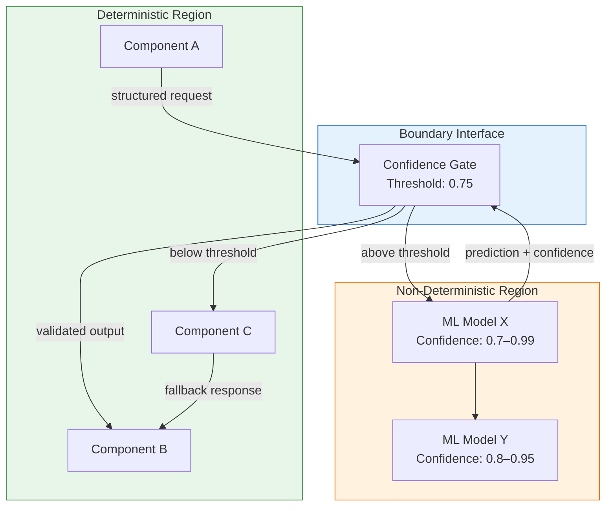

# Non-Determinism Boundary Diagram

> **Extends:** C4 Model — system-level overlay

## Purpose

Explicitly mark the boundary between deterministic and non-deterministic regions of the architecture. Annotate with confidence levels, fallback strategies, and degradation behaviors. This is fundamental to understanding, testing, and reasoning about AI-augmented systems.

## Boundary Overview

## Boundary Interfaces

<!-- Document each point where deterministic and non-deterministic regions interact -->

| Interface ID | From (Region) | To (Region) | Data Exchanged | Contract |
|-------------|--------------|------------|---------------|---------|
| *[BI-001]* | *[Deterministic]* | *[Non-deterministic]* | *[Request format]* | *[Schema + expected response time]* |
| *[BI-002]* | *[Non-deterministic]* | *[Deterministic]* | *[Prediction + confidence score]* | *[Schema + confidence range]* |

## Confidence Thresholds

| Model | High Confidence | Medium Confidence | Low Confidence | Rejection |
|-------|----------------|------------------|---------------|-----------|
| *[Model name]* | *[> 0.9: auto-accept]* | *[0.75–0.9: accept with logging]* | *[0.5–0.75: human review]* | *[< 0.5: reject, use fallback]* |

## Degradation Behavior

<!-- What happens when non-deterministic components fail or produce low-confidence outputs? -->

| Scenario | Detection | System Behavior | User Experience |
|----------|-----------|-----------------|----------------|
| *[Model unavailable]* | *[Health check failure]* | *[Switch to rule-based fallback]* | *[Slightly degraded accuracy, no outage]* |
| *[Low confidence output]* | *[Confidence < threshold]* | *[Route to human review queue]* | *[Delayed response]* |
| *[Model returns error]* | *[HTTP 5xx / timeout]* | *[Return cached prediction + stale flag]* | *[Potentially stale result with warning]* |

## Propagation Rules

<!-- How does non-determinism propagate through the system? -->

| Rule | Description |
|------|-------------|
| *[e.g., Confidence composition]* | *[When Model A feeds Model B, output confidence = min(conf_A, conf_B)]* |
| *[e.g., Deterministic wrapper]* | *[Business rules applied after ML prediction restore determinism for specific cases]* |
| *[e.g., Cascade failure]* | *[If Model A fails, Models B and C that depend on it switch to fallback mode]* |

## Testing Implications

| Test Type | Purpose | Approach |
|-----------|---------|----------|
| *[Boundary testing]* | *[Verify behavior at confidence thresholds]* | *[Inject predictions at exact threshold values]* |
| *[Fallback testing]* | *[Verify graceful degradation]* | *[Simulate model unavailability]* |
| *[Chaos testing]* | *[Verify system resilience]* | *[Random model failures, latency injection]* |
